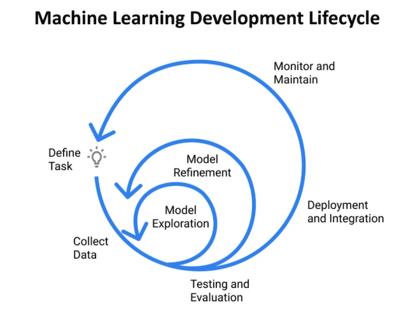

Learn more about Jeremy on his [site](https://www.jeremyjordan.me/) and [Twitter](https://twitter.com/jeremyjordan).

### *Please share a bit about yourself: your current role, where you work, and what you do?*

I currently work as a machine learning engineer at Duo Security; we have a range of products (such as [two-factor authentication](https://duo.com/product/multi-factor-authentication-mfa/two-factor-authentication-2fa)) which help ensure that our users can securely access their applications. My team, specifically, works on algorithms to detect abnormal access attempts and evaluate the risk associated with a given login attempt.

We built [Duo Trust Monitor](https://duo.com/docs/trust-monitor), which provides security administrators with a daily feed of login attempts that our algorithms have flagged as anomalous. You can check out more information about how our anomaly detection models work in a [recent talk some of my coworkers gave](https://www.youtube.com/watch?v=Kh9cKJGA5DM) at DefCon’s [AI Village](https://aivillage.org/events/2020/8/4/ai-village-def-con-28-safe-mode-w6wsl).

### *What was your path towards working with machine learning? What factors helped along the way?*

I got my degree in Materials Science and Engineering. Throughout my time in university, I worked in various materials research labs. For the first two years, I worked in a lab exploring some novel techniques for carbon sequestration. This was very hands-on research and involved a lot of time in a physical laboratory formulating materials and performing various experiments. 

I eventually shifted my focus to computational modeling research, thinking that it would be more efficient to perform a wide range of experiments via computer simulations, identify a few promising candidates, and reduce the time spent in a physical laboratory formulating materials.

I really enjoyed the modeling aspects of my computational materials research and I kept reading about interesting applications of data science and machine learning, so that summer I decided to apply for data science internships to “dip my toes in the water” and see if I enjoyed it. I ended up getting an internship at Red Hat where I built some web scrapers and used some basic NLP techniques to find duplicate product questions across web forums. I had an absolute blast that summer and it confirmed my desire to pursue machine learning as a career. 

However, that internship experience also showed me that I had a lot to learn. After finishing my materials science degree, I immediately dove into a (full time) self-study to build my machine learning foundation. I put together a curriculum of topics, watched lectures from Stanford, MIT, and Udacity, and started writing [blog posts](https://www.jeremyjordan.me/data-science/) to summarize what I was learning. My engineering background ended up helping immensely, since I had already built a strong foundation in calculus, statistics, and mathematical computing.

After making my way through this initial set of coursework, I started working on some side projects to apply what I had learned. One of those side projects gained some momentum and grew into a startup, which I wrote more about [here](https://www.jeremyjordan.me/mobius/). After that didn’t pan out, I took a job in industry and started working at Proofpoint where I built machine learning models for phishing and malware detection. 

### *How do you spend your time day-to-day?*

No day is exactly the same, but most of my days are some combination of:
- Reviewing PRs
- Writing code and submitting PRs
- Reading design docs and proposals, providing feedback/input
- Writing design docs and proposals, soliciting feedback/input
- Meeting with stakeholders

I’m currently working with some teammates to re-architect our machine learning infrastructure to be more modular, flexible, and scalable as Duo continues to grow and add new machine learning capabilities to our products. This involves work such as tracking all of our models with MLflow, building out an offline feature store for our batch jobs, and working on shifting some of our model training workflows from EMR clusters to a container-native approach.

### *How do you work with business to identify and define problems suited for machine learning? How do you align ML projects with business objectives?*

One of the things that attracted me to Duo is the company’s strong product culture. My team works with an amazing product manager that spends a lot of time talking with customers, performing competitive analysis across the industry, and shaping a product vision for _data-informed features_ and improvements to our product line.

We spend a lot of time focusing on **understanding the problems** we’re trying to tackle, being careful not to prescribe specific solutions too early on in the process. Part of this includes **_not_** making the assumption that machine learning will always be the right tool to solve a problem. 

In fact, we’ll usually only reach for machine learning solutions after initially deploying a heuristic-based approach, observing the performance characteristics, and identifying the failure modes of simple rules.

### *Machine learning systems can be several steps removed from users, relative to product and UI. How do you maintain empathy with your end-users?*

At Duo, we have a design research team that has put a ton of effort into defining a set of **user personas** that represent the various sets of user groups that interact with our product (e.g. a security administrator, an end user, the company’s CISO). Each persona includes a description of their background, objectives and motivations, and concerns or pain points they may have with our products. When we’re talking about changes or improvements to the product, we’re sure to specify the change in the context of the relevant personas.

We also use Duo’s products in our day to day work! We’ll often [dogfood](https://en.wikipedia.org/wiki/Eating_your_own_dog_food) new products and features internally first to gather user experience feedback before shipping to customers. At Duo we pride ourselves in being the “most loved company in security”, so dogfooding our own products can help ensure that we’re building lovable products that provide security without compromising on the user experience.

### *Imagine you're given a new, unfamiliar problem to solve with machine learning. How would you approach it?*

Perhaps it would be helpful to provide a concrete example. At my last company, I worked on a project with some of our threat researchers that wanted better visibility on the malware landscape. Specifically, they wanted to be able to (1) track the evolution of malware over time and (2) identify malware variants where we may be missing family attribution.

If you’re not familiar with malware detection, those objectives probably don’t mean much to you. I was starting off from a similar position! I spent countless hours on Zoom calls with these researchers to understand their existing workflows, how they detect and categorize malware, and where they lacked visibility in their current workflows.

I learned that the threat actor groups who deliver malware track the effectiveness of their attacks and will ship new versions when their malware starts getting detected (and thus blocked) too often. I also learned that our products provided value to our customers not only by blocking malware, but also by providing **intelligence** on the malware that we detect. Thus, it’s important to not only detect the malware but effectively categorize it (i.e. malware family attribution).

Once I felt that I had a decent understanding of the problem that we wanted to address, I mocked up some wireframes in [Figma](https://www.figma.com/) to showcase different approaches we could take and how it might fit into their existing workflow. Through this exercise, I learned that these researchers wanted a tool that would allow them to flexibly query across files that we scanned as part of our malware detection pipelines; we discussed various “knobs” which the user could control in order to facilitate this exploration and landed on a design for a **semantic search** tool that would meet their needs. After validating the high-level approach, I trained some simple embedding models to power an initial prototype.

Once the researchers were able to play around with the initial prototype powered by these simple models, they were able to give me feedback on where performance was suffering and I was able to make targeted improvements to the models (and UX design) to address their concerns.

In general, if you’re given a new, unfamiliar problem to solve I recommend to:
- Learn from domain experts to get a better understanding of the problem you’re attempting to solve.
- Solve the problem manually, paying attention to how you solved the problem yourself.
- Make a quick prototype and get it in front of users; aim for fast iterations and short feedback loops to make sure you’re heading in the right direction.

_Related: check out this [blog post](https://www.jeremyjordan.me/ml-requirements/S) I wrote which details some concrete techniques for translating a vague problem statement into a set of requirements for a machine learning project._

### *Designing, building, and operating ML systems is a big effort. Who do you collaborate with? How do you scale yourself?*

It can be a big effort indeed. On a typical project, we’ll collaborate with product managers and designers to make sure that we (1) understand the problem well and (2) that the solutions we develop are intuitive to the end user. We’ll also collaborate with other engineering teams, as the ML service that we deploy is usually only one piece of the larger system that powers the product, in addition to working with our site reliability engineers to ensure the services we deploy are robust and in-line with company standards.

In order to scale myself, I try to always leave behind a trail of documentation so that I’m never the only person who knows how to operate the systems that I build. I also try to take the opportunity to automate processes as much as feasibly possible so that I can be efficient with where my time is spent.

### *There are many ways to structure DS/ML teams—what have you seen work, or not work?*

I’ve seen a number of organizational structures including: 
- **The research lab**: this is usually an organizational model that companies use when they’re first starting out on their data science journey, spinning up a new organization with the goal of finding interesting problems they can tackle with data. These teams typically have a large degree of autonomy and get the chance to work on some interesting problems. However, depending on the size of the company, the team will invariably start receiving pressure to get their research projects integrated into the company’s product line. One challenging aspect of this organizational model is that “getting research into production” typically requires partnering with product teams that are already set up to own production systems, but these product teams don’t always have the bandwidth available to work with you. 
- **The embedded model**: another approach is to place data scientists directly on product teams (where they can have the most direct impact) while providing centralized management and a sense of community among other data scientists. This model allows data scientists to be managed by leaders familiar with the nature of the work, but it can sometimes be difficult to feel that shared sense of community among the other data scientists if everyone is too focused on their day-to-day product work.
- **The product-centered model**: one of my favorite approaches is to organize data scientists and machine learning engineers as a product team (or set of teams) which develop and own ML systems end-to-end. In this model, you can integrate into the product line through APIs instead of taking your work and “throwing it over the wall” for another team to own and manage (common in the research model). This structure provides a nice balance between _autonomy_ to define what the team should be working on and _agency_ to be able to deliver services in production. If you squint hard enough, you might say this looks like another incarnation of the embedded model, but I think the key difference is the product team’s explicit focus on developing and owning machine learning-powered services.

With all of this said, I don’t think there’s one organizational model that reigns supreme in all scenarios. Ultimately, the right organizational model is going to depend on your company size, maturity, and variety of data science work available. 

_For more on this topic, I’d recommend checking out [Pardis’ article on organizational models for data science teams](https://djpardis.medium.com/models-for-integrating-data-science-teams-within-organizations-7c5afa032ebd)._

### *How does your organization or team enable rapid iteration on machine learning experiments and systems?*

To start, we _value_ rapid iteration as part of our process. This allows us to make upfront investments in infrastructure aimed at reducing the amount of time it takes to get from an experiment to results. We spend a lot of time thinking about how we can enable _paved paths_ for common workflows while preserving flexibility for data scientists to be able to use the right tool/framework for their problem.

I’m a big fan of the Unix philosophy of simple, sharp tools that **work well together**. In the context of machine learning infrastructure, most of our effort is focused on designing **interfaces** between modular components which represent the machine learning lifecycle. For example, [feature stores](https://feast.dev/) can provide a great interface between _feature processing_ and _modeling workflows_ while [model registries](https://www.mlflow.org/docs/latest/model-registry.html) can provide a nice interface between _model training_ and _model scoring_ workflows.

Additionally, we like to stay scrappy at the beginning of projects and get feedback from low-fidelity mockups before spending much time building anything. We take a very incremental approach towards developing solutions, which naturally leads to shorter feedback loops.

### *What processes, tools, or artifacts have you found helpful in the machine learning lifecycle? What would you introduce if you joined a new team?*

A couple years ago, I wrote a [blog post](https://www.jeremyjordan.me/ml-projects-guide/) which details the process that I follow when developing machine learning models. I try to revisit this post every 6-12 months and make updates as I gain more experience building and deploying machine learning systems.

The central theme of that blog post is that the machine learning lifecycle is an extremely iterative process. The figure below depicts a visual summary of the process that I follow.

A few tools that I’ve found valuable as I follow this process on projects:
- **Experiment tracking**: using tools like [Weights and Biases](https://wandb.ai/) or [MLflow](https://mlflow.org/) make it easy to record the model - exploration and refinement stages, allowing you to easily review which ideas are working best
- **Prototyping**: creating mock-ups in [Figma](http://figma.com) can be really useful at the task definition stage, and then for functional prototypes I like to whip together a [Streamlit](https://streamlit.io/) app

### *After shipping your ML project, how do you monitor performance in production? Did you have to update pipelines or retrain models—how manual or automatic was this?*

At Duo, we train and deploy thousands of models daily; this scale necessitates a high level of automation to build, deploy, and monitor these models. Currently, our models are retrained on a fixed schedule, although we’ve been looking into the feasibility of switching to an event-based model where retraining is tied to some metric/threshold.

In terms of monitoring performance, we have a series of alerts that fire when our model behavior deviates from its expected parameters (e.g. flagging way too many login attempts as anomalous). We also have feedback mechanisms built into the product which allows our users to provide signals when our models are doing well and when they’re doing poorly.

### *Think of people who are able to apply ML effectively–what skills or traits do you think contributed to that?*

I’ve been fortunate to work with and learn from a good number of highly effective practitioners. One of the common themes that I’ve observed is that they spend a lot of time talking with stakeholders/end users. For example, one of my previous coworkers would have this practice of scheduling a **ton** of “informational interviews” at the onset of a project; he would take time to understand the existing workflows and established processes that various people followed in order to better understand the task we were trying to automate. He was very skilled in identifying the part of the process where we could feasibly introduce automation with ML to make the end users more effective at the overall task.

Additionally, I’ve found that highly effective practitioners are also usually the most curious; they will invest a lot of time making sure they deeply understand the systems and tools they’re using to build out a solution.

### *Do you have any lessons or advice about applying ML that's especially helpful? Anything that you didn't learn at school or via a book (i.e., only at work)?*

- Pretty much every experienced person will say this but it’s worth repeating, **_start simple_**.
- Share your work and solicit feedback often. Soliciting feedback is a bit of an art form. I’ve found that I receive the most helpful feedback when I either (1) ask very targeted questions or (2) share a concern I have about the approach or direction that a project is heading. 
- Consider how people are going to be using the system that you build. There’s a plethora of great resources and people to learn from in the [MLUX community](https://twitter.com/mluxmeetup).
- Remember to verify that your model metrics align with product goals. Take a holistic approach towards evaluating your ML systems. [Karl Higley](https://twitter.com/karlhigley) has written some great Twitter threads on this topic.

### *How do you learn continuously? What are some resources or role models that you've learned from?*

I keep a Trello board with my learning goals for the current year. This board has a combination of blog posts I want to write, side projects I want to work on, and courses I’m interested in taking. I also try to keep up with the firehose of research papers and blog posts that pique my interest in newsletters or my Twitter feed.

I’ve found writing to be a really effective learning tool for me in a number of ways. One of my original goals for writing as I learned about machine learning topics was to provide a snapshot of my mental state when a concept “clicked” and record this in my own words; that way I can easily revisit a subject in the future, even if I haven’t touched it in a few years, and quickly get back up to speed. I also discovered that writing is a really effective way to identify gaps in my understanding of a topic, since it forces me to think through a narrative flow of how I would teach myself a given concept. Finally, publishing my writing on a blog has opened the door for **_so many_** conversations and friendships with people who have similar interests – it’s been incredibly rewarding!
