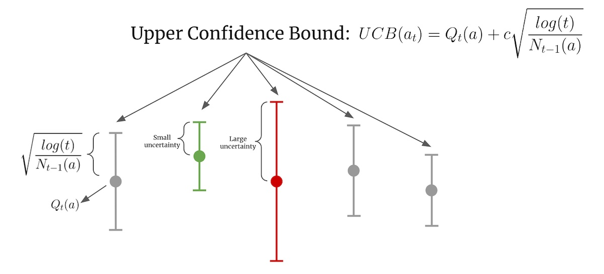
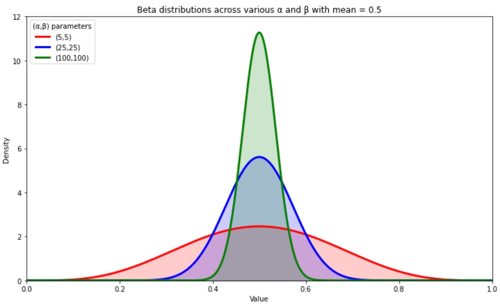
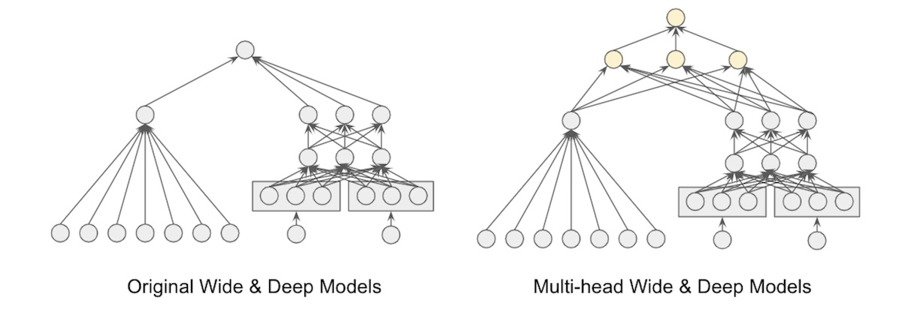

import { FigureCaption } from '../../components/figure-caption';

Recommender systems work well when we have a lot of data on user-item preferences. With a lot of data, we have high certainty about what users like. Conversely, with very little data, we have low certainty. Despite the low certainty, recommenders tend to greedily promote items that received higher engagement in the past. And because they influence how much exposure an item gets, potentially relevant items that aren’t recommended continue getting no to low engagement, perpetuating the feedback loop.

**Bandits address this by modeling uncertainty and exploration.** By acknowledging the uncertainty in the data and deliberately exploring to reduce it, bandits learn about the relevance of unexplored items. 

**This is especially applicable when the item set changes quickly**, such as for news, ads, and tweets, **or when the rate of traffic is low.** If new items are constantly added, waiting to collect batch data before retraining the model can be too slow. Bandits are a good fit as they can incrementally update with new data and adaptively focus on items with higher reward. This reduces regret, which is the opportunity cost while recommending suboptimal items.

## ε-greedy, UCB, and Thompson Sampling

We’ll briefly discuss three main bandit algorithms before looking at some industrial implementations of each. Here are a few terms I use throughout: (i) action/arm: recommendation candidates, (ii) reward: customer interaction from a single trial, such as a click or purchase, (iii) value: estimated long-term reward of an arm over multiple trials, and (iv) policy: algorithm/agent that chooses actions based on learned values.

**ε-greedy is the classic bandit algorithm.** At every trial, it randomly chooses an action with probability ε and greedily chooses the highest value action with probability 1 - ε. We balance the explore-exploit trade-off via the parameter ε. A higher ε leads to more exploration while a lower ε leads to more exploitation. However, ε-greedy can explore longer than necessary (though this can be mediated by decreasing ε over time). Another downside is that ε-greedy doesn’t provide guidance on which items to explore and defaults to exploring all items uniformly at random.

**Upper Confidence Bound (UCB) considers the uncertainty** of an arm and selects arms that have the highest potential. Uncertainty is modeled **via confidence bounds** while potential is represented by the upper confidence bound (thus the name of the algorithm). Because of how it works, UCB is often referred to as “optimism in the face of uncertainty”.

<FigureCaption caption="Example of UCB with a frequently tried arm (green) and a rarely tried arm (red)"/>

In the image above, _Qₜ(a)_ is the estimated value of arm _a_ at time step _t_, _Nₜ(a)_ is the number of times arm _a_ was selected, and _c_ is a confidence parameter (which defaults to 1). The green arm has been chosen frequently and thus has narrower confidence bounds. In contrast, the red arm hasn’t been selected as often and thus has wider confidence bounds. When selecting an action, even though the green arm has a higher estimated value, the red arm has a higher UCB and is thus chosen. As the red arm is selected more, its confidence bounds will shrink. If the estimated value stays the same, its UCB will decrease to below the UCB of the green arm and the green arm will be chosen.

**Thomson Sampling models uncertainty by building a probability distribution** from historical rewards and then samples from the distribution when choosing actions. In the simple case where rewards are binary, a Beta distribution is used. The Beta distribution takes two parameters, α and β, and the mean value of the distribution is α/α + β which can be thought of as successes / successes + failures. To select an action, we sample from each arm’s Beta distribution and choose the arm with the highest sampled values.

<FigureCaption caption="Beta distributions that get narrower as α and β increase"/>

As we collect more data, α and β increase. As a result, the Beta distribution becomes narrower and we gain more certainty in our estimate of the arm’s value. The Beta distributions above all have the same mean of 0.5 though those with larger α and β are narrower. With a narrower distribution, our sampled values will be closer to the mean, thus reducing exploration and increasing exploitation.

## Industry examples of bandits for recsys

**An example of ε-greedy** is [Spotify’s recplanations](https://dl.acm.org/doi/10.1145/3240323.3240354) (recommending explanations for music recommendations). They adopted ε-greedy for its simplicity of implementation in production and propensity scoring. To limit the negative impact of exploration on user experience, they pre-select 100 most relevant items to explore. These 100 items were selected via a separate embedding-based model that captured user preferences similar to the candidate selection stage of the [YouTube paper](https://dl.acm.org/doi/10.1145/2959100.2959190). 

Another example is [Schibsted’s multi-armed bandit ranker](https://arxiv.org/abs/1809.02130) which reranks candidate items from multiple sub-recommenders. For every input that is reranked, 5% random items are added to avoid local minima during training.

**The classic example of UCB** is [Yahoo’s LinUCB for news recommendations](https://arxiv.org/abs/1003.0146). Ridge regression is trained to estimate reward linear on an arm’s features. The UCB is then derived by summing the predicted reward and the standard deviation of the ridge regression. A hybrid version of LinUCB also uses features that are shared by all arms (e.g., news category) and experiments showed that shared features allowed CTR information to be learned and exploited across multiple news articles.

Another example is [Alibaba’s LinUCB for item recommendations](https://arxiv.org/abs/2008.09368) where they adopted the [user browsing model](https://dl.acm.org/doi/10.1145/1390334.1390392) to add positional weights. The goal was to address position bias which has a strong influence on user engagement, especially on mobile surfaces. The positional weights modeled examination probability and the rewards for each arm are updated to consider both the arm’s features and examination probability. Similarly, ridge regression is applied and the standard deviation is used to compute the UCB.

**An example of Thompson Sampling** is [Doordash’s bandits for cuisine recommendations](https://doordash.engineering/2020/01/27/personalized-cuisine-filter/). User preferences for a cuisine is modeled via Beta(α=number of orders of the cuisine, β=number of orders of other cuisines). When selecting a set of cuisine filters to show on the explore page, the value for each cuisine is sampled from the cuisine’s Beta distribution. These values are then sorted in descending order to select the top cuisines to display.

Another example is [Yahoo’s Thompson Sampling bandit for recommending ads and news](https://papers.nips.cc/paper/2011/hash/e53a0a2978c28872a4505bdb51db06dc-Abstract.html). To predict the reward (i.e., CTR) of an ad or news article, they learned a regularized logistic regression model. Then, to model uncertainty, the posterior distribution of the model’s weights are represented by Gaussian distributions. For every trial, each weight is drawn independently from its Gaussian posterior distribution before being used to predict the reward of an action.

A similar example is [Amazon’s multivariate bandits to optimize page layouts](https://arxiv.org/abs/1810.09558). Model weights are also represented and sampled from independent Gaussian distributions. However, because the decision space is so large due to the many layout combinations, they approximate argmax via greedy hill-climbing instead of an exhaustive search. Random restarts are included to alleviate suboptimal solutions.

**Uncertainty can also be modeled via deep learning techniques.** [Twitter’s deep learning bandit for ad recommendations](https://arxiv.org/abs/2008.00727) considered two approaches: bootstrapping and dropout.

Bootstrapping models uncertainty by training multiple identical networks on different subsets of the data. However, this is costly as it requires partitioning and storing masks of the data, training multiple networks, and multiple forward passes across all networks. To reduce the computation cost, they used a multi-headed network that shares the same bottom layers and had each data subset pass through a different head during training.

Dropout models uncertainty by having the network predict an action’s value via multiple forward passes with different dropout units. This is akin to sampling from the posterior distribution. The dropout layer acts as the heads of the multi-headed network.

<FigureCaption caption="Twitter's bayesian bandit which models uncertainty via a perultimate dropout layer" source="https://arxiv.org/abs/2008.00727"/>

Their eventual architecture used a dropout layer as the penultimate layer (right side of image above). When sampling from the posterior, they only needed to compute the bottom layers once before multiple passes through the dropout layer are done in parallel. The dropout layer provides a mask for each data point without having to explicitly partition the data set and also acts as the heads in a multi-headed network.

## Lessons on applying bandits in industry

**First, UCB and Thompson Sampling [outperform ε-greedy](https://arxiv.org/abs/1003.0146)**. By default, ε-greedy is unguided and chooses actions uniformly at random. In contrast, UCB and Thompson Sampling are guided by confidence bounds and probability distributions that shrink as the action is tried more often. As a result, because UCB and Thompson Sampling smartly explore arms that have higher uncertainty, they have lower regret. 

**Second, when feedback is delayed, Thompson Sampling outperforms UCB.** Delayed feedback, where user-item interactions are not processed immediately, is common for most real-world systems due to resource and run-time constraints. In this situation, because UCB selects arms deterministically, it chooses the same action until new feedback is incorporated. In contrast, because Thompson Sampling chooses actions stochastically by sampling from the posterior distribution, it randomizes over actions even without updated rewards. [Yahoo’s evaluation of Thompson Sampling](https://papers.nips.cc/paper/2011/hash/e53a0a2978c28872a4505bdb51db06dc-Abstract.html) and [Deezer’s music bandit](https://arxiv.org/abs/2009.06546) observed that this led to wider exploration and thus better outcomes. 

To further study the impact of delayed rewards, Yahoo simulated different update delays of 10, 30, and 60 minutes. Thompson Sampling was competitive over all delays. On the other hand, while UCB outperformed Thompson Sampling when the delay was short (10 minutes), it performed worse than Thompson Sampling when the delay increased to 30 and 60 minutes. Overall, this suggests that stochastic policies are more robust to delay as they continue to explore even without updated rewards.

**Third, how the bandit is initialized makes a difference.** [Deezer](https://arxiv.org/abs/2009.06546) found that pessimistic initialization performed better than naive initialization. For Thompson Sampling, they experimented with naive initialization where the prior was Beta(1, 1) and pessimistic initialization where the prior was Beta(1, 99). Similar naive and pessimistic initialization was adopted for UCB. They found that pessimistic initialization performed better due to the lower prior probabilities which were more reflective of real-world reward.

## Exploring new items - two options

The few papers that discussed exploration adopted two main approaches: (i) **large exploration on a limited set of users** vs. (ii) **small exploration on all users**.

For the former, [Yahoo uses an exploration bucket](https://arxiv.org/abs/1003.0146) that users are randomly selected into. Users in the exploration bucket are then served news articles uniformly at random. Similarly, [Twitter has a random ad policy](https://arxiv.org/abs/2008.00727) that serves 1% of production traffic. 

For the latter, [Netflix tests new artwork on all users](https://netflixtechblog.com/artwork-personalization-c589f074ad76) (“… the regret incurred by exploration is typically very small and is amortized across our large member base with each member implicitly helping provide feedback on artwork for a small portion of the catalog.”) Similarly, Schibsted adds 5% random items to every input of their bandit ranker.

## Addressing the curse of dimensionality

We can represent users via features such as gender, age group, location, behavior, etc. However, **one concern with applying bandits conditioned on these features is the curse of dimensionality**. More dimensions leads to less data for each combination of dimensions.

[Yahoo addressed this by applying PCA](https://arxiv.org/abs/1003.0146) for dimensionality reduction before learning a policy via LinUCB. They started with 1.2k user features (e.g., demographics, geolocation, and behavior). They also had 83 article features based on URL categories and editor categories. For feature reduction, they projected user features onto article features and then clustered users into five groups where users in each group had similar preferences. This reduced the 1.2k user features into five features. Article features were also reduced in a similar manner.

[Deezer compared](https://arxiv.org/abs/2009.06546) between representing users as clusters (semi-personalization) vs. user features (full personalization). For semi-personalization, users were clustered into 100 groups via k-means clustering on past behavior. This resulted in clusters of users with similar musical tastes. They then trained a separate bandit for each cluster. For full personalization, users were represented via a 97-dimension vector which summarizes user preferences for genres, moods, countries, etc. The vector was obtained by factorizing the user-song interaction matrix. They then trained a contextual bandit on these user features.

**The semi-personalized approach outperformed the fully personalized alternative.** Because the semi-personalized bandits were trained on user clusters, each bandit received more feedback and was thus able to learn more effectively and rank playlists faster.

## Warm-starting bandits for better user experience

**To ensure our bandits provide a good user experience from the very first interaction**, it’s typical to learn from previously logged user interactions to warm-start the bandit.

[Doordash shared how they warm-start](https://doordash.engineering/2020/01/27/personalized-cuisine-filter/) their cuisine bandits via higher-level regional data. For each cuisine, they learn a bandit policy at multiple levels (i.e., regional, subregional, user). The top-level bandit is initialized at Beta(α=1, β=1). Then, for each lower-level bandit, they update α by adding the average number of orders for the cuisine (at that level) and update β by adding the average number of orders for other cuisines (at that level). Finally, for the user-level bandit, α and β are updated with the user’s order data. As a result, a new user’s cuisine bandit is warm-started with higher-level marketplace data before each new order updates the bandit with their personal preferences.

Another approach is to warm-start user preferences using data collected via a random policy. [Yahoo learned](https://arxiv.org/abs/1003.0146) user-specific CTR estimates (on random data) which were then added to context-free CTR estimates for news recommendations. They found that bandits warm-started with user preferences data were able to beat the context-free bandits.

As an alternative to random data, this [paper](https://arxiv.org/abs/1003.0120) showed how to warm-start bandits on data logged via the production policy by importance weighting it. The production policy (i.e., probability of each action) is required to importance weight logged events. To derive the production policy, they used empirical estimation. Specifically, for each ad and page pair, they computed the number of times an ad appeared on each page. This estimate is then used to importance weight logged events that the bandit learns on.

Data collected via a greedy policy can also be helpful for warm-start. [Twitter warm-started](https://arxiv.org/abs/2008.00727) their bandit on data collected by a greedy policy and found that warm-starting for more epochs (500 vs. 100) led to improved metrics on the test set.

## Evaluating bandits via off-policy evaluation

**Several bandit implementations (e.g., Netflix, Yahoo) cite the [replay method by Li et al.](https://arxiv.org/abs/1003.5956)** for off-policy evaluation. Replay assumes that (i) individual events are independently and identically distributed and (ii) the logging policy chose each arm uniformly at random. The paper then states that the latter assumption can be weakened so any randomized policy—not just uniform random—can be used. (My understanding is that randomness is required for sufficient support and thus uniform randomness isn’t strictly necessary.)

During evaluation, replay takes in the new policy (to be evaluated) and the logged policy events. If the new policy chooses the same action as the logged policy, the event is added to the history and the reward is updated. If not, the event is ignored with no reward update. ([Counterfactual evaluation](/resources/counterfactual/)) via Inverse Propensity Scoring is another alternative.)

How does bandit off-policy evaluation compare to typical supervised machine learning evaluation on logged data? [Twitter’s paper](https://arxiv.org/abs/2008.00727) provides some insight. They computed two sets of metrics: (i) PR-AUC on a standard test set and (ii) CTR improvements vs. a random policy. There was a trade-off between PR-AUC and CTR. 

Although the greedy policy performed well on PR-AUC, it did relatively poorly on CTR. Conversely, bandit policies such as UCB and Thompson Sampling did poorer on PR-AUC but outperformed the greedy policy on CTR. This shows the divergence where **supervised learning that evaluates well on biased logged data via conventional metrics may not actually perform well on the metrics we really care about** (e.g., CTR, conversion).

## Conclusion

Whew, that was a lot longer than the average post. If you’re still with me, I hope you found bandits to be a viable alternative for recommendation systems. Their focus on modeling uncertainty and deliberate exploration makes them effective when our data is small and we have low certainty on user-item preferences.

Do you know of other industrial implementations of bandit-based recommendation systems? Please share them in the comments below!

## References
- [Artwork Personalization at Netflix](https://netflixtechblog.com/artwork-personalization-c589f074ad76)
- [Personalized Cuisine Filter](https://doordash.engineering/2020/01/27/personalized-cuisine-filter/)
- [A Contextual-Bandit Approach to Personalized News Article](https://arxiv.org/abs/1003.0146)
- [Learning from Logged Implicit Exploration Data](https://arxiv.org/abs/1003.0120)
- [Explore, Exploit, and Explain: Personalizing Explainable Recommendations](https://dl.acm.org/doi/10.1145/3240323.3240354)
- [Bandit based Optimization of Multiple Objectives on a Music Streaming Platform](https://dl.acm.org/doi/10.1145/3394486.3403374)
- [Carousel Personalization in Music Streaming Apps with Contextual Bandits](https://arxiv.org/abs/2009.06546)
- [Contextual User Browsing Bandits for Mobile Recommendations](https://arxiv.org/abs/2008.09368)
- [An Efficient Bandit Algorithm for Realtime Multivariate Optimization](https://arxiv.org/abs/1810.09558)
- [Deep Bayesian Bandits: Exploring in Online Personalized Recommendations](https://arxiv.org/abs/2008.00727)
- [Deep Neural Network Marketplace Recommenders in Online Experiments](https://arxiv.org/abs/1809.02130)
- [An Empirical Evaluation of Thompson Sampling](https://papers.nips.cc/paper/2011/hash/e53a0a2978c28872a4505bdb51db06dc-Abstract.html)
- [Unbiased Offline Evaluation of Contextual-bandit-based News Article Recommendation Algorithms](https://arxiv.org/abs/1003.5956)