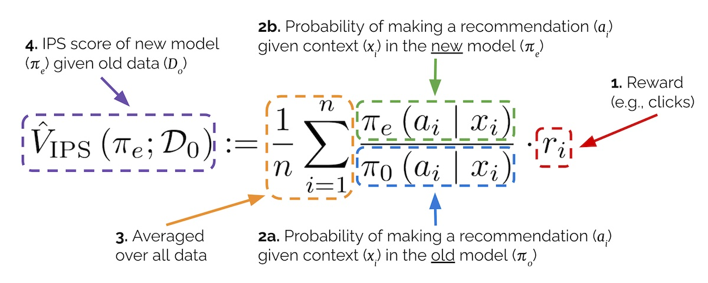
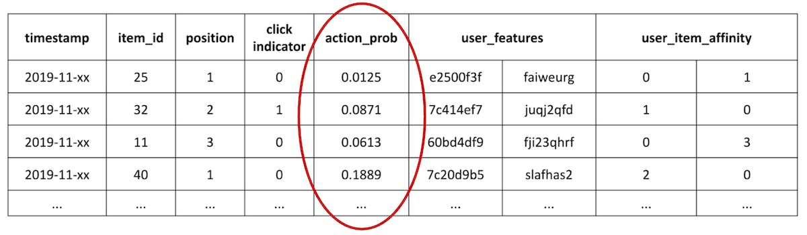
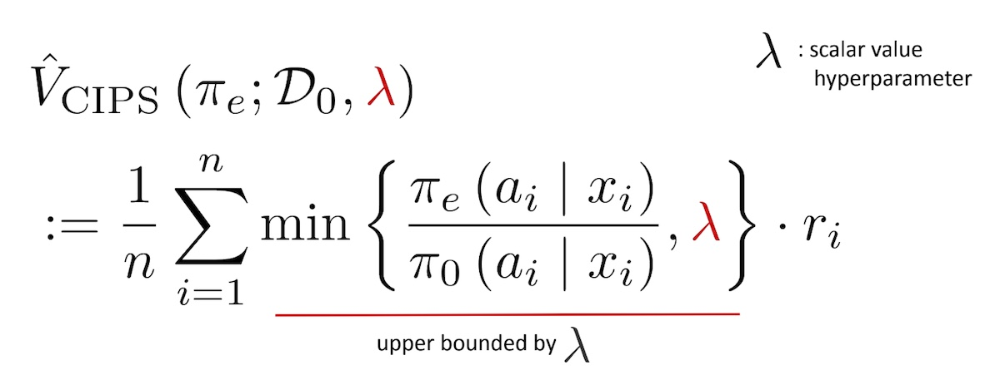
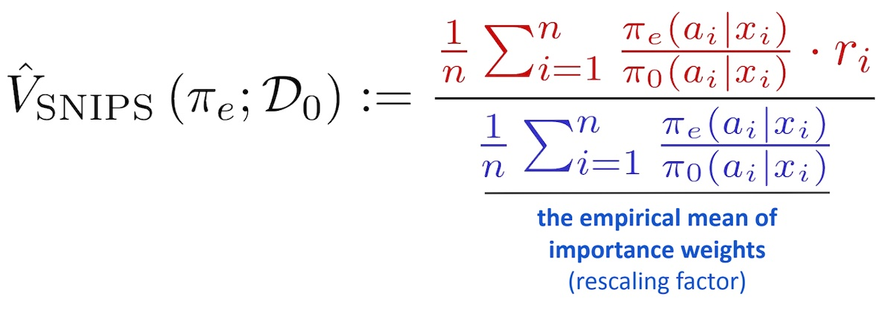
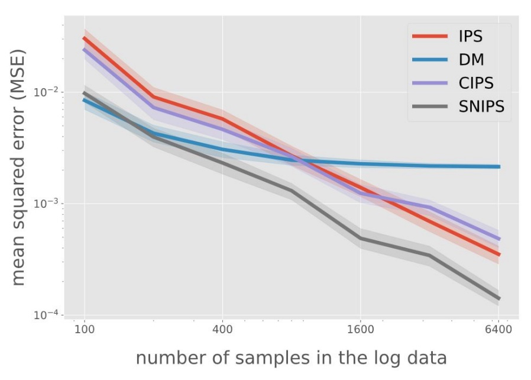

import { FigureCaption } from '../../components/figure-caption';

When I first started working on recommendation systems, I thought there was something weird about the way we did offline evaluation. First, we split customer interaction data into training and validation sets. Then, we train our recommenders on the training set before evaluating them on the validation set, usually on metrics such as recall, precision, and NDCG. This is similar to how we evaluate supervised machine learning models and doesn't seem unusual at first glance.

But don't our recommendations change how customers click or purchase? If customers can only interact with items shown to them, why do we perform offline evaluation on static historical data?

## Observational vs. interventional problems

It took me a while to put a finger on it but I think this is why it felt weird: We're treating recommendations as an [observational problem when it really is an interventional problem](https://www.cff.org/interventional-versus-observational-studies-whats-difference).

Problems solved via supervised machine learning are usually observational problems. Given an observation such as product title, description, and image, we try to predict the product category. Our model learns _P(category=phone\|title=“…”, description=“…”, image=image01.jpeg)_.

On the other hand, recommendations are an interventional problem. We want to learn how different interventions (i.e., item recommendations) lead to different outcomes (i.e., clicks, purchases). By using logged customer interaction data as labels, the observational offline evaluation approach ignores the interventional nature of recommendations. 

As a result, we're not evaluating if users would click or purchase more due to our new recommendations; we're evaluating how well the new recommendations fit logged data. Thus, what our model learns is _P(view3=iphone\|view1=pixel, view2=galaxy)_ when what we really want is _P(click=True\|recommend=iphone, view1=pixel, view2=galaxy)_.

## Evaluating recsys as an interventional problem

The straightforward way to evaluate recommendations as an interventional problem is via A/B testing. Our interventions (i.e., new recommendations) are shown to users, we log their behavior attributed to our new recommendations, and then measure how metrics such as click-thru-rate and conversion change. However, it requires more effort relative to offline evaluation, experiment cycles may be long as we need enough data to make a judgement, and there's the risk of deploying terrible experiments. Also, we may not have easy access to A/B testing we're working on the research side of things.

The less direct approach is **[counterfactual](https://en.wikipedia.org/wiki/Impact_evaluation) [evaluation](https://sites.google.com/cornell.edu/recsys2021tutorial)**. Counterfactual evaluation tries to answer “what would have happened if we show users our new recommendations instead of the existing recommendations?” This allows us to estimate the outcomes of potential A/B tests without actually running them.

The most widely known technique for counterfactual evaluation is [Inverse Propensity Scoring (IPS)](https://academic.oup.com/biomet/article/70/1/41/240879). It's sometimes also referred to as inverse probability weighting/sampling. The intuition behind it is that we can estimate how customer interactions will change—by reweighting how often each interaction will occur—based on how much more (or less) each item is shown by our new recommendation model. Here's the IPS equation.

<FigureCaption caption="Breakdown of the Inverse Propensity Score estimator"/>

Let's try to understand it by starting from the right. In section 1, `r` represents the reward for an observation. This is the number of clicks or purchases or whatever metric is important to you in the logged data. 

Next is the **importance weight**. The denominator (section 2a) represents our existing production recommender's (`π0`) probability of making a recommendation (aka _action_ `a`) given the context `x`; the numerator (section 2b) represents the same probability but for our new recommender (`πe`). (`π` stands for recommendation _policy_.) For a user-to-item recommender, `x` is the user; for an item-to-item recommender, `x` is an item.

With the importance weight, we can compute how often a recommendation is made via the new model relative to the existing model. We can then use the ratio to update our logged rewards. For example, we have an old model (`π0`) and new model (`πe`) that recommend iPhone on the Pixel detail page, but with different probabilities: 
- _π0(recommend=iPhone\|view=Pixel)_ = 0.4
- _πe(recommend=iPhone\|view=Pixel)_ = 0.6

In this scenario, the new model will recommend iPhone 0.6/0.4 = 1.5x as often as the old model. Thus, assuming a non-zero reward (i.e., the user clicked or purchased), we can reweight the logged reward to be worth 1.5x as much.

Finally, we average over our data (section 3) to get the IPS estimate (section 4) for our new recommender. This IPS estimate suggests how much reward (i.e., clicks, purchases) the new recommender would get relative to the production recommender if the new recommender was shown to users.

But how do we get the probability of making a recommendation (`a`) given the context (`x`)? Well, we can normalize the raw scores for each recommendation (via [Plackett-Luce](https://en.wikipedia.org/wiki/Discrete_choice#J._Exploded_logit)) to get each recommendation's probability. Alternatively, if our recommendations are pre-computed, we can count the frequency of each recommendation in our recommendation store. My preferred approach is to use the impression count for each recommendation—I believe this is the most direct measure of the probability of making a recommendation and best adjusts for the presentation bias. 

This dependence on recommendation probabilities or impressions likely explains why counterfactual evaluation isn't more widely adopted in academic papers—most public datasets don't include them. One exception is the [Open Bandit Dataset](https://github.com/st-tech/zr-obp/tree/master/obd) which includes the recommendation probability (`action_prob`) for each recommendation observation.

<FigureCaption caption="Sample rows in the Open Bandit Pipeline with the action probabilities"/>

However, IPS has its pitfalls. One challenge is [**insufficient support**](https://arxiv.org/abs/2006.09438). This happens when our new recommender being evaluated (`πe`) makes a recommendation (`a`) that our existing production recommender (`π0`) didn't make. Thus, `π0`'s probability of `a` is zero and we can't compute the importance weight. We can mitigate this by deliberately showing random samples of non-recommended items on a sliver of traffic to log interactions for potential recommendations. (Spoiler: PMs might not like this.) A more palatable approach is ensure that all eligible items have a non-zero recommendation probability and then sample based on that probability. This gives all items a chance to be recommended. 

IPS can also suffer from **high variance** when the new model (`πe`) recommends very differently from the old model (`π0`). Suppose `π0` makes a recommendation (`a`) with a probability of 0.001 and we logged a single click. If `πe` makes the same recommendation (`a`) with a probability of 0.1, we would reweight that single click by 100x—this is likely a severe overestimation. One solution is to ensure that the new recommenders being evaluated don't differ too much from the production recommender, thus preventing the importance weight from exploding.

Another solution is [Clipped IPS (CIPS)](https://jmlr.org/papers/v16/swaminathan15a.html). CIPS lets us set a maximum threshold for the importance weight. For example, if our threshold is 10, an importance weight greater than 10 is clipped to it. However, tuning the clipping parameter can be tricky.

<FigureCaption caption="Clipped Inverse Propensity Score"/>

Another approach is [Self-Normalized IPS (SNIPS)](https://papers.nips.cc/paper/2015/hash/39027dfad5138c9ca0c474d71db915c3-Abstract.html). SNIPS divides the IPS estimate by the importance weight. This rescaling prevents overinflated IPS estimates. Relative to CIPS, SNIPS is simpler and doesn't require setting a parameter.

<FigureCaption caption="Self-normalized Inverse Propensity Score"/>

Which works better? At a recent [RecSys 2021 tutorial](https://sites.google.com/cornell.edu/recsys2021tutorial), Yuta Saito compared various methods via experiments on synthetic data [generated via Open Bandit Pipeline](https://github.com/usaito/recsys2021-tutorial/blob/main/simulations/evaluation-of-ope-1.ipynb) with 10 possible actions. He also assessed the direct method (DM) which we didn't discuss. In a nutshell, DM trains a model to impute missing rewards. Think of it as similar to building an environment model for reinforcement learning, such as [OpenAI gym](https://github.com/openai/gym) or [Criteo reco-gym](https://github.com/criteo-research/reco-gym), which we can then use to train and evaluate our RL models.

<FigureCaption caption="Comparing various IPS estimators and the Direct Method" source="https://sites.google.com/cornell.edu/recsys2021tutorial"/>

He found that IPS outperformed DM as the amount of logged data increases, and that CIPS didn't perform much better than IPS. Overall, SNIPS performed the best (i.e., had the least error) and without the need for any parameter tuning. The [tutorial](https://sites.google.com/cornell.edu/recsys2021tutorial) goes on to discuss other estimators such as Doubly Robust (combining DM and SNIPS) as well as counterfactual learning—highly recommend checking it out.

Nonetheless, one downside of SNIPS is that it requires computing the importance weight for _all_ observations; in IPS, we only need the importance weight for observations with non-zero reward. If we consider how most recommendations have zero reward (<10% CTR or conversion), SNIPS increases storage requirements of recommendation probabilities and computation of importance weights by 10x or more. That said, the authors of SNIPS found that the [increase in computation is made up for via faster convergence](https://papers.nips.cc/paper/2015/hash/39027dfad5138c9ca0c474d71db915c3-Abstract.html). 

## Another tool in our recsys evaluation toolbox

Let me conclude by clarifying that I'm not suggesting for us to stop training and evaluating recsys models via the observational paradigm. Despite its limitations, it has several benefits. First, it's an established evaluation framework with many public datasets and standard metrics. This makes it easier to compare various techniques. Second, we can collect training and evaluation data even before deploying our first recommender. Customer interaction data is generated organically when customers use our platforms. Thus, the conventional offline evaluation approach is a good place to start.

Nonetheless, if you're keen to try a new evaluation approach, or find your offline metrics diverging from online A/B testing outcomes, consider counterfactual evaluation via SNIPS. In addition, though I've been discussing counterfactual evaluation in the context of recsys, it's also applicable to other use cases where you want to simulate A/B tests offline.

## References
- [The Central Role of Propensity in Observational Studies for Causal Effects](https://academic.oup.com/biomet/article/70/1/41/240879?login=false) (IPS)
- [Batch Learning from Logged Bandit Feedback through Counterfactual Risk Minimization](https://jmlr.org/papers/v16/swaminathan15a.html) (CIPS)
- [The Self-Normalized Estimator for Counterfactual Learning](https://papers.nips.cc/paper/2015/hash/39027dfad5138c9ca0c474d71db915c3-Abstract.html) (SNIPS)
- [SIGIR 2016 Tutorial on Counterfactual Evaluation and Learning](https://www.cs.cornell.edu/~adith/CfactSIGIR2016/)
- [RecSys2021 Tutorial Counterfactual Learning and Evaluation](https://sites.google.com/cornell.edu/recsys2021tutorial)
- [Open Bandit Pipeline: A Research Framework for Off-Policy Evaluation & Learning](https://github.com/st-tech/zr-obp)
- [Simulating A/B tests offline with counterfactual inference](https://abhadury.com/articles/2019-05/simulating-ab-tests)