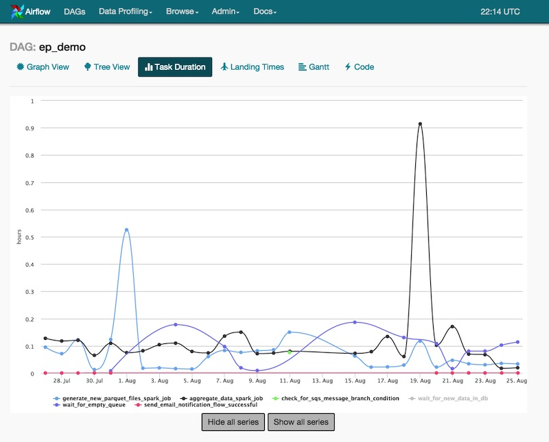

import { FigureCaption } from '../../components/figure-caption';

In the past year or two, many companies have shared their data discovery platforms (the latest being [Facebook’s Nemo](https://engineering.fb.com/data-infrastructure/nemo/)). Based on this [list](https://github.com/eugeneyan/applied-ml#data-discovery), we now know of more than 10 implementations.

After reading this write-up, you’ll learn about the key features that solve 80% of data discoverability problems. We’ll also see how the platforms compare on these features, and take a closer look at open source solutions available.

## Questions we ask in the data discovery process

Before discussing platform features, let’s briefly go over some common questions in the data discovery process.

**Where can I find data about ____?** If we don’t know the right terms, this is especially challenging. For user browsing behavior, do we search for “click”, “page views”, or “browse”? A common solution is free-text search on table names and even columns. (We’ll see how Nemo improves on this in the next section.)

**What is the data about?** What columns does the data have? What are the data types? What do they mean? Displaying table schemas and column descriptions go a long way here.

**Who can I ask for access?** Ownership and how to get permissions should be part of the metadata displayed for each table.

**How is the data created? Can I trust it?** Before using the data in production, we’ll want to ensure its reliability and quality. Who’s creating the data? Is it a scheduled data cleaning pipeline? Or does an analyst manually run it for monthly reporting? Also, how widely is the data used? Displaying usage statistics and [data lineage](https://en.wikipedia.org/wiki/Data_lineage) helps with this. 

**How should I use the data?** Which columns are relevant? What tables should I join on? What filters should I apply to clean the data? To address this, one way is to display the most frequent users of each table so people can ask them. Alternatively, we can provide statistics on column usage.

**How frequently does the data refresh?** If delays are common, what is the extent of it? Stale data can reduce the effectiveness of time-sensitive machine learning systems. Also, what is the period of data? If the table is only a few weeks old, we won’t have enough for machine learning. A simple solution is to show table creation dates, partition dates, and when it was last updated.

## Features to find, understand, and use data

The features of data discovery platforms can be grouped into the various stages of data discovery. First, identifying the right data. Then, learning and assessing the suitability of the data. Last, figuring out how to use it.

### Finding via free-text search or other smarter ways

How do we help users find the data they need? All data discovery platforms **allow users to search** for table names that contain a specified term. Some go beyond that by also searching column names, table and column descriptions, and user-input description and comments. This is usually implemented by indexing the metadata in Elasticsearch.

Assuming we have many search results, how should we rank them? For [Lyft](https://eng.lyft.com/amundsen-lyfts-data-discovery-metadata-engine-62d27254fbb9#ebfe) and [Spotify](https://engineering.atspotify.com/2020/02/27/how-we-improved-data-discovery-for-data-scientists-at-spotify/), ranking based on popularity (i.e., table usage) was a simple and effective solution. While not always correlated, widely used tables tend to relevant, better maintained, and more production worthy. This is implemented by parsing query logs for table usage and adding it to Elasticsearch documents (i.e., tables) for ranking.

Facebook’s [Nemo](https://engineering.fb.com/data-infrastructure/nemo/) takes it further. First, search terms are parsed with a [spaCy](https://spacy.io)-based library. Then, table candidates are generated via [Unicorn](https://research.fb.com/publications/unicorn-a-system-for-searching-the-social-graph/), the same infra they use for scalable search on the social graph. Finally, candidates are ranked based on social signals (e.g., table users) and other features such as kNN-based scoring. Taken together, this gives Nemo the ability to parse natural language queries. 


<FigureCaption caption="Nemo's search architecture; don't expect this in other platforms" source="https://engineering.fb.com/data-infrastructure/nemo/" />

While seldom mentioned, **another way to help users find data is via recommendations**. This is usually on the home page. Recommendations can be based on popular tables within the organization and team, or tables recently queried by the user. New, “golden” datasets by data publishers can also be recommended to raise awareness. 20% of monthly active users used homepage recommendations when Spotify implemented this.

### Understanding via schemas, previews, statistics, lineage

As users browse through tables, how can we help them quickly understand the data? To address this, most platforms **display the data schema**, including column names, data types, and descriptions.

If the user has read permissions, we can also provide a **preview of the data** (100 rows). Pre-computed column-level statistics can also be made available. They include:
- All columns: Counts and proportion of null values
- Numerical columns: Min, max, mean, median, standard deviation
- Categorical columns: Number of distinct values, top values by proportion
- Date columns: Range of dates in the data


<FigureCaption caption="Column statistics in Amundsen" source="https://eng.lyft.com/amundsen-lyfts-data-discovery-metadata-engine-62d27254fbb9" />

**Providing data lineage** also helps users learn about upstream dependencies. ETL jobs (e.g., scheduled via Airflow) can be linked to let users inspect scheduling and delays. This is helpful when evaluating data sources for production.

### Learning how to use via other user behavior

After users have found the tables, how can we help them get started? A simple way is to **show people associated with the table**. Owners can help with granting permission. Frequent users can help with a walk-through of the data and its idiosyncrasies. (Lyft’s and LinkedIn’s platforms include people as an entity that can be attached to a table). 

However, the availability of such gurus can be a bottleneck. A more scalable approach is to attach additional metadata to the table itself. 

To help users find the most relevant columns, we can provide **column usage statistics** for each table. Also, users will need to learn which tables to join on. Providing a list of mostly **commonly joined tables**, as well as the joining columns, can help with this. Getting such data requires query log parsing.

To give users even greater detail on how the data is used, we can provide **recent queries** on the table. Users can then examine how others are cleaning (which columns to apply `IS NOT NULL` on) and filtering (how to filter on product category). This makes tribal knowledge more accessible. Spotify’s platform displays this, together with columns usage statistics and commonly joined tables.

Another useful feature is **data lineage**. This helps users learn about downstream tables that consume the current table, and perhaps the queries creating them. Users can learn how queries are adapted for different uses cases (i.e., tables) and reach out to downstream users to learn more. They might also find downstream tables that fully meet their requirements and use them directly. This reduces compute and storage costs. Several platforms support lineage, including Twitter’s [Data Access Layer](https://blog.twitter.com/engineering/en_us/topics/insights/2016/discovery-and-consumption-of-analytics-data-at-twitter.html), Uber’s [Databook](https://eng.uber.com/databook/), and Netflix’s [Metacat](https://netflixtechblog.com/metacat-making-big-data-discoverable-and-meaningful-at-netflix-56fb36a53520).

Before using the data in production, users will want to know how frequently it’s updated. Indicating **how the data is partitioned** by time (e.g., day, hour) can help. Alternatively, data discovery platforms can integrate with an orchestrator like Airflow. Users can then examine scheduled ETL jobs and the time taken for them to complete. Lyft’s Amundsen has Airflow integration through I’m uncertain about the extent of it.


<FigureCaption caption="Task durations on Airflow" source="https://www.agari.com/email-security-blog/airflow-agari/" />

## High-level comparison across features

I’ve compiled a high level comparison based on publicly available information. (Note: This is likely to be incomplete; please [reach out](https://twitter.com/eugeneyan) if you have additional information!) A few observations:
- All platforms have free-text search (via Elasticsearch or Solr). Only Amundsen (Lyft) and Lexikon (Spotify) include recommendations on the home page.
- All platforms show basic table information (i.e., schema, description). Amundsen (Lyft) and Databook (Uber) include data previews and column statistics. 
- Most platforms have data lineage built-in. A notable exception is Amundsen. Nonetheless, native data lineage is a priority in the [2020 roadmap](https://www.amundsen.io/amundsen/roadmap/).
-  Five platforms are open-sourced (we’ll discuss them below). Nonetheless, [Spotify has shared about Lexicon](https://engineering.atspotify.com/2020/02/27/how-we-improved-data-discovery-for-data-scientists-at-spotify/) in great detail with a focus on product features. Maybe it’ll be open-sourced soon?


```bash
|                             | Search | Recommendations | Schemas & Description | Data Preview | Column Statistics | Space/cost metrics | Ownership | Top Users | Lineage | Change Notification | Open Source | Documentation | Supported Sources                                      | Push or Pull |
|-----------------------------|--------|-----------------|-----------------------|--------------|-------------------|--------------------|-----------|-----------|---------|---------------------|-------------|---------------|-------------------------------------------------------|--------------|
| Amundsen (Lyft)             | ✔      | ✔               | ✔                     | ✔            | ✔                 |                    | ✔         | ✔         | Todo    |                     | ✔           | ✔             | Hive, Redshift, Druit, RDBMS, Presto, Snowflake, etc.  | Pull         |
| Datahub (LinkedIn)          | ✔      |                 | ✔                     |              |                   |                    | ✔         | ✔         | ✔       |                     | ✔           | ✔             | Hive, Kafka, RDBMS                                    | Push         |
| Metacat (Netflix)            | ✔      |                 | ✔                     |              | ✔                 | ✔                  |           | Todo      |         | Todo                | ✔           |               | Hive, RDS, Teradata, Redshift, S3, Cassandra          |              |
| Atlas (Apache)              | ✔      |                 | ✔                     |              |                   |                    |           |           | ✔       | ✔                   | ✔           | ✔             | HBase, Hive, Sqoop, Kafka, Storm                      | Push         |
| Marquez (Wework             | ✔      |                 | ✔                     |              |                   |                    |           |           | ✔       |                     | ✔           |               | S3, Kafka                                             |              |
| Databook (Uber)             | ✔      |                 | ✔                     | ✔            | ✔                 |                    |           |           | ✔       |                     |             |               | Hive, Vertica, MySQL, Postgress, Cassandra            |              |
| Dataportal (Airbnb)         | ✔      |                 | ✔                     |              | ✔                 |                    | ✔         | ✔         |         |                     |             |               | Unknown                                               |              |
| Data Access Layer (Twitter) | ✔      |                 | ✔                     |              |                   |                    |           |           | ✔       |                     |             |               | HDFS, Vertica, MySQL                                  |              |
| Lexikon (Spotify)           | ✔      | ✔               | ✔                     |              |                   |                    | ✔         | ✔         |         |                     |             |               | Unknown                                               |              |
```

## Assessing five open source solutions

### DataHub (LinkedIn)
  
LinkedIn’s DataHub started as [WhereHows](https://engineering.linkedin.com/blog/2016/03/open-sourcing-wherehows--a-data-discovery-and-lineage-portal) (released in 2016). Since then, WhereHows has been re-architected (based on the [lessons](https://engineering.linkedin.com/blog/2019/data-hub) they’ve learned) into DataHub. In the process, the monolithic WhereHows has been broken into two stacks: a modular UI frontend and a generalized metadata backend. DataHub was officially released on GitHub in [Feb 2020](https://engineering.linkedin.com/blog/2020/open-sourcing-datahub--linkedins-metadata-search-and-discovery-p) and can be found [here](https://github.com/linkedin/datahub).

DataHub has all the essential features including search, table schemas, ownership, and lineage. While WhereHows cataloged metadata data around a single entity (datasets), DataHub provides additional support for [users and groups](https://github.com/linkedin/datahub/blob/master/docs/how/entity-onboarding.md), with more entities (e.g., jobs, dashboards) [coming soon](https://github.com/linkedin/datahub/blob/master/docs/features.md#data-constructs-entities). It has good [documentation](https://github.com/linkedin/datahub#documentation) and can be [tested locally via docker](https://github.com/linkedin/datahub/tree/master/docker).


<FigureCaption caption="Ownership types on DataHub" source="https://engineering.linkedin.com/blog/2019/data-hub" />

The open-source version supports metadata from Hive, Kafka, and relational databases. The internal version has support for additional [data sources](https://engineering.linkedin.com/blog/2020/open-sourcing-datahub--linkedins-metadata-search-and-discovery-p) and more connectors might be made available publicly. 
  
Given the maturity of DataHub, it’s no wonder that it has been [adopted](https://github.com/linkedin/datahub#adoption) at nearly 10 organizations include Expedia, Saxobank, ad Typeform. Also, 20+ other organizations are building a POC or evaluating the use of DataHub.

### Amundsen (Lyft)

Lyft wrote about Amundsen in [April 2019](https://eng.lyft.com/amundsen-lyfts-data-discovery-metadata-engine-62d27254fbb9) and open-sourced it in [Oct that year](https://eng.lyft.com/open-sourcing-amundsen-a-data-discovery-and-metadata-platform-2282bb436234). Nonetheless, the [code](https://github.com/amundsen-io/amundsen) has been available since Feb 2019 as part of the open-source soft launch. Since then, Amundsen has been working with early adopter organizations such as ING and Square. 

Amundsen helps us find data via search (with popularity ranking) and recommendations (via the home page). Table detail pages are rich with information including row previews, columns statistics, owners, and frequent users (if they’re made available). While Amundsen lacks native data lineage integration, it’s on the 2020 [roadmap](https://www.amundsen.io/amundsen/roadmap/). Other items on the roadmap including integration with a data quality system ([Great Expectations](https://github.com/great-expectations/great_expectations) perhaps?), improving search ranking, and displaying commonly joined tables.


<FigureCaption caption="Amundsen's detail page" source="https://github.com/amundsen-io/amundsen/" />

Since its release, an amazing community has gathered around Amundsen. The community has contributed valuable features such as extractors for BigQuery and Redshift, integration with Apache Atlas, and markdown support for the UI. 

Amundsen has a rich set of [integrations](https://github.com/amundsen-io/amundsen#supported-integrations). This includes connecting to over 15 types of data sources (e.g., Redshift, Cassandra, Hive, Snowflake, and various relational DBs), three dashboard connectors (e.g., Tableau), and integration with Airflow. Many of these have been contributed by the community. It also has good [documentation](https://www.amundsen.io/amundsen/) to help users get started and [test it locally](https://www.amundsen.io/amundsen/developer_guide/#testing-amundsen-frontend-locally) via Docker. 

Despite being the new kid on the block, Amundsen has been popular and is [adopted](https://github.com/amundsen-io/amundsen#who-uses-amundsen) at close to 30 organizations, including Asana, Instacart, iRobot, and Square. In July 2020, it joined the Linux AI Foundation as a [new incubation project](https://lfai.foundation/blog/2020/08/11/amundsen-joins-lf-ai-as-new-incubation-project/).

### Metacat (Netflix) 

Netflix shared about [Metacat](https://netflixtechblog.com/metacat-making-big-data-discoverable-and-meaningful-at-netflix-56fb36a53520) in Jun 2018. In addition to the usual features such as free-text search and schema details, it also includes metrics that can be used for analyzing cost and storage space. There’s also a push notification system for table and partition changes. This allows users to be notified of schema changes, or when a table is dropped so that infra can clean up the data as required.

Metacat supports integrations for Hive, Teradata, Redshift, S3, Cassandra, and RDS. In addition to data discovery, Metacat’s goal is to make data easy to process and manage. Thus the emphasis on physical storage metrics (e.g., cost) and schema change notifications. Netflix also shared that it was working on schema and metadata data versioning and metadata validation. 

While [Metacat is open source](https://github.com/Netflix/metacat), there isn’t any documentation for it (currently `TODO` on the project `README`). There’s also no information about other organizations adopting Metacat. 

### Marquez (WeWork)

WeWork shared about Marquez in [Oct 2018](https://www.datacouncil.ai/talks/marquez-a-metadata-service-for-data-abstraction-data-lineage-and-event-based-triggers), with a focus on data quality and lineage. (Additional [slides](https://www.slideshare.net/WillyLulciuc/marquez-an-open-source-metadata-service-for-ml-platforms) on Marquez). It focuses on metadata data management including data governance and health (via Great Expectations), and catalogs both datasets and jobs.

Marquez includes components for a [web UI](https://github.com/MarquezProject/marquez-web) and [Airflow](https://github.com/MarquezProject/marquez-airflow), and has clients for [Java](https://github.com/MarquezProject/marquez-java) and [Python](https://github.com/MarquezProject/marquez-python). While it’s easy to [test Marquez locally](https://github.com/MarquezProject/marquez#quickstart) via docker, there isn’t much documentation on its [website](https://marquezproject.github.io/marquez/) or [GitHub](https://github.com/MarquezProject/marquez/tree/main/docs).

### Apache Atlas (Hortonworks)

Atlas started incubation at Hortonworks in Jul 2015 as part of the Data Governance Initiative. It had engineers from Aetna, JP Morgan, Merck, SAS, etc. collaborating with Hortonworks. While initially focused on finance, healthcare, pharma, etc., it was [later extended](https://cwiki.apache.org/confluence/display/ATLAS/Atlas+Home) to address data governance issues in other industries. Atlas 1.0 was released in Jun 2018 and it’s currently on [version 2.1](https://atlas.apache.org/#/WhatsNew-2.1).

Atlas’ primary goal is data governance and helping organizations meet their security and compliance requirements. Thus, it has rich features for tagging assets (e.g., sensitive, personally identifiable information), tag propagation to downstream datasets, and security on metadata access. It also has notifications on metadata changes. For data discovery, it has free-text search, schema details, and data lineage. It also includes [advanced search](https://atlas.apache.org/#/SearchAdvance) where users can query via a syntax similar to SQL. 


<FigureCaption caption="Tag propagation on Atlas" source="https://atlas.apache.org/#/ClassificationPropagation" />  

Atlas supports integration with [metadata sources](https://atlas.apache.org/#/Architecture) such as HBase, Hive, and Kafka, with more to be added in the future. It also allows users to create and update metadata entities via REST API. [Documentation for Atlas](https://atlas.apache.org/#/) is comprehensive and the code can be found [here](https://github.com/apache/atlas).

### How other organizations have adopted these platforms

Various organizations have shared their experiences with DataHub and Amundsen. Expedia [shared](https://www.youtube.com/watch?v=ajcRdB22s5o) about evaluating both Atlas and DataHub and going into production with DataHub (the video also includes a demo). Square [shared](https://developer.squareup.com/blog/using-amundsen-to-support-user-privacy-via-metadata-collection-at-square/) how they adopted Amundsen to support user privacy.

It was particularly interesting to see how ING [adopted both Atlas and Amundsen](https://medium.com/wbaa/facilitating-data-discovery-with-apache-atlas-and-amundsen-631baa287c8b). Atlas handled metadata management, data lineage, and data quality metrics, while Amundsen focused on search and discovery. Table popularity scores were calculated via Spark on query logs to rank search results in Amundsen.


<FigureCaption caption="How ING uses both Atlas and Amundsen" source="https://medium.com/wbaa/facilitating-data-discovery-with-apache-atlas-and-amundsen-631baa287c8b" />

A few other companies shared how they evaluated various open source and commercial solutions (e.g., [SaxoBank](https://www.slideshare.net/SheetalPratik/linkedinsaxobankdataworkbench#14), [SpotHero](https://www.slideshare.net/MaggieHays/data-discoverability-at-spothero#6)). Do you know of more? Please let me know!

## Not as sexy, but a critical first step

While not as sexy as machine learning or deployment, data discovery is a crucial first step of the data science workflow. I’m glad more attention is being paid to it, and grateful for the teams open sourcing their solutions.

Is your organization struggling with data discovery? If so, take a look at Amundsen, Atlas, and DataHub. Or if you’re trying to develop one in-house, consider how your [features](#features-to-find-understand-and-use-data) will help users answer their questions.
  
How has your experience with data discovery platforms been? Would love to hear how they helped, and the challenges you faced—reply on this tweet or in the comments below!

## References
- [Amundsen — Lyft’s Data Discovery & Metadata Engine](https://eng.lyft.com/amundsen-lyfts-data-discovery-metadata-engine-62d27254fbb9)
- [Open Sourcing Amundsen: A Data Discovery & Metadata Platform](https://eng.lyft.com/open-sourcing-amundsen-a-data-discovery-and-metadata-platform-2282bb436234) ([Code](https://github.com/lyft/amundsen))
- [Amundsen: One Year Later](https://eng.lyft.com/amundsen-1-year-later-7b60bf28602)
- [Discovery and Consumption of Analytics Data at Twitter](https://blog.twitter.com/engineering/en_us/topics/insights/2016/discovery-and-consumption-of-analytics-data-at-twitter.html)
- [Democratizing Data at Airbnb](https://medium.com/airbnb-engineering/democratizing-data-at-airbnb-852d76c51770)
- [Databook: Turning Big Data into Knowledge with Metadata at Uber](https://eng.uber.com/databook/)
- [Metacat: Making Big Data Discoverable and Meaningful at Netflix](https://netflixtechblog.com/metacat-making-big-data-discoverable-and-meaningful-at-netflix-56fb36a53520) ([Code](https://github.com/Netflix/metacat))
- [DataHub: A Generalized Metadata Search & Discovery Tool](https://engineering.linkedin.com/blog/2019/data-hub) ([Code](https://github.com/linkedin/datahub))
- [How We Improved Data Discovery for Data Scientists at Spotify](https://engineering.atspotify.com/2020/02/27/how-we-improved-data-discovery-for-data-scientists-at-spotify/)
- [How We’re Solving Data Discovery Challenges at Shopify](https://engineering.shopify.com/blogs/engineering/solving-data-discovery-challenges-shopify)
- [Nemo: Data discovery at Facebook](https://engineering.fb.com/data-infrastructure/nemo/)
- [Apache Atlas: Data Goverance and Metadata Framework for Hadoop](https://atlas.apache.org/#/) ([Code](https://github.com/apache/atlas))
- [Collect, Aggregate, and Visualize a Data Ecosystem's Metadata](https://marquezproject.github.io/marquez/) ([Code](https://github.com/MarquezProject/marquez))