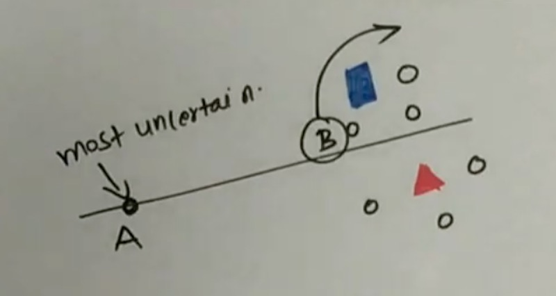
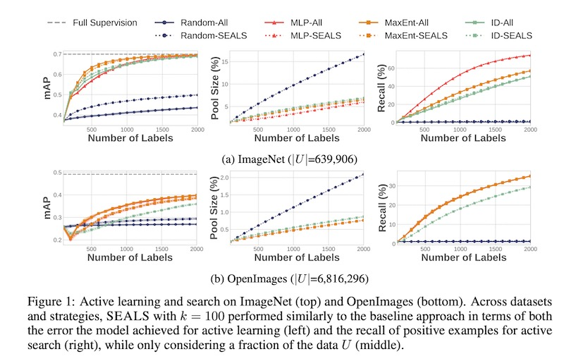
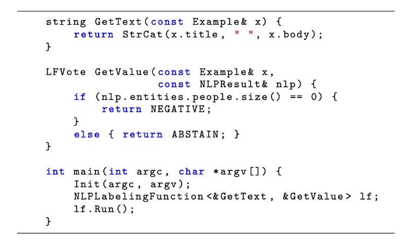
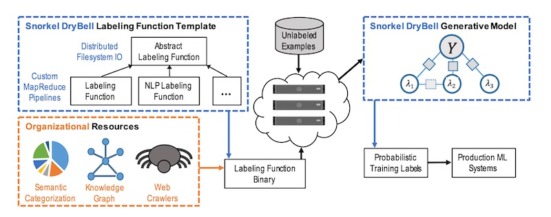

import { FigureCaption } from '../../components/figure-caption';

Most machine learning tutorials and papers assume the availability of training labels. This includes benchmark datasets such as [OpenImages](https://opensource.google/projects/open-images-dataset) or [SuperGLUE](https://super.gluebenchmark.com), or customer interaction behavior such as clicks or purchases. But what if labeled datasets are **not available?**

We would have to collect them. Collecting training labels is a seldom discussed art. Imagine you’re monitoring social media for undesirable content—how would you get labels for subtle concepts like COVID-19 misinformation, terrorism, or [cyberbullying](https://www.kaggle.com/c/jigsaw-toxic-comment-classification-challenge)? Or imagine you need to tag a corpus of book reviews to indicate if the review is about quality, pricing, or writing style—where would you begin?

In this write-up, we’ll discuss semi, active, and weakly supervised learning, and see examples of the latter two approaches from DoorDash, Facebook, Google, and Apple.

# Semi, active, and weak supervision

**In semi-supervised learning**, we combine a small amount of hand-labeled data with a larger amount of unlabeled data during training. Here’s a step-by-step:
- Train a high-precision model on labeled data
- Predict on unlabeled data
- Select the most confident predictions as pseudo-labels; add them to training data
- Train another model on labels and pseudo-labels
- Repeat until you have sufficient high confidence pseudo-labels 

I haven’t come across any papers sharing about semi-supervised learning applied in industry. Nonetheless, it’s frequently used in Kaggle competitions (e.g., pseudo-labels from the test dataset added as training data). Here’s an example of a [4th place submission](https://www.kaggle.com/c/freesound-audio-tagging-2019/discussion/96440) using semi-supervised learning on audio tagging. (Also see this Google [paper](https://arxiv.org/abs/2105.01622) on how adversaries can “poison” unlabeled samples and cause models trained via semi-supervised labels to misclassify. 

**In active learning**, we select the most “interesting” unlabeled samples for labeling via human-in-the-loop (HITL). One way to identify such samples is uncertainty sampling, where samples with the highest uncertainty in model predictions are selected. For example, if the model is a binary classifier, uncertainty sampling selects samples where the predicted probability is close to 0.5. Query-by-committee extends uncertainty sampling with multiple models—samples that models disagree on are considered the most informative and selected.

Another approach is [information density](https://dl.acm.org/doi/10.5555/1613715.1613855), where points that are most uncertain _and_ representative of the data distribution are selected. Assume we have two samples that have similar uncertainty. One has many samples close to it, while the other is an outlier. In this case, we would pick the sample that has other samples close to it. 

<FigureCaption caption="Point A has highest uncertainty but B has uncertainty & information density" source="https://www.youtube.com/watch?v=6q7c6Dlw0JI" />

**Doordash shared how they used active learning and HITL** to [overcome the cold-start problem for menu item tagging](https://doordash.engineering/2020/08/28/overcome-the-cold-start-problem-in-menu-item-tagging/). First, they **created some seed data** using a simple, high-precision classifier to select samples for annotation—samples were selected with a higher probability threshold. They also shared about using unsupervised semantic embeddings to identify ambiguous samples for annotation. Nonetheless, it’s unclear how they trained the classifier (without labeled data), or how the semantic embeddings were used to select annotation samples—if you have more details, please reach out. 

<FigureCaption caption="Doordash's workflow (automated steps in green & HITL steps in red)" source="https://doordash.engineering/2020/08/28/overcome-the-cold-start-problem-in-menu-item-tagging/" />

**Data augmentation** was then applied to the seed data by identifying unlabeled samples close to the labeled samples (in terms of edit distance and embedding cosine similarity) and added as training data. They also used random text augmentation by varying sentence order in item description and randomly remove information (e.g., menu categories). A ratio of 100 synthetic samples to one labeled sample was used for training.

**Single-layer, multi-class LSTMs with FastText word embeddings were trained for each attribute group** (e.g., regional cuisine style, flavor). Inputs included item names, menu categories, and full-text descriptions. They also tried multi-task models but found that they underperformed as sampling didn’t preserve actual tag distribution and there were too few samples to only train on labeled data. Nonetheless, as more labeled data was collected, the performance of multi-task models improved. 

**To select more samples for annotation**, they focused on precision and recall. To improve precision, they selected samples similar to those where the model prediction conflicted with the annotator label. To improve recall, they used the model to predict on the unlabeled dataset and select samples that the model had low confidence on. The selected samples were sent to Mechanical Turk for a first pass; the more ambiguous samples were then sent to professional annotators for a second pass.

The primary metric used in **label verification** was cross-rater agreement. Nonetheless, they also measured annotation agreement between different vendors to assess for systematic bias. In addition, they used annotated samples to build a small set of “golden” data which had high-confidence labels. Then, when onboarding new annotators, they mixed in the golden data to check if the baseline precision met their requirements.

**Facebook added a twist to active learning by including similarity search as a filter** ([Similarity Search for Efficient Active Learning and Search](https://arxiv.org/abs/2007.00077) aka SEALS). They shared that, data is often heavily skewed, with only a small fraction of the data being relevant (ie., 1 in 1,000 or more). Thus, they use nearest neighbors on positive labels before active learning. Using nearest neighbors as a filter reduces the number of unlabeled samples to consider in the active learning step and increases annotation efficiency. 

<FigureCaption caption="Nearest neighbors allowed similar performance with 2 - 15% of data" source="https://arxiv.org/abs/2007.00077" />

**Weak supervision blends knowledge from multiple data sources to get lower quality labels, albeit more efficiently.** Sources include labeling functions that formalize heuristics via regex or aggregated statistics (i.e., data programming), or existing resources such as knowledge bases, alternative datasets, or pre-trained models. While labels from weak supervision may not be as accurate as hand-labeled data, they’re good enough to obtain decent performance. 

**Google shared how they applied [weak supervision via Snorkel DryBell](https://arxiv.org/abs/1812.00417).** It uses labeling functions that take in data points and either return a label or abstain. Labeling functions can be used to operationalize heuristics about the data source or content. They can also be based on internal models (e.g., internally developed topic models, named-entity recognizers) or graphs (e.g., user knowledge or entity graphs to derive labels). Here’s an example labeling function template. 

<FigureCaption caption="Template labeling function written in C++" source="https://arxiv.org/abs/1812.00417" />

Then, a generative model is used to estimate the accuracies of the various functions based on their observed agreements and disagreements. These accuracies are then used to re-weight and combine labels across labeling functions. 

Here’s an overview of Snorkel DryBell. Developers write labeling functions based on heuristics, existing models (e.g., internal NLP, topic models), or organization resources (e.g., knowledge graphs). Snorkel DryBell then applies these labeling functions on unlabeled examples before loading the output and labeling functions into a generative model. The model then combines them and returns probabilistic labels for use in production systems. 

<FigureCaption caption="An overview of Snorkel Drybell outline (in dashed blue lines)" source="https://arxiv.org/abs/1812.00417" />

It was adopted in two use cases, one for topic classification and one for product classification. For topic classification, a developer wrote 10 labeling functions to apply heuristics based on the linked URL (URL-based), custom named-entity recognition models (NER-tagger-based), and internal topic models (topic model-based). For product classification, they used eight labeling functions based on keywords in the content (keyword-based), translations of keywords in 10 languages via the knowledge graph (graph-based), and semantic models to identify content unrelated to product categories of interest (model-based).

In both cases, Snorkel DryBell had higher predicted accuracy than data trained directly on a small, hand-labeled development set (which was also used to formulate labeling functions, hyperparameter tuning, etc.) To match the performance of Snorkel DryBell, it required 80k hand-labeled samples for topic classification and 12k hand-labeled samples for product classification. 

**Apple also shared a similar system ([Overton](https://arxiv.org/abs/1909.05372)).** When new features are created or quality bugs are identified, engineers can provide additional supervision via data programming or other heuristics. Lineage for each source of information is also tracked. They also shared that there are production systems with no traditional supervised training data, which is important for privacy-conscious applications. 

There are also other examples of weak supervision in the wild, such as IBM’s [bootstrapping of conversational agents](https://arxiv.org/abs/1812.06176) and Intel’s [weak supervision on imbalanced extraction problems](https://dl.acm.org/doi/abs/10.1145/3329486.3329492). Facebook also shared about [dialogue learning with human-in-the-loop](https://arxiv.org/abs/1611.09823).

## Other important points

An under-appreciated aspect of gathering labeled data is defining labeling guidelines. While tasks such as labeling porn or hate speech might be relatively straightforward, how would you define labeling guidelines for COVID-19 misinformation? It might blend truth about COVID-19 with misinformation about vaccines, or could be nuanced with sarcasm. Even Tesla, which probably has one of the most sophisticated data labeling systems to support Autopilot, hasn’t worked out all the kinks.

<blockquote class="twitter-tweet">
Even after 4 years I still haven&#39;t &quot;solved&quot; labeling workflows. Labeling, QA, Final QA, auto-labeling, error-spotting, diversity massaging, labeling docs + versioning, ppl training, escalations, data cleaning, throughput &amp; quality stats, eval sets + categorization &amp; boosting, ...
&mdash; Andrej Karpathy (@karpathy) <a href="https://twitter.com/karpathy/status/1413242233394929664?ref_src=twsrc%5Etfw">July 8, 2021</a></blockquote> 

DoorDash shared tips to develop good labeling guidelines for tags, such as:
- Ensure tags are mutually exclusive (i.e., no overlap): This allows annotators to move on if a sample already has a tag and reduces annotation volume.
- Partition taxonomy at the top level by distinct attributes (e.g., regional cuisine style, flavor, etc.): This allows parallelization of annotation tasks. 
- Ensure there are classes for “Other” at each level: This allows you to revisit the “Other” tags to improve granularity in the future (instead of having to go through all tags again).
- Ensure tags are objective: Tags such as “popular” or “convenient” are  subjective and can change over time.

It also helps to think beyond HITL labeling or semi/active/weak supervision. Try searching for labels creatively in the user data. If we’re trying to tag books with various attributes based on their content (e.g., Russia, Fae, etc), examine [how users organize their bookshelves](https://www.goodreads.com/blog/show/1399-goodreads-hack-how-to-create-custom-bookshelves) on GoodReads. These bookshelf names can be used as weak labels to seed tags.

Alternatively, we can start with approaches that don’t require user data. How do we build semantic search without user interaction labels? One way is to start with [lexical approaches](/resources/search-query-matching/#lexical-based-the-bedrock-of-query-processing) such as [BM25](https://en.wikipedia.org/wiki/Okapi_BM25) or whatever’s available in ElasticSearch or Solr. Once deployed, we can then collect user interaction data (e.g., clicks, purchases) on search results, which can then be used as labels for semantic search models. 

Other approaches to consider include crowdsourcing from users (e.g., thumbs up/down on recommendations or search results), synthetic data generation (e.g., [VAEs](https://en.wikipedia.org/wiki/Variational_autoencoder), [GANs](https://en.wikipedia.org/wiki/Generative_adversarial_network)), label propagation via graphs, or transfer learning using models trained on other tasks. 

## How to bootstrap labels from scratch 

In the earliest stage, we can adopt weak supervision. This can include labeling functions via keyword-based regex, statistical aggregations, knowledge graphs, user segmentation, etc. If necessary, we can apply HITL to verify the labels before using high-confidence labels to train models. 

With some seed data, we can then adopt semi-supervised learning. We can train a high precision model to predict on unlabeled samples, then add the pseudo-labels with the highest confidence to the training data. Or we can try active learning (e.g., nearest neighbors + uncertainty sampling/information density) to identify labels with the highest uncertainty for HITL before adding it to the dataset. 

Finally, in the late stage, our machine learning systems and policies would have matured. Here’s where we start to get a stream of good labels for model training, and can try more sophisticated models that require a large number of labels. These models may eventually be strong enough for auto-decision, with the lowest confidence predictions being sent to HITL for confirmation.