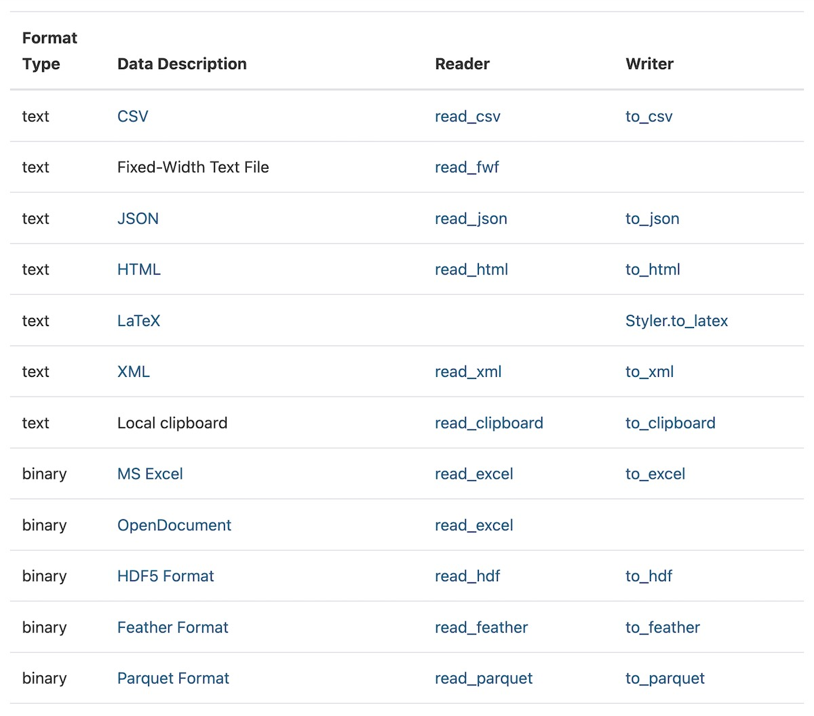
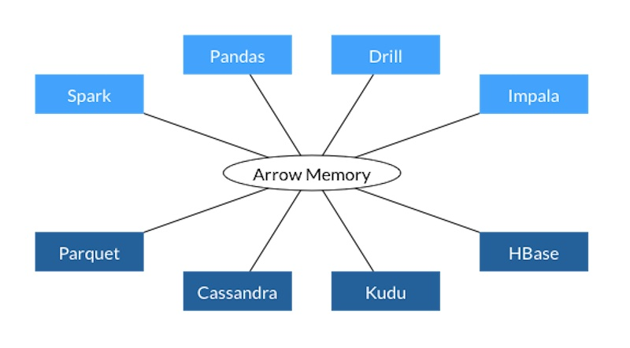
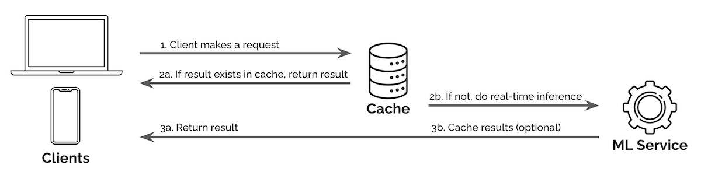
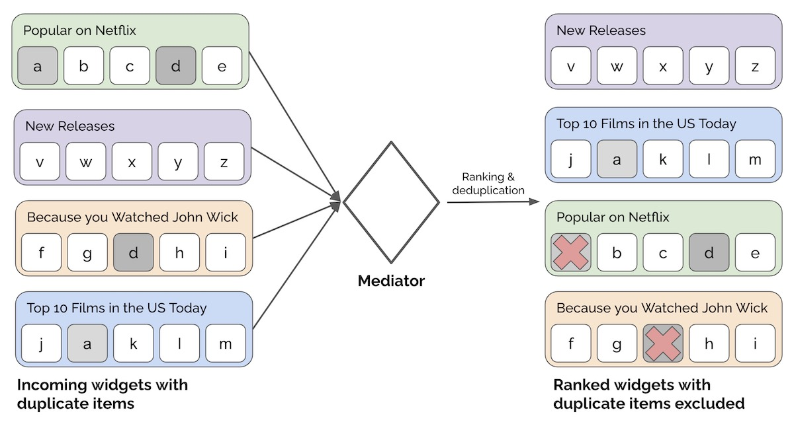

import { FigureCaption } from '../../components/figure-caption';

Design patterns are not just a way to structure code. They also communicate the problem addressed and how the code or component is intended to be used.

Here are some patterns I've observed in machine learning code and systems, mostly from the [Gang of Four design patterns book](https://en.wikipedia.org/wiki/Design_Patterns). Most developers have some familiarity with these patterns and having a basic understanding provides a shared vocabulary to discuss ideas on design and implementation.

## Design patterns in libraries and code

**The factory pattern decouples objects, such as training data, from how they are created.** Creating these objects can sometimes be complex (e.g., distributed data loaders) and providing a base factory helps users by simplifying object creation and providing constraints that prevent mistakes.

The base factory can be defined via an interface or abstract class. Then, to create a new factory, we can subclass it and provide our own implementation details.

PyTorch's [`Dataset`](https://pytorch.org/docs/stable/data.html#torch.utils.data.Dataset) is a good example. To create our own datasets, we should subclass `Dataset` and override the `__len__` and `__getitem__` methods. The former returns the size of the dataset while the latter supports indexing to get the _i_ th example. Here's an [example](https://github.com/eugeneyan/recsys-nlp-graph/blob/master/src/ml/data_loader.py#L237) of creating a custom dataset.

```python
from torch.utils.data import Dataset

class SequencesDataset(Dataset):
    def __init__(self, sequences: Sequences, neg_sample_size=5):
        self.sequences = sequences
        self.neg_sample_size = neg_sample_size

    def __len__(self):
        return self.sequences.n_sequences

    def __getitem__(self, idx):
        pairs = self.sequences.get_pairs(idx)
        neg_samples = []
        for center, context in pairs:
            neg_samples.append(self.sequences.get_negative_samples(context))

        return pairs, neg_samples
```

Gensim's [`textcorpus`](https://radimrehurek.com/gensim/corpora/textcorpus.html) is another example. It simplifies reading text files for downstream language modeling. Users need to override the `get_texts()` method to read and process a single line (or document) and return it as a sequence of words.

```python
from gensim.corpora.textcorpus import TextCorpus
from gensim.test.utils import datapath
from gensim import utils

class CorpusMiislita(TextCorpus):
    stopwords = set('for a of the and to in on'.split())
    
    def get_texts(self):
        for doc in self.getstream():
            yield [word for word in utils.to_unicode(doc).lower().split() if word not in self.stopwords]

    def __len__(self):
        self.length = sum(1 for _ in self.get_texts())
        return self.length

corpus = CorpusMiislita(datapath('head500.noblanks.cor.bz2'))
>>> len(corpus)
250
document = next(iter(corpus.get_texts()))
```

A final example is Hugging Face's [`Dataset`](https://huggingface.co/docs/datasets/loading) that doesn't require subclassing. It provides a simple way for users to load data into Apache Arrow which provides for fast lookup with low memory requirements. It also includes methods to stream, interleave, shuffle, etc.

```python
from datasets import load_dataset
from datasets import interleave_datasets

# Load as streaming = True
en_dataset = load_dataset('oscar', "unshuffled_deduplicated_en", split='train', streaming=True)
fr_dataset = load_dataset('oscar', "unshuffled_deduplicated_fr", split='train', streaming=True)

# Interleave
multilingual_dataset = interleave_datasets([en_dataset, fr_dataset])

# Shuffle
shuffled_dataset = multilingual_dataset.shuffle(seed=42, buffer_size=10_000)
```

**The adapter pattern increases compatibility between interfaces**, such as data formats like CSV, Parquet, JSON, etc. This allows objects (e.g., stored data) with incompatible interfaces to collaborate. Specific to data pipelines, adapters are often used to read data stored in different formats into a standard data object such as a Dataframe.

For example, Pandas has almost 20 adapters to [read](https://pandas.pydata.org/docs/user_guide/io.html) most file storages types into the pandas Dataframe.


<FigureCaption caption="Non-exhaustive list of adapters to read different file storage formats in Pandas"/>

Similarly, Spark has adapters to read from different data formats such as [Parquet](https://spark.apache.org/docs/latest/sql-data-sources-parquet.html), [JSON](https://spark.apache.org/docs/latest/sql-data-sources-json.html), [CSV](https://spark.apache.org/docs/latest/sql-data-sources-csv.html), [Hive](https://spark.apache.org/docs/latest/sql-data-sources-hive-tables.html), and [Text](https://spark.apache.org/docs/latest/sql-data-sources-text.html) files.

```scala
val parquetDf = spark.read.parquet("people.parquet")
val jsonDf = spark.read.json("examples/src/main/resources/people.json")
val hiveDF = sql("SELECT name, job_family FROM people WHERE age < 60 ORDER BY age")
val csvDf = spark.read.csv("examples/src/main/resources/people.csv")
val textDf = spark.read.text("examples/src/main/resources/people.txt")
```

Another example is [Apache Arrow](https://arrow.apache.org/overview/) which provides a standard columnar format across multiple data frameworks like Pandas, Spark, Parquet, Cassandra, and more. (Hugging Face's Dataset uses Arrow for its local caching system.)


<FigureCaption caption="Apache Arrow standardizes in-memory columnar data for several data frameworks"/>

**The decorator pattern allows users to easily add functionality to their existing code.** Objects can be “decorated” (aka adding functionality) at run time without having to update the structure or behavior of other objects of the same class.

In Python, decorating methods is easy via the `@` syntax. Applying `@decorator` on `method()` is equivalent to calling `method = decorator(method)`.

A handy example of a built-in operator is functool's [`lru_cache()`](https://docs.python.org/3/library/functools.html#functools.lru_cache). It saves the most recent _x_ calls in a dictionary which maps input arguments to returned results. Here's an example using cache to efficiently compute Fibonacci numbers.

```python
from functools import lru_cache

@lru_cache(maxsize=None)
def fib(n):
    if n < 2:
        return n
    return fib(n-1) + fib(n-2)

>>> [fib(n) for n in range(16)]
[0, 1, 1, 2, 3, 5, 8, 13, 21, 34, 55, 89, 144, 233, 377, 610]

>>> fib.cache_info()
CacheInfo(hits=28, misses=16, maxsize=None, currsize=16)
```

Another example is [Pytest's](https://docs.pytest.org/en/7.1.x/index.html) decorators to define [fixtures](https://docs.pytest.org/en/6.2.x/fixture.html). These fixtures can then be referenced in downstream tests. Think of fixtures as methods that generate data for testing expected behavior. These fixtures are called before running any tests and shared across tests. Here are some [examples](https://github.com/eugeneyan/testing-ml/blob/master/tests/tree/fixtures.py) of fixtures to load sample data and trained models.

```python
import pytest
import numpy as np

from src.data_prep.prep_titanic import load_df, prep_df, split_df, get_feats_and_labels
from src.tree.decision_tree import DecisionTree
from src.tree.random_forest import RandomForest

# Returns data for training and evaluating our models
@pytest.fixture
def dummy_dataset():
    df = load_df()
    df = prep_df(df)

    train, test = split_df(df)
    X_train, y_train = get_feats_and_labels(train)
    X_test, y_test = get_feats_and_labels(test)
    return X_train, y_train, X_test, y_test

# Returns a trained DecisionTree that is evaluated on implementation and behavior
@pytest.fixture
def dummy_decision_tree(dummy_dataset):
    X_train, y_train, _, _ = dummy_dataset
    dt = DecisionTree(depth_limit=5)
    dt.fit(X_train, y_train)
    return dt

# Returns a trained RandomForest that is evaluated on implementation and behavior
@pytest.fixture
def dummy_random_forest(dummy_dataset):
    X_train, y_train, _, _ = dummy_dataset
    rf = RandomForest(num_trees=8, depth_limit=5, col_subsampling=0.8, row_subsampling=0.8)
    rf.fit(X_train, y_train)
    return rf
```

A simple decorator I often use is a [timer](https://github.com/eugeneyan/testing-ml/blob/master/src/utils/timer.py) that measures how long a method call takes and returns the results. This is useful when building prototypes that call different models—with varying latencies—to check the time taken for each call.

```python
from functools import wraps
from time import perf_counter
from typing import Callable
from typing import Tuple

def timer(func: Callable) -> Callable:
    @wraps(func)
    def wrapper(*args, **kwargs):
        start = perf_counter()
        results = func(*args, **kwargs)
        end = perf_counter()
        run_time = end - start
        return results, run_time

    return wrapper

@timer
def predict_with_time(model, X_test: np.array) -> Tuple[np.array]:
    return model.predict(X_test)
```

**The strategy pattern lets users change the intended behavior or algorithm of an object.** Users can create new objects for each strategy (aka algorithm) and depending on the strategy object used, the context behavior can vary at runtime. This decouples algorithms from clients, adding flexibility and reusability to the code.

Most machine learning libraries come with builtin algorithms and settings. Nonetheless, they also provide the flexibility for users to add their own algorithms so long as it adheres to the strategy interface.

For example, XGBoost provides [various methods](https://xgboost.readthedocs.io/en/stable/treemethod.html) to construct trees (e.g., exact, approx, hist, gpu\_hist) and several [objective functions](https://xgboost.readthedocs.io/en/stable/parameter.html#learning-task-parameters) such as squared error, logistic, and pairwise ranking. Nonetheless, we can also provide a [custom objective function](https://xgboost.readthedocs.io/en/stable/tutorials/custom_metric_obj.html#customized-objective-function) if we want to, such as the squared log error example below.

```python
import numpy as np
import xgboost as xgb
from typing import Tuple

def gradient(predt: np.ndarray, dtrain: xgb.DMatrix) -> np.ndarray:
    y = dtrain.get_label()
    return (np.log1p(predt) - np.log1p(y)) / (predt + 1)

def hessian(predt: np.ndarray, dtrain: xgb.DMatrix) -> np.ndarray:
    y = dtrain.get_label()
    return ((-np.log1p(predt) + np.log1p(y) + 1) / np.power(predt + 1, 2))

def squared_log(predt: np.ndarray, dtrain: xgb.DMatrix) -> Tuple[np.ndarray, np.ndarray]:
    predt[predt < -1] = -1 + 1e-6
    grad = gradient(predt, dtrain)
    hess = hessian(predt, dtrain)
    return grad, hess

xgb.train({'tree_method': 'hist', 'seed': 1994},
           dtrain=dtrain,
           num_boost_round=10,
           obj=squared_log)  # Using the custom objective function
```

Similarly, Hugging Face's [pipeline](https://huggingface.co/docs/transformers/main_classes/pipelines) makes it easy to use various strategies (aka language models) for inference. Pipelines supports tasks such as sentiment analysis, translation, question answering, and more.

```python
from transformers import pipeline

pipe = pipeline("sentiment-analysis")
>>> pipe(["This restaurant is awesome", "This restaurant is aweful"])
[{'label': 'POSITIVE', 'score': 0.9998743534088135},
 {'label': 'NEGATIVE', 'score': 0.9996669292449951}]

en_fr_translator = pipeline("translation_en_to_fr")
>>> en_fr_translator("How old are you?")
[{'translation_text': ' quel âge êtes-vous?'}]

qa_model = pipeline("question-answering")
question = "Where do I live?"
context = "My name is Merve and I live in İstanbul."
>>> qa_model(question = question, context = context)
{'answer': 'İstanbul', 'end': 39, 'score': 0.953, 'start': 31}
```

**The iterator pattern provides a way to go through objects in a collection of objects.** This decouples the traversal algorithm from the data container and users can define their own algorithm. For example, if we have data in a tree, we might want to swap between breadth-first and depth-first traversal.

An example is PyTorch's [`DataLoader`](https://pytorch.org/docs/stable/data.html#torch.utils.data.DataLoader) which lets users define batch size, shuffling, number of workers, and even provide custom [collate functions](https://pytorch.org/docs/stable/data.html#working-with-collate-fn). 

```python
from torch.utils.data import DataLoader

dataset = SequencesDataset(sequences)

def collate(batches):
    batch_list = []

    for batch in batches:
        pairs = np.array(batch[0])
        negs = np.array(batch[1])
        negs = np.vstack((pairs[:, 0].repeat(negs.shape[1]), negs.ravel())).T

        pairs_arr = np.ones((pairs.shape[0], pairs.shape[1] + 1), dtype=int)
        pairs_arr[:, :-1] = pairs

        negs_arr = np.zeros((negs.shape[0], negs.shape[1] + 1), dtype=int)
        negs_arr[:, :-1] = negs

        all_arr = np.vstack((pairs_arr, negs_arr))
        batch_list.append(all_arr)

    batch_array = np.vstack(batch_list)

    # Return item1, item2, label
    return (torch.LongTensor(batch_array[:, 0]), torch.LongTensor(batch_array[:, 1]),
            torch.FloatTensor(batch_array[:, 2]))

# We can customize the batch size, number of works, shuffle, etc.
train_dataloader = DataLoader(dataset, batch_size=128, shuffle=True, num_workers=8, collate_fn=collate)
```

**The pipeline pattern lets users chain a sequence of transformations.** Transforms are steps to process the data, such as data cleaning, feature engineering, dimensionality reduction, etc. An estimator (aka machine learning model) can be added to the end of the pipeline. Thus, the pipeline takes data as input, transforms it, and trains a model at the end.

IMHO, in ML pipelines, everything from data preparation to feature engineering to model hyperparameters is a parameter to tune. Being able to chain and vary transforms and estimators makes for convenient pipeline parameter tuning. How would model metrics change if we `np.log` continuous variables or add trigrams to our text features?

When using a pipeline, we should be aware that the input and output of each transform step should have a standardized format, such as a Pandas Dataframe. Also, each transform should have the required methods such as `.fit()` and `.transform()`.

Sklearn's [`Pipeline`](https://scikit-learn.org/stable/modules/generated/sklearn.pipeline.Pipeline.html) allows users to provide a list of transforms and a final estimator. We can also use the [`TransformerMixin`](https://scikit-learn.org/stable/modules/generated/sklearn.base.TransformerMixin.html) to create [custom transforms](https://www.section.io/engineering-education/custom-transformer/).

```python
from sklearn.svm import SVC
from sklearn.preprocessing import StandardScaler
from sklearn.impute import SimpleImputer
from sklearn.datasets import make_classification
from sklearn.model_selection import train_test_split
from sklearn.pipeline import Pipeline

X, y = make_classification(random_state=0)
X_train, X_test, y_train, y_test = train_test_split(X, y, random_state=0)

# Create and train pipeline
pipe = Pipeline([('imputer', SimpleImputer(strategy="median")), 
                 ('scaler', StandardScaler()), 
                 ('svc', SVC())])
pipe.fit(X_train, y_train)

# Evaluate the pipeline
>>> pipe.score(X_test, y_test)
0.88
```

Spark's MLlib also uses the concept of [pipelines](https://spark.apache.org/docs/latest/ml-pipeline.html) which are built around dataframes, transformers, and estimators.

```scala
import org.apache.spark.ml.{Pipeline, PipelineModel}
import org.apache.spark.ml.classification.LogisticRegression
import org.apache.spark.ml.feature.{HashingTF, Tokenizer}
import org.apache.spark.ml.linalg.Vector
import org.apache.spark.sql.Row

// Prepare training documents from a list of (id, text, label) tuples.
val training = spark.createDataFrame(Seq(
  (0L, "a b c d e spark", 1.0),
  (1L, "b d", 0.0),
  (2L, "spark f g h", 1.0),
  (3L, "hadoop mapreduce", 0.0)
)).toDF("id", "text", "label")

// Configure an ML pipeline, which consists of three stages: tokenizer, hashingTF, and lr.
val tokenizer = new Tokenizer()
  .setInputCol("text")
  .setOutputCol("words")
val hashingTF = new HashingTF()
  .setNumFeatures(1000)
  .setInputCol(tokenizer.getOutputCol)
  .setOutputCol("features")
val lr = new LogisticRegression()
  .setMaxIter(10)
  .setRegParam(0.001)
val pipeline = new Pipeline()
  .setStages(Array(tokenizer, hashingTF, lr))

// Fit the pipeline to training documents.
val model = pipeline.fit(training)

// Now we can optionally save the fitted pipeline to disk
model.write.overwrite().save("/tmp/spark-logistic-regression-model")
```

## Design patterns in systems

Beyond being used in code and libraries, I think design patterns also apply to systems. Here are two patterns commonly seen in machine learning systems.

**The proxy pattern allows us to provide a substitute for the production database or service.** The proxy can then perform tasks on behalf of the endpoint.

One example is using a cache proxy to serve search queries. Search queries follow the Pareto principle where a fraction of queries account for the bulk of requests. Thus, by caching results for the top queries (e.g., query suggestion, query classification, retrieval and ranking), we can reduce the amount of compute required for real-time inference.

In the image below, when a request is made, our service first checks if the result is available in the cache. If so, it returns the result from the cache; if not, the query is passed through for real-time inference.


<FigureCaption caption="Using a cache proxy to serve common requests and reduce compute cost from real-time inference"/>

Another example is using a reverse proxy to serve models. One way to scale is by serving via multiple machines (i.e., horizontal scaling). Nonetheless, we still want to provide a single address for access. A reverse proxy can accept incoming requests via a single address and distribute them across multiple servers to spread the load and ensure low latency.


<FigureCaption caption="Using a reverse proxy to distribute incoming requests to multiple backend servers"/>

**The mediator pattern provides a middleman that restricts direct communication between services**, forcing services to collaborate—indirectly—via the mediator. This promotes loose coupling by preventing services from referring to one another explicitly and implementing to the other services' interface.

If there are mediators in our existing systems, we should expect to serve machine learning services through them instead of directly to downstream applications (e.g., e-commerce sites, trade orders). Mediators typically have standard requirements (e.g., request schemas) and constraints (e.g., latency, rate limiting) to adhere to.

For example, we might have multiple recommendation widgets to display on the home page of Netflix. Instead of allowing widgets to decide how they're shown to users, we can require each widget to go through a mediator which ranks the widgets. The mediator may also perform checks (e.g., exclude widgets with less than _x_ items) or update widgets (e.g., deduplicate items across multiple widgets).


<FigureCaption caption="Using a mediator to allocate widgets to placements on the home page"/>

## Conclusion

Knowing that something is a factory, decorator, or mediator helps us use them as intended. Conversely, using the right pattern when developing libraries or systems helps users understand our intent. What other common design patterns have you seen in machine learning code and systems? Please [reach out](https://twitter.com/eugeneyan) or comment below!

## References
- [Design Patterns: Elements of Reusable Object-Oriented Software](https://en.wikipedia.org/wiki/Design_Patterns)
- [Head First Design Patterns](https://www.goodreads.com/book/show/58128.Head_First_Design_Patterns)
- [Refactor Guru Design Patterns](https://refactoring.guru/design-patterns)
- [ml-design patterns (Mark Saroufim)](https://github.com/msaroufim/ml-design-patterns)