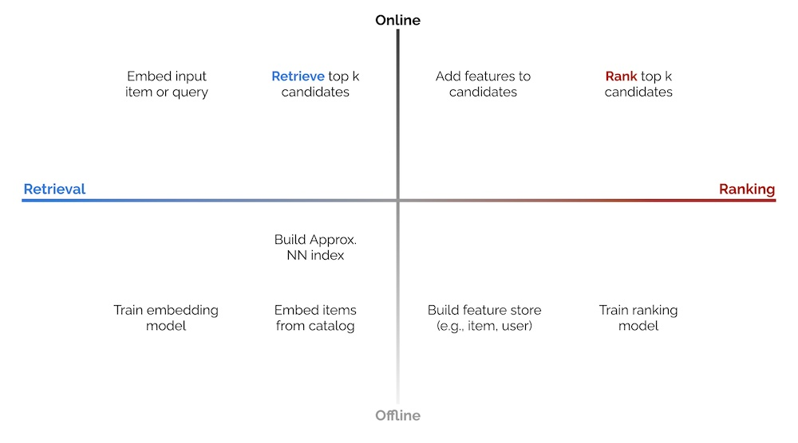
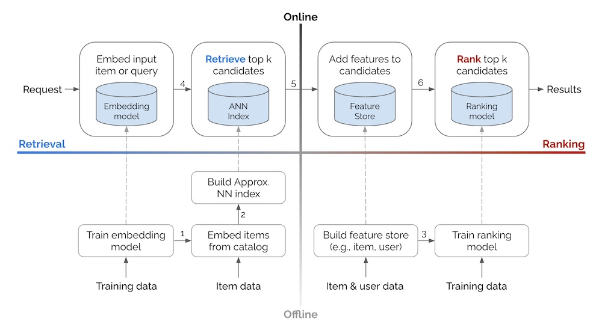
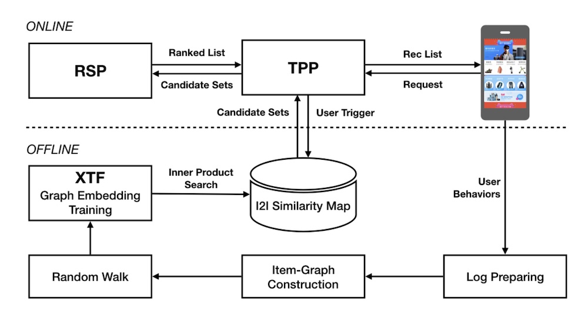
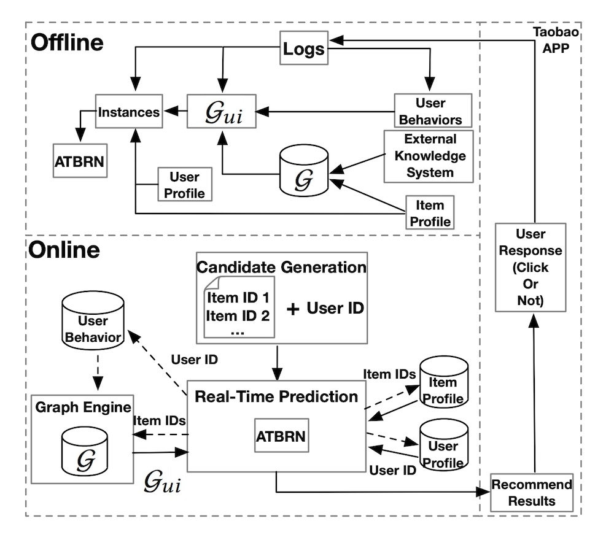
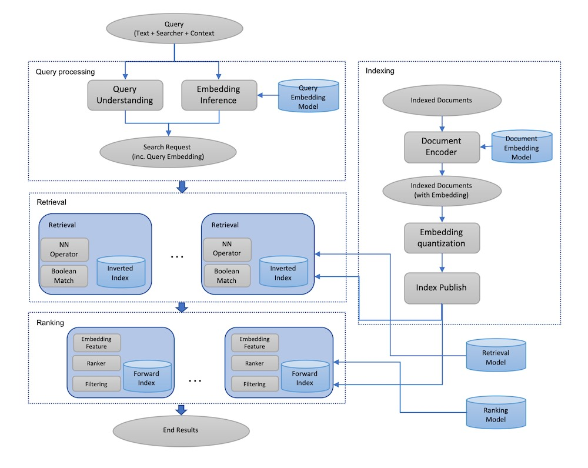
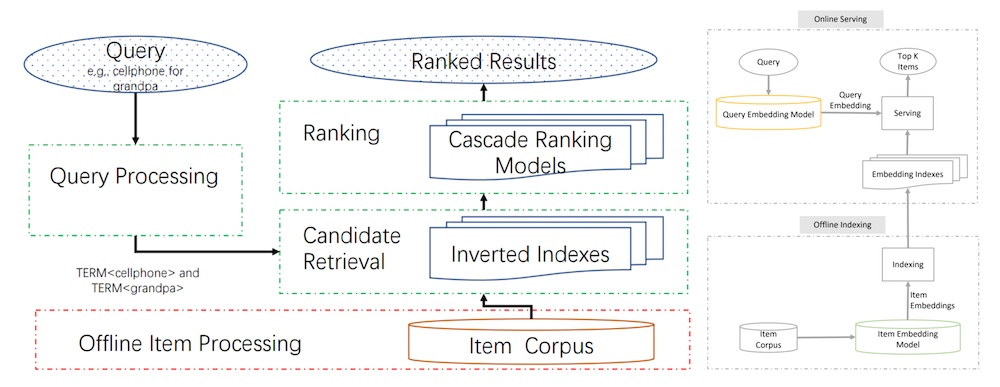
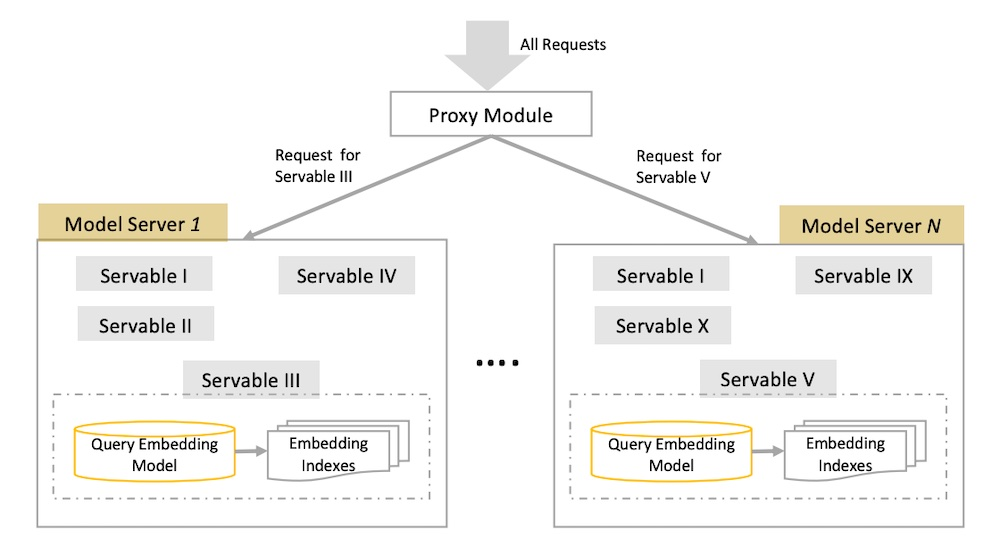
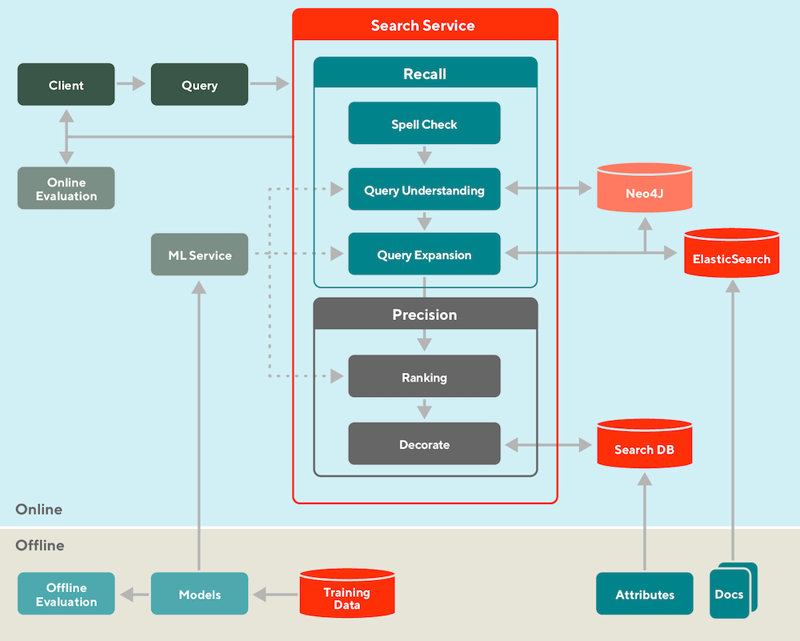
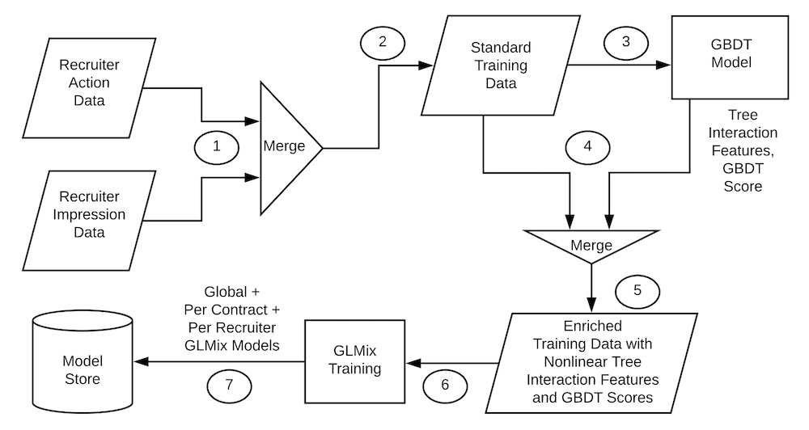
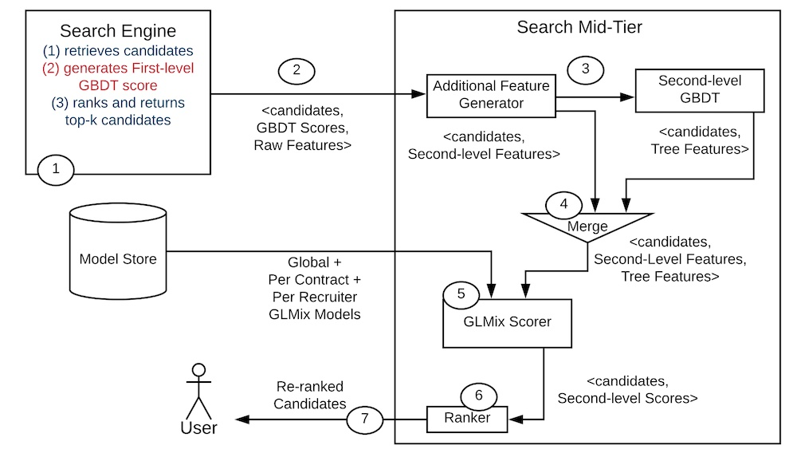

import { FigureCaption } from '../../components/figure-caption';

How do the system designs for industrial recommendations and search look like? It’s uncommon to see system design discussed in machine learning papers or blogs; most focus on model design, training data, and/or loss functions. Nonetheless, the papers that discuss implementation details elucidate design patterns and best practices that are hard to gain outside of hands-on experience.

Specific to discovery systems (i.e., recommendations and search), most implementations I’ve come across follow a similar paradigm—components and processes are split into offline vs. online environments, and candidate retrieval vs. ranking steps. The 2 x 2 below tries to simplify this.

<FigureCaption caption="2 x 2 of online vs. offline environments, and candidate retrieval vs. ranking." />

**The offline environment** hosts batch processes such as model training (e.g., representation learning, ranking), creating embeddings for catalog items, and building an approximate nearest neighbors (ANN) index or knowledge graph to find similar items. It may also include loading item and user data into a feature store that is used to augment input data during ranking. 

**The online environment** then uses the artifacts generated (e.g., ANN indices, knowledge graphs, models, feature stores) to serve individual requests. A typical approach is converting the input item or search query into an embedding, followed by candidate retrieval and ranking. There are also other preprocessing steps (e.g., standardizing queries, tokenization, spell check) and post-processing steps (e.g., filtering undesirable items, business logic) though we won’t discuss them in this writeup. 

**Candidate retrieval** is a fast—but coarse—step to narrow down millions of items into hundreds of candidates. We trade off precision for efficiency to quickly narrow the search space (e.g., from millions to hundreds, a 99.99% reduction) for the downstream ranking task. Most contemporary retrieval methods convert the input (i.e., item, search query) into an embedding before using ANN to find similar items. Nonetheless, in the examples below, we’ll also see systems using graphs (DoorDash) and decision trees (LinkedIn).

**Ranking** is a slower—but more precise—step to score and rank top candidates. As we’re processing fewer items (i.e., hundreds instead of millions), we have room to add features that would have been infeasible in the retrieval step (due to compute and latency constraints). Such features include item and user data, and contextual information. We can also use more sophisticated models with more layers and parameters. 

Ranking can be modeled as a learning-to-rank or classification task, with the latter being more commonly seen. If deep learning is applied, the final output layer is either a softmax over a catalog of items, or a sigmoid predicting the likelihood of user interaction (e.g., click, purchase) for each user-item pair.

Next, let’s see how the processes above come together in a recommender or search system. 

<FigureCaption caption="Basic system design for recommendations and search, based on the 2 x 2 above." />

**In the offline environment, data flows bottom-up,** where we use training data and item/user data to create artifacts such as models, ANN indices, and feature stores. These artifacts are then loaded into the online environment (via the dashed arrows). **In the online environment, each request flows left to right,** through the retrieval and ranking steps before returning a set of results (e.g., recommendations, search results).

Additional details on some arrows in the diagram:
1. With the representation learning model, embed items in the catalog.
2. With the item embeddings, build the ANN index that allows retrieval of similar embeddings and their respective items.
3. Get (historical) features to augment training data for the ranking model. Use the same feature store in offline training and online serving to minimize train-serve skew. Might require [time travel](/resources/feature-stores/).
4. Use the input query/item(s) embedding to retrieve similar items via ANN.
5. Add item and user features to the candidates for downstream ranking.
6. Rank the candidates based on objectives such as click, conversion, etc.  

## Examples from Alibaba, Facebook, JD, Doordash, etc.

Next, we’ll briefly discuss the high-level system design of some discovery systems, based on their respective papers and tech blogs. I’ll highlight how these systems are split into offline and online environments, and their retrieval and ranking steps. For full details on the methodology, model, etc., I recommend you read the full paper/blog. 

**We start with Alibaba’s sharing about [building item embeddings for candidate retrieval](https://arxiv.org/abs/1803.02349).** In the _offline_ environment, session-level user-item interactions are mined to construct a weighted, bidirectional item graph. The graph is then used to generate item sequences via random walks. Item embeddings are then learned via representation learning (i.e., word2vec skip-gram), doing away with the need for labels. Finally, with the item embeddings, they get the nearest neighbor for each item and store it in their item-to-item (i2) similarity map (i.e., a key-value store). 

<FigureCaption caption="Alibaba's design for candidate retrieval in Taobao via item embeddings and ANN." source="https://arxiv.org/abs/1803.02349" />

In the _online_ environment, when the user launches the app, the [Taobao](https://taobao.com) Personalization Platform (TPP) starts by fetching the latest items that the user interacted with (e.g., click, like, purchase). These items are then used to _retrieve_ candidates from the i2i similarity map. The candidates are then passed to the Ranking Service Platform (RSP) for _ranking_ via a deep neural network, before being displayed to the user.

**Alibaba also shared a similar example where they apply a [graph network for ranking](https://arxiv.org/abs/2005.12002).** In the _offline_ environment, they combine an existing knowledge graph (`G`), user behavior (e.g., impressed but not clicked, clicked), and item data to create an adaptive knowledge graph (`G_ui`). This is then merged with user data (e.g., demographics, user-item preferences) to train the ranking model (Adaptive Target-Behavior Relational Graph Network, ATBRN).

<FigureCaption caption="Alibaba's design for ranking in Taobao via a graph network (ATBRN)." source="https://arxiv.org/abs/2005.12002" />

In the _online_ environment, given a user request, the candidate generator _retrieves_ a set of candidates and the user ID, before passing them to the Real-Time Prediction (RTP) platform. RTP then queries the knowledge graph and feature stores for item and user attributes. The graph representations, item data, and user data is then fed into the _ranking_ model (i.e., ATBRN) to predict the probability of click on each candidate item. The candidates are then reordered based on probability and displayed to the user. 

**Next, we look at Facebook’s [embedding-based retrieval for search](https://arxiv.org/abs/2006.11632).** In the _offline_ environment (right half of image), they first train a two-tower network—with a query encoder and document encoder—that outputs cosine similarity for each query-document pair (not shown in image). This ensures that search queries and documents (e.g., user profiles, groups) are in the same embedding space. 

<FigureCaption caption="Facebook's design for embedding-based retrieval via query and document encoders." source="https://arxiv.org/abs/2006.11632" />

Then, with the document encoder, they embed each document via Spark batch jobs. The embeddings are quantized and published into the ANN index (“inverted index”). This ANN index is based on [Faiss](https://engineering.fb.com/2017/03/29/data-infrastructure/faiss-a-library-for-efficient-similarity-search/) and fine-tuned (see Section 4.1 of paper). The embeddings are also published in a forward index, without quantization, for ranking. The forward index includes other data such as profile and group attributes to augment candidates during ranking. 

In the _online_ environment, each search request goes through query understanding and is embedded via the query encoder. The search request and associated embedding then go through the _retrieval_ step to get nearest neighbor candidates via the ANN index and boolean filtering (e.g., match on name, location, etc.). The candidates are then augmented with full embeddings and additional data from the forward index before being _ranked_.

**JD shared a similar approach for [semantic retrieval for search](https://arxiv.org/abs/2006.02282).** In the _offline_ environment, a two-tower model with a query encoder and an item encoder is trained to output a similarity score for each query-item pair. The item encoder then embeds catalog items before loading them into an embedding index (i.e., key-value store).

<FigureCaption caption="Major stages of an e-commerce search systems (left), JD's design for candidate retrieval (right)." source="https://arxiv.org/abs/2006.02282" />

Then, in the _online_ environment, each query goes through preprocessing (e.g., spelling correction, tokenization, expansion, and rewriting) before being embedding via the query encoder. The query embedding is then used to _retrieve_ candidates from the embedding index via nearest neighbors lookup. The candidates are then _ranked_ on factors such as relevance, predicted conversion, etc.

The paper also shares practical tips to optimize model training and serving. For model training, they raised that the de facto input of user-item interaction, item data, and user data is duplicative—item and user data appear once per row, consuming significant disk space. To address this, they built a custom TensorFlow dataset where user and item data are first loaded into memory as lookup dictionaries. Then, during training, these dictionaries are queried to append user and item attributes to the training set. This simple practice reduced training data size by 90%.

They also called out the importance of ensuring offline training and online serving consistency. For their system, the most critical step was text tokenization which happens thrice (data preprocessing, training, serving). To minimize train-serve skew, they built a C++ tokenizer with a thin Python wrapper that was used for all tokenization tasks. 

For model serving, they reduced latency by combining services. Their model had two key steps: query embedding and ANN lookup. The simple approach would be to have each as a separate service, but this would require two network calls and thus double network latency. Thus, they unified the query embedding model and ANN lookup in a single instance, where the query embedding is passed to the ANN via memory instead of network. 

They also shared how they run hundreds of models simultaneously, for different retrieval tasks and various A/B tests. Each "servable" consists of a query embedding model and an ANN lookup, requiring 10s of GB. Thus, each servable had their own instance, with a proxy module (or load balancer) to direct incoming requests to the right servable.

<FigureCaption caption="How JD organizes the embedding model and ANN indices across multiple versions." source="https://arxiv.org/abs/2006.02282" />

(Aside: My candidate retrieval systems have a similar design pattern. Embedding stores and ANN indices are hosted on the same docker container—you’ll be surprised how far this goes with efficiently-sized embeddings. Furthermore, Docker makes it easy to version, deploy, and roll back each model, as well as scale horizontally. Fronting the model instances with a load balancer takes care of directing incoming requests, [blue-green deployments](https://docs.aws.amazon.com/wellarchitected/latest/machine-learning-lens/bluegreen-deployments.html), and [A/B testing](https://docs.aws.amazon.com/sagemaker/latest/dg/model-ab-testing.html). SageMaker makes this easy.)

**Next, we move from the embedding + ANN paradigm and look at DoorDash’s use of a [knowledge graph for query expansion and retrieval](https://doordash.engineering/2020/12/15/understanding-search-intent-with-better-recall/).** In the _offline_ environment, they train models for query understanding, query expansion, and ranking. They also load documents (i.e., restaurants and food items) into ElasticSearch for use in retrieval, and attribute data (e.g., ratings, price points, tags) into a feature store. 

<FigureCaption caption="DoorDash splits search into offline and online, and retrieval (recall) and ranking (precision)." source="https://doordash.engineering/2020/12/15/understanding-search-intent-with-better-recall/" />

In the _online_ environment, each incoming query is first standardized (e.g., spell check) and synonymized (via a manually curated dictionary). Then, the knowledge graph (Neo4J) [expands the query](/resources/feature-stores/) by finding related tags. For example, a query for “KFC” will return tags such as “fried chicken” and “wings”. These tags are then used to _retrieve_ similar restaurants such as “Popeyes” and “Bonchon”. 

These candidates are then _ranked_ based on lexical similarity between the query and documents (aka restaurants, food items), store popularity, and possibly the search context (e.g., time of day, location). Finally, the ranked results are augmented with attributes such as ratings, price point, and delivery time and cost before displayed to the customer. 

**Finally, we look at how LinkedIn [personalizes talent search results](https://arxiv.org/abs/1902.09041).** Their system relies heavily on XGBoost, first as a model to retrieve the top 1,000 candidates for ranking, and second, as a generator of features (i.e., model scores, tree interactions) for their downstream ranking model (a generalized linear mixed model aka GLMix).

<FigureCaption caption="LinkedIn's offline design for generating tree-based features, and training GLMix ranking models." source="https://arxiv.org/abs/1902.09041" />

In the _offline_ environment,  they first combine impression and label data to generate training data (step 1 in image above). Labels consist of instances where the recruiter sent a message to potential hires and the user responded positively. The training data is then fed into a pre-trained XGBoost model to generate model scores and tree interaction features (step 3 in image above) to augment the training data. This augmented data is then used to train the ranking model (GLMix). 

<FigureCaption caption="LinkedIn's online design for candidate retrieval, feature augmentation, and ranking via GLMix." source="https://arxiv.org/abs/1902.09041" />

In the _online_ environment, with each search request, the search engine (maybe Elastic or Solr?) first _retrieves_ candidates which are then scored via a first-level XGBoost model. The top 1,000 candidates are then augmented with (i) additional features (step 2 in image above) and (ii) tree interaction features via a second-level XGBoost model (step 3 in image above). Finally, these augmented candidates are ranked before the top 125 results are shown to the user.

## Conclusion

That was a brief overview of the offline-online, retrieval-ranking pattern for search and recommendations. While this isn’t the only approach for discovery systems, from what I’ve seen, it’s the most common design pattern. I've found it helpful to distinguish the latency-constrained online systems from the less-demanding offline systems, and split the online process into retrieval and ranking steps. 

If you’re starting to build your discovery system, start with [candidate retrieval via simple embeddings and approximate nearest neighbors](/resources/real-time-recommendations/), before adding a ranker on top of it. Alternatively, consider using a knowledge graph [like Uber and DoorDash did](/resources/feature-stores/). But before you get too excited, think hard about whether you need real-time retrieval and ranking, or [if batch recommendations will suffice](/resources/real-time-recommendations/).

## References
- [Billion-scale Embedding for E-commerce Recommendation](https://arxiv.org/abs/1803.02349) `Alibaba`
- [Adaptive Target-Behavior Relational Graph Network](https://arxiv.org/abs/2005.12002) `Alibaba`
- [Embedding-based Retrieval in Facebook Search](https://arxiv.org/abs/2006.11632) `Facebook`
- [End-to-End Solution for E-commerce Search via Embedding Learning](https://arxiv.org/abs/2006.02282) `JD`
- [Things Not Strings: Understanding Search Intent](https://doordash.engineering/2020/12/15/understanding-search-intent-with-better-recall/) `DoorDash`
- [Entity Personalized Talent Search with Tree Interaction Features](https://arxiv.org/abs/1902.09041) `LinkedIn`
- [Faiss: A Library for Efficient Similarity Search](https://engineering.fb.com/2017/03/29/data-infrastructure/faiss-a-library-for-efficient-similarity-search/) `Facebook`
