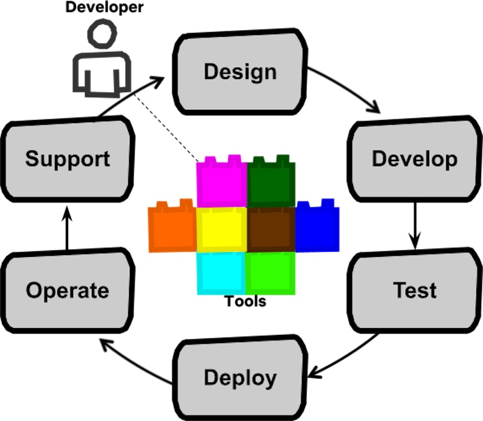

import { FigureCaption } from '../../components/figure-caption';

Data scientists can be more effective by **being more end-to-end**. This is contrary to the recent trend of splitting the machine learning lifecycle across various roles such as data engineer, data scientist, and ML engineering. By being more end-to-end, data scientists reduce coordination overhead and diffusion of responsibility, and gain ownership and a big-picture view. 

## From start (identify the problem) to finish (solve it)

This idea of an end-to-end data scientist may seem similar to existing concepts such as:

- [Generalist](https://towardsdatascience.com/why-you-shouldnt-be-a-data-science-generalist-f69ea37cdd2c): Focused on roles ([DE](https://www.oreilly.com/content/data-engineering-a-quick-and-simple-definition/), [DS](https://en.wikipedia.org/wiki/Category:Data_scientists), [MLE](https://www.quora.com/What-exactly-does-a-machine-learning-engineer-do)); some negative connotation
- [Full-stack](https://skillcrush.com/blog/front-end-back-end-full-stack/): Focused on tech (Spark, Torch); popularized by full-stack devs
- [Unicorn](https://www.infoworld.com/article/3429185/stop-searching-for-that-data-science-unicorn.html): Focused on mythology; believed not to exist

Hoever, these definitions only focus on part of the picture (e.g., roles, technology). A simpler and more pragmatic defintion is that an end-to-end data scientist can **identify the problem, design a solution, ship it, and measure outcomes**. To achieve the goal, they’ll wear as many hats as required. They’ll also learn and apply whatever tech, methodology, and process that works. Throughout the process, they ask questions such as:

- What is the problem? Why is it important?
- Can we solve it? How should we solve it?
- What is the estimated value? What was the actual value?

## More context, faster iteration, greater satisfaction

For most data science roles, being more end-to-end improves your ability to make meaningful impact. (Nonetheless, there are [roles](https://nvidia.wd5.myworkdayjobs.com/en-US/NVIDIAExternalCareerSite/job/US-CA-Santa-Clara/Senior-Deep-Learning-Data-Scientist--RAPIDS---AI_JR1929838) that focus on machine learning.)

**Working end-to-end provides increased context.** While specialized roles can increase efficiency, it reduces context (for the data scientist) and leads to suboptimal solutions.

> The trick to forgetting the big picture is to look at everything close-up. – Chuck Palahniuk

It’s hard to design a holistic solution without full context of the upstream problem. Let’s say conversion has decreased and a PM raises a request to improve our search algorithm. However, what’s causing the decrease in the first place? There could be various causes:

- Product: Is fraudulent/poor quality product reducing customer trust?
- Data pipelines: Has data quality been compromised or are there delays/outages?
- Model refresh: Is the model not refreshing regularly/correctly?

More often than not, the problem—and solution—lies _outside_ of machine learning. A solution to _improve the algorithm_ would miss the root cause.

Similarly, it’s risky to develop a solution without awareness of downstream engineering and product constraints. There’s no point:

- Building a near-real time recommender that infra cannot support
- Building an infinite-scroll recommender that doesn’t fit the product

By working end-to-end, data scientists will have the full context to identify the right problems and develop usable solutions. It can also lead to innovative ideas that specialists, with their narrow context, might miss. Overall, it increases the ability to deliver value.

**Communication and coordination overhead is reduced.** With multiple roles comes additional overhead. Let’s look at an example of a data engineer (DE) cleaning the data and creating features, a data scientist (DS) analysing the data and training the model, and a machine learning engineer (MLE) deploying and maintaining it.

> What one programmer can do in one month, two programmers can do in two months. – Frederick P. Brooks

The DE and DS need to _communicate_ on what data is (and is not) available, how it should be cleaned (e.g., outliers, normalisation), and which features should be created. Similarly, the DS and MLE have to discuss how to deploy, monitor, and maintain the model, as well as how often it should be refreshed. When issues occur, we’ll need three people in the room (likely with a PM) to triage the root cause and next steps to fix it.

It also leads to additional coordination, where schedules need to be aligned as work is executed and passed along in a sequential approach. If the DS wants to experiment with additional data and features, we’ll need to wait for the DE to ingest the data and create the features. If a new model is ready for A/B testing, we’ll need to wait for the MLE to (convert it to production code) and deploy it.

While the actual development work may take days, the communication back-and-forth and coordination can take weeks, if not longer. With end-to-end data scientists, we can minimize this overhead as well as prevent technical details from being lost in translation.

(But, can an end-to-end DS really do all that? I think so. While the DS might not be as proficient in some tasks as a DE or MLE, they will be able to perform most tasks effectively. If they need help with scaling or hardening, they can always get help from specialist DEs and MLEs.)

**Iteration and learning rate is increased.** With greater context and lesser overhead, we can now iterate, fail (read: learn), and deliver value faster.

This is especially important for developing data and algorithmic products. Unlike software engineering (a far more mature craft), we can’t do all the learning and design before we start building—our blueprints, architectures, and design patterns are not as developed. Thus, rapid iteration is essential for the design-build-learn cycle.

**There’s greater ownership and accountability.** Having the data science process split across multiple people can lead to diffusion of responsibility, and worse, social loafing.

A common anti-pattern observed is “[throw over the wall](https://wiki.c2.com/?ThrownOverTheWall)”. For example, the DE creates features and throws a database table to the DS, the DS trains a model and throws `R` code over to the MLE, and the MLE translates it to `Java` to production.

If things get lost-in-translation or if results are unexpected, who is responsible? With a strong culture of ownership, everyone steps up to contribute in their respective roles. But without it, work can degenerate into ass-covering and finger-pointing while the issue persists and customers and the business suffers.

Having the end-to-end data scientist take ownership and responsibility for the entire process can mitigate this. They should be empowered to take action from start to finish, from the customer problem and input (i.e., raw data) to the output (i.e., deployed model) and measurable outcomes.

**For (some) data scientists, it can lead to increased motivation and job satisfaction**, which is [closely tied](https://www.clearpointstrategy.com/how-employees-are-motivated-autonomy-mastery-purpose/) to autonomy, mastery, and purpose.

- **Autonomy:** By being able to solve problems independently. Instead of waiting and depending on others, end-to-end data scientists are able to identify and define the problem, build their own data pipelines, and deploy and validate a solution.
- **Mastery:** In the problem, solution, outcome from end-to-end. They can also pick up the domain and tech as required.
- **Purpose**: By being deeply involved in the entire process, they have a more direct connection with the work and outcomes, leading to an increased sense of _purpose_.

## But, we need specialist experts too

Nonetheless, being end-to-end is not for everyone, for the reasons below.

**Wanting to specialize** in machine learning, or perhaps a specific niche in machine learning such as neural text generation (read: [GPT-3 primer](https://mc.ai/the-subtle-art-of-priming-gpt-3/)). While being end-to-end is valuable, we also need such world-class experts in research and industry who push the envelope. Much of what we have in ML came from academia and pure research efforts.

> No one achieves greatness by becoming a generalist. You don't hone a skill by diluting your attention to its development. The only way to get to the next level is focus. – John C. Maxwell

**Lack of interest.** Not everyone is keen to engage with customers and business to define the problem, gather requirements, and write design documents. Likewise, not everyone is interested in software engineering, production code, unit tests, and CI/CD pipelines.

**Working on large, high leverage systems where 0.01% improvement has giant impact.** For example, algorithmic trading and advertising. In such situations, hyper-specialization is required to eke out those improvements.

Others have also made arguments for why data scientists should specialize (and not be end-to-end). Here are a few articles to provide balance and counter-arguments:

- [Why You Shouldn’t Be A Data Science Generalist](https://towardsdatascience.com/why-you-shouldnt-be-a-data-science-generalist-f69ea37cdd2c)
- [Why Every Data Scientist Needs to Specialize](https://www.simplilearn.com/why-every-data-scientist-needs-to-specialize-article)
- [Want a Job in Data Science? Here’s Why You Should Specialize](https://www.dataquest.io/blog/job-data-science-specialize/)

## The best way to pick it up is via learning by doing

If you’re still keen on becoming more end-to-end, we’ll now discuss how to do so. Before that, without going into specific technology, here are the buckets of skills that end-to-end data scientists commonly use:

- Product: Understand customer problems, define and prioritize requirements
- Communication: Facilitate across teams, get buy-in, write docs, share results
- Data engineering: Move and transform data from point A to B
- Data analysis: Understand and visualize data, A/B testing & inference
- Machine learning: The usual plus experimentation, implementation, and metrics
- Software engineering: Production code practices including unit tests, docs, logging
- Dev Ops: Basic containerization and cloud proficiency, build and automation tools

(This list is neither mandatory nor exhaustive. Most projects don’t require all of them.)

Here are four ways you can move closer to being an end-to-end data scientist:

**Study the right books and courses.** (Okay, this is _not_ learning by doing but we all need to start somewhere). I would focus on courses that cover tacit knowledge rather than specific tools. While I’ve not come across such materials, I’ve heard good reviews about [Full Stack Deep Learning](https://course.fullstackdeeplearning.com).

**Do your own projects end-to-end** to get first-hand experience of the entire process. At the risk of oversimplifying it, here are some steps I would take with their associated skills.

> I hear and I forget. I see and I remember. I do and I understand. – Confucius

Start with identifying a problem to solve and determining the success metric (`product`). Then, find some [raw data](https://datasetsearch.research.google.com) (i.e., not Kaggle competition data); this lets you clean and prepare the data and create features (`data engineering`). Next, try various ML models, examining learning curves, error distributions, and evaluation metrics (`data science`).

Assess each model’s performance (e.g., query latency, memory footprint) before buildng an app around one (`software engineering`). (You might also want to build a simple user interface). Then, containerise and deploy it online for others to use via your preferred cloud provider (`dev ops`).

Once that’s done, go the extra mile to share about your work. You could write an article for your site or speak about it at a meetup (`communication`). Show what you found in the data via meaningful visuals and tables (`data analysis`). Share your work on GitHub. [Learning](https://www.swyx.io/writing/learn-in-public/) and working in public is a great way to get feedback and find potential collaborators.

**Volunteer through groups like [DataKind](https://www.datakind.org).** DataKind works with social organizations (e.g., NGOs) and data professionals to address humanitarian issues. By collaborating with these NGOs, you get the opportunity to work as part of a team to tackle real problems with real(ly messy) data.

While volunteers may be assigned specific roles (e.g., PM, DS), you’re always welcome to tag along and observe. You’ll see (and learn) how PMs engage with NGOs to frame the problem, define solutions, and organize the team around it. You’ll learn from fellow volunteers how to work with data to develop working solutions. Volunteering in hackathon-like [DataDives](https://www.datakind.org/datadives) and longer-term [DataCorps](https://www.datakind.org/datacorps) is a great way to contribute to the data science process end-to-end.

**Join a startup-like team.** Note: A startup-like team is not synonymous with a startup. There are big organizations that run teams in a startup-like manner (e.g., two-pizza teams) and startups made up of specialists. Find a lean team where you’re encouraged, and have the opportunity, to work end-to-end.

## End-to-end in Stitch Fix and Netflix

Eric Colson of **Stitch Fix** was initially “lured to a function-based division of labour by the attraction of process efficiencies” (i.e., the [data science pin factory](https://multithreaded.stitchfix.com/blog/2019/03/11/FullStackDS-Generalists/)). But over trial and error, he found end-to-end data scientists to be more effective. Now, instead of organizing data teams for specialization and productivity, Stitch Fix organizes them for **learning and developing new data and algorithmic products**.

> The goal of data science is not to execute. Rather, the goal is to learn and develop new business capabilities. … There are no blueprints; these are new capabilities with inherent uncertainty. … All the elements you’ll need must be learned through experimentation, trial and error, and iteration. – Eric Colson

He suggests that data science roles should be made more general, with broad responsibilities agnostic to technical function and optimized for learning. Thus, his team hires and grows generalists who can conceptualize, model, implement, and measure. Of course, this is dependent on a solid data platform that abstracts away the complexities of infra setup, distributed processing, monitoring, automated failover, etc.

Having end-to-end data scientists improved Stitch Fix’s learning and innovation capabilities, enabling them to discover and build more business capabilities (relative to a specialist team).

**Netflix** Edge Engineering initially had specialized roles. However, this created inefficiencies across the product life cycle. Code releases took more time (weeks instead of days), deployment problems took longer to detect and resolve, and production issues required multiple back-and-forth communications.

<FigureCaption
  caption="Full cycle dev are empowered across the entire software life cycle"
  source="https://netflixtechblog.com/full-cycle-developers-at-netflix-a08c31f83249"
/>

To support full cycle devs, centralized teams built tooling to automate and simplify common development process (e.g., build and deploy pipelines, monitoring, managed rollbacks). Such tooling is reusable across multiple teams, acts as a force multiplier, and helped devs be effective across the entire cycle.

With the full cycle developer approach, Edge Engineering was able to iterate quicker (instead of coordinating across teams), with faster and more routine deployments.

## Try it out

You may not be end-to-end now. That’s okay—few people are. Nonetheless, consider its benefits and stretching closer towards it.

Which aspects would disproportionately improve your ability to deliver as a data scientist? Increased engagement with customers and stakeholders to design more holistic, innovative solutions? Building and orchestrating your own data pipelines? Greater awareness of engineering and product constraints for faster integration and deployments?

Pick one and try it. After you get better at it, try something else. Let me know how it goes in the tweet or comments below!

### Addendum: Clarifying the intent of this post

A couple months after publishing this, I realize some readers interpret this post from the skills and technical knowledge perspective. They see this post as pushing for data scientists / ML engineers to be full-stack and have in-depth knowledge of how to set up K8s, do PhD-level research, design front-end, etc. **That's _not_ my intention.**

Instead, I'm trying to convince that end-to-end **visibility, cohesion (i.e., reverse [Conway's Law](https://en.wikipedia.org/wiki/Conway%27s_law)), and ownership** leads to better outcomes. Although visibility should be paired with ability to make an impact, for a start, its sufficient to be able to use the tools _without_ being able to set it up yourself. The effective data scientists I know are power users of their tools even without being able to set it up from scratch (though I'm sure they can pick it up fast).

> You don't have to be able to build a plane or airport to be a pilot.
