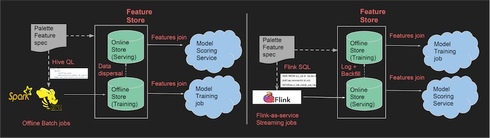
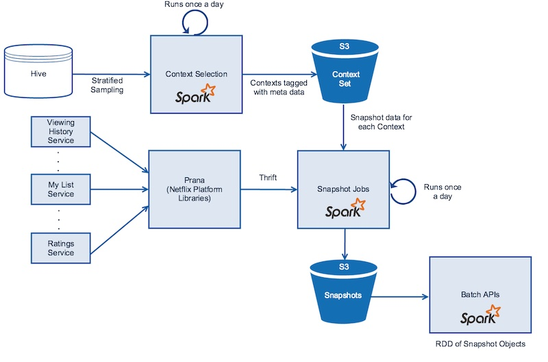
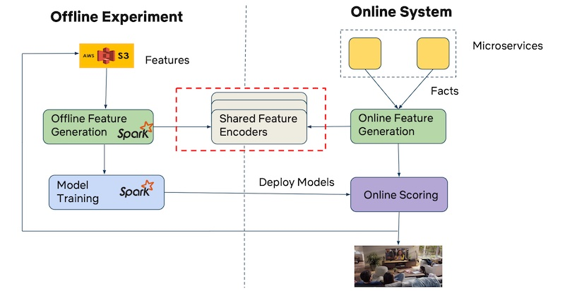
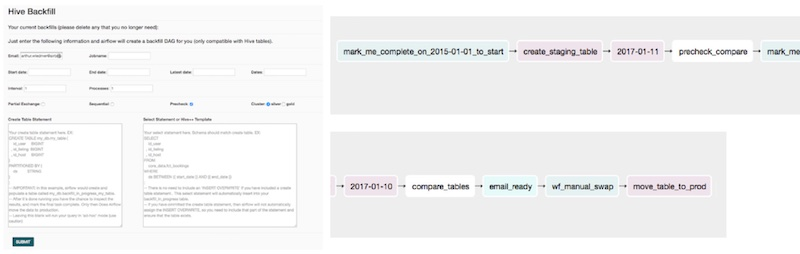

import { FigureCaption } from '../../components/figure-caption';

Feature stores have gotten a lot of attention lately. In December 2020, Amazon Web Services [released](https://aws.amazon.com/about-aws/whats-new/2020/12/introducing-amazon-sagemaker-feature-store/) its SageMaker Feature Store. Last month, Splice Machine, a big data platform, [launched](https://splicemachine.com/press-releases/splice-machine-launches-the-splice-machine-feature-store-to-simplify-feature-engineering-and-democratize-machine-learning/) its own feature store too. Datanami even went as far as to call 2021 the [year of the feature store](https://www.datanami.com/2021/01/19/2021-the-year-of-the-feature-store/) (quoting Tecton.ai's co-founder).

> It turns out that managing features, in our experience, is one of the biggest bottlenecks in productizing your ML models. — Uber

**Features (and labels) are the inputs** for machine learning models. In a regression equation, labels are the _dependent variable_, features are _independent variables_. In a table, labels are the _column_ we try to predict, features are _the other columns_ (though we usually drop IDs).

**What is a feature store?** Well, it depends on who you ask. Some articles define it simply as _"the central place to store curated features"_. Others say it helps you _"build features once; plug them anywhere"_ or _"deploy models 100x faster"_. There's a wide range of definitions and I think it's because **what a feature store is depends on what you need**. 

To learn more about feature stores and the needs they address, I dug into [tech/blogs from companies](https://github.com/eugeneyan/applied-ml#feature-stores). Unsurprisingly, I found myself organizing feature store features (haha) into a hierarchy of needs (inspired by Maslow). We’ll go over an overview of the feature store hierarchy of needs before discussing how companies have met those needs at each level.

## The feature store hierarchy of needs

Maslow’s Hierarchy of Needs is a motivational theory in psychology. It suggests that there are five tiers of human needs and is often shown as hierarchical levels within a pyramid. The largest, most fundamental needs at the bottom must be satisfied before individuals become motivated to higher-level needs.

I think feature stores can be organized as a hierarchy of needs too. Some needs are more pressing than others (e.g., access to data, serving features in production). These essential needs have to be fulfilled before higher needs are considered.


<FigureCaption caption="Feature Store Hierarchy of Needs"/>

**At the base, we have access needs.** This includes access to feature information and data, transparency, and lineage. Transparency lets users view the logic and code creating the features while lineage lets them trace upstream sources. Together, they make it easier to find, share, and reuse features, minimizing duplicate work.

> Previously, ML practitioners at Airbnb spent roughly 60% of their time on collecting and writing transformations for machine learning tasks. — Airbnb

**Next, we have serving needs.** Here, the key need is to use the features in production, usually at high throughput and low latency (i.e., not SQL queries). Other needs include the ability to integrate with existing offline feature stores so features can be synced from offline to online feature stores (e.g., Redis). It can also include the ability to perform real-time feature transformations within the feature store itself.

> Data scientists would typically implement features in individual silos, then hand over their code to a data engineering team to reimplement production-ready pipelines. This process of reimplementing pipelines can add months to a project and requires complex coordination between teams. — GoJek

**Once lower needs are met, we can turn to integrity needs.** Here, the prevalent need is minimizing train-serve skew. This means ensuring consistency between the features during training, and the features used as input when calling the model in production.  Another common need is point-in-time correctness (aka time travel). This ensures that historical features and labels used in offline training and evaluation don’t have data leaks.

> A lot of training is done in an offline way, and serving often happens, at least at Uber, in real-time environments. It is absolutely important to make sure that the data that you're using in real-time, at serving time, matches the data that is used at training. — Uber

**Beyond that, we have convenience needs.** The feature store needs to be easy and quick to use for data practitioners to adopt and realize the productivity gains. Such needs include having simple, intuitive APIs that can be used for training _and_ serving, as well as interactivity to allow for faster development and debugging. 

> But remember, we are a platform, not an engineering team… How can we provide a tool for (users) so that we can give this power back to them, so that they can, without help from us, do all this work by themselves? — Uber

**Finally, we have autopilot needs.** These are needs to automate tedious work such as backfilling features, monitoring and alerts on feature distributions, etc. Some companies have implemented solutions to address these needs, but they are not widespread across the material I’ve researched.

> Backfilling is a major bottleneck when you’re iterating on your training set ideas. Efficiently computing new training sets is a huge deal for speeding up your data scientist workflow. —Airbnb

**Not all organizations will require all levels of needs** though most teams can benefit from meeting the first two levels (access and serving) and part of the third (minimizing train-serve skew). The extent of each need may also vary. Organizations with fewer online ML use cases may have less demanding serving needs relative to DoorDash (i.e., millions of requests per second). Models and features that update intraday may have tricker needs for point-in-time correctness.

Now that we have an understanding of the various levels of needs, let’s take a look at how companies have built feature stores to address them.

## Access: Reducing duplication & encouraging reusability

What happens if access to feature information and data is low? Here’s a common experience across several companies:
- Different teams built the same feature multiple times, sometimes with as many as 10 different versions of the same feature.
- Duplicate pipelines were built to create features that were conceptually similar, leading to wasted effort and resources (e.g., compute, storage).
- Hard to get consistent results as models used different versions of the same feature.
- Thus, slower iteration and development by data science and ML teams.

> Features representing the same business concepts are being redeveloped many times, when existing work from other teams could have been reused. — GoJek

To address this, [GoJek built Feast](https://www.gojek.io/blog/feast-bridging-ml-models-and-data), a feature store that acts as the interface between data engineers and scientists, and ML practitioners. Data engineers and scientists create features and contribute them to the feature store. Then, ML practitioners consume these ready-made features, saving time by not having to create their own features. 

(Not sure how I feel about this productivity gain, given my preference for data scientists to be more [end-to-end](https://eugeneyan.com/writing/end-to-end-data-science/). Nonetheless, this spilt between data engineering and machine learning might have been an artifact of how GoJek’s data team was structured, with the data engineering team mostly situated in India while the ML team was mostly in Singapore. Thus, Feast served as an interface for both teams to collaborate on.)

Similarly, Uber built their [Palette feature store](https://www.infoq.com/presentations/michelangelo-palette-uber/) to encourage the sharing—and reuse—of features in a single location. Various teams across Uber could contribute features to, and use features from, Palette. For Uber, this minimized duplicate work, made ML outcomes more consistent, and accelerates the ML process. 

To make features easy to find and use, it’ll also need aspects of data discoverability (_though it can also be argued that this is a convenience need_). I didn’t come across much discussion on data discoverability in the context of feature stores, but I suspect it’ll be very similar to what I’ve previously written about [open-sourced data discovery platforms](/posts/data-discovery/).

At this level, the feature store mostly serves as a _store_, albeit a very useful one that contains crowd-sourced/curated features that ML practitioners can just plug-and-play. Nonetheless, it’s not much different from a data warehouse. What distinguishes feature stores (from data warehouses) is their ability to meet the second level of the hierarchy of needs—serving.

## Serving: Using features in real-time environments

When training machine learning models, we usually train them offline with batch data. Then, when serving these models online, the same features need to be available in real-time. Here’s where teams stumble—how do we serve those features in production, at high throughput and low latency?

> When shipping tabular-based models, we kept finding that many of the features we would input into a model while training it were __not__ readily available in our production infrastructure. — Monzo Bank

For Monzo Bank, the features were available in their analytics stack, which was used for training models, but not in their production stack, which was used for serving. To solve this, they took a [lean approach](https://nlathia.github.io/2020/12/Building-a-feature-store.html) by automating the synchronization of features from their analytics store (BigQuery) to their production store (Cassandra).
- First, tags are added to SQL queries that create feature tables within the analytics stack. These tables update at daily/hourly intervals.
- The feature store Go service checks the schema of these feature tables (e.g, are required columns, such as `subject_type` and `subject_id` present?)
- Finally, a cron job checks for updated feature tables and syncs them from BigQuery to Cassandra, via a staging area in Google Cloud Storage.

Uber’s Palette adopts a similar dual-store approach. The offline store (Hive) saves feature snapshots and is mainly used by training jobs. The online store (Cassandra) serves the same features in real-time. Features not available in Cassandra are generated online via Flink before being saved to Cassandra. Data between both stores are synchronized. New features added in Hive are automatically copied to Cassandra; real-time features added to Cassandra are ETL-ed to Hive.


<FigureCaption caption="Creating batch and real-time features, and synchronizing between stores" source="https://www.infoq.com/presentations/michelangelo-palette-uber/" />

DoorDash took addressing serving needs to the extreme with their [Gigascale feature store](https://doordash.engineering/2020/11/19/building-a-gigascale-ml-feature-store-with-redis/). Here are the demanding technical requirements they had:
- Stores billions of records via persistent, scalable storage: DoorDash has millions of entities (users, merchants, food items) leading to billions of feature-value pairs.
- Scales to millions of queries per second (QPS): Multiple use cases use the feature store, including store ranking which uses dozens of features and makes more than 1 million predictions per second. Considering the models they have in production, the feature store gets as much as 10+ million QPS.
- Refreshes daily via fast batch writes: Most of the features are updated daily, with real-time features (e..g, each store’s delivery time over a 20-minute moving average) being updated uniforming throughout the day. 

To build this feature store, DoorDash benchmarked several key-value stores—Redis, Cassandra, CockroachDB, ScyllaDB, and YugabyteDB—before sticking with Redis. More details on their benchmarking process and optimizing Redis in their excellent [write-up](https://doordash.engineering/2020/11/19/building-a-gigascale-ml-feature-store-with-redis/).

Another approach is to compute features in real-time. This is how Alibaba serves [real-time recommendations](https://102.alibaba.com/detail?id=183), where their Alibaba Basic Feature Server computes statistical features on user interactions (e.g., clicks, likes, purchases) in real-time. These features are then used for candidate generation. More about real-time recsys [in a previous post](/posts/real-time-recommendations/).

## Integrity: Creating correct offline and online features

With serving needs met, we turn to integrity needs. There are two main pain points here:
- Difficulty creating point-in-time accurate features to simulate production; doing this incorrectly can lead to data leaks.
- Inconsistency between features used in training and serving, leading to suboptimal model performance when deployed online. 

To address the first problem, Netflix built [distributed time-travel](https://netflixtechblog.com/distributed-time-travel-for-feature-generation-389cccdd3907). It takes snapshots of their offline and online data. These snapshots cover various contexts such as member type, device, time of day, etc.


<FigureCaption caption="Creating snapshots from offline stores and online micro services" source="https://netflixtechblog.com/distributed-time-travel-for-feature-generation-389cccdd3907" />

However, creating snapshots for every context is expensive. Thus, they perform stratified sampling on attributes such as viewing patterns, device type, time spent on device, region, etc. These samples provide a good distribution of data to train and validate their models on. The sampling is done via Spark and snapshots are stored in S3. 

A similar process snapshots online data from their hundreds of microservices. These microservices provide data such as viewing history, personalized viewing queues, and predicted ratings. Spark parallelizes the calls to [Prana](https://medium.com/@Netflix_Techblog/prana-a-sidecar-for-your-netflix-paas-based-applications-and-services-258a5790a015) which fetches the data from various microservices. Similarly, the snapshots are stored in S3 via Parquet format. 

To solve the second pain point of train-serve skew, GoJek adopted Apache Beam as their data processing pipeline. Data from batch and streaming sources (e.g., BigQuery, Kafka) are ingested via Beam into offline and online stores (e.g., BigQuery, Redis). A unified API (to access historical and online data) minimizes the need to rewrite feature pipelines for the serving environment and thus accidentally introducing train-serve skew.


<FigureCaption caption="GoJek's Feast ingesting features via Apache Beam" source="https://www.gojek.io/blog/feast-bridging-ml-models-and-data" />

Netflix addressed this via shared feature encoders. Though they have different pipelines for offline (Spark) and online feature generation, both pipelines use the same feature encoders (i.e., same classes, libraries, and data formats). This ensures that feature generation is consistent across training and serving environments.


<FigureCaption caption="Netflix uses the same encoders for offline and online feature generation" source="https://databricks.com/session/fact-store-scale-for-netflix-recommendations" />

We’ve also seen how Uber approached this by keeping their offline (Hive) and online (Cassandra) feature stores in sync. New features in either store are copied to the other store, ensuring consistency between data used for training and serving.

We also need monitoring to ensure the integrity of features:
- When were the features last updated?
- Are the schemas correct? Has the data distribution shifted?
- Are we meeting serving requirements (i.e., throughput, latency)?

To allow data scientists to visually inspect features for integrity, Airbnb's Zipline includes a UI that shows the distribution of features, correlations between features and labels, and performs clustering analysis (not sure what this clustering analysis is on though).

Similarly, Uber built [Data Quality Monitor](https://eng.uber.com/monitoring-data-quality-at-scale/). It provides users with data quality scores daily, as well as alerts when anomalies are detected. It does this by:
- Calculating metrics on features (e.g., mean, median, maximum, minimum for numerics, unique value count, missing value count for categoricals).
- Then, building a multi-dimensional time series on those metrics (and PCA is applied to get the top components).
- Finally, a time series is built on the top components. If the current measurement does not match the one-step ahead forecast, it is classified as an anomaly.


<FigureCaption caption="Data quality scores over time, and when incidents occur" source="https://eng.uber.com/monitoring-data-quality-at-scale/"/>

## Convenience: Making it as easy to use as possible

I didn’t come across much content on convenience (or pain points) in the context of feature stores. Nonetheless, as practitioners, it’s important for our tools and platforms to be easy to use (e.g., PyTorch vs TensorFlow).

The best example I found comes from GoJek. They provide unified SDKs in Python, Java, and Go to simplify retrieving features from both offline and online stores. The API lets you use nearly identical code to `get_batch_features()` and `get_online_features()`, easing the transition between offline to online feature engineering.

```python
customer_features = ['credit_score', 'balance', 'total_purchases', 'last_active']

historical_features_df = feast.get_historical_features(customer_ids, customer_features)
model = ml.fit(historical_features_df)  # pseudo code

online_features = feast.get_online_features(customer_ids, customer_features)
prediction = model.predict(online_features)
```

For time-travel, Netflix provides simple APIs so data scientists can create point-in-time correct features and labels. Here’s an example of fetching a snapshot of viewing history for the movie [OUTATIME](http://outatimemovie.com).

```scala
val snapshot = new SnapshotDataManager(sqlContext)
  .withTimestamp(1445470140000L)
  .withContextID(OUTATIME)
  .getViewingHistory
```

Building on this snapshot, users can perform time-travel to create features—for training and validation—by providing the following: 
- Context: Where, when, and how the model is used (e.g., country, device, member profile, movie, time); time is the critical component here.
- Items: Items to score/rank (e.g., movies, recommendation slates, search entities)
- Labels: Targets for supervised learning (e.g., click, watched, minutes viewed). Not required in unsupervised learning.
- Feature encoder: How to combine context and item data to create features, such as [feature-crosses](https://developers.google.com/machine-learning/crash-course/feature-crosses/encoding-nonlinearity) (e.g., country-movie, userID-movie) and other combinations.

## Autopilot: Automating as much as we can

At the top, we have autopilot needs. Not meeting these needs may mean your data scientists have to spend time on tedious, manual work—it’s not a blocker for using ML in production, though it can reduce development effort and operations cost. While some companies shared about addressing these needs, it’s not widespread in industry (yet).

Airbnb noticed that backfilling was a bottleneck when their data scientists iterated on ML experiments. Thus, Zipline includes a feature to backfill features automatically. A simple UI is provided where data scientists could define new features, specify the start and end dates, and how many processes to parallelize the backfill for. These features would then be added to their existing training feature set [via an Airflow pipeline](https://speakerdeck.com/artwr/using-apache-airflow-as-a-platform-for-data-engineering-frameworks?slide=16). 


<FigureCaption caption="Airbnb`s UI for backfilling and the Airflow DAG it creates" source="https://speakerdeck.com/artwr/using-apache-airflow-as-a-platform-for-data-engineering-frameworks?slide=17" />  


Other ways to meet autopilot needs include: 
- Netflix’s [Metacat](https://netflixtechblog.com/metacat-making-big-data-discoverable-and-meaningful-at-netflix-56fb36a53520) provides metrics for analyzing cost and storage space. This makes it easy to manage (and drop) features tables that are not used, saving on cost.
- Uber's [Data Quality Monitor](https://eng.uber.com/monitoring-data-quality-at-scale/) with automatic anomaly detection and notifications on data quality metrics, as well as daily data quality scores.
- Uber’s experimentation with automatic feature selection. The intent is to let users search for features by providing the _labels_ they are trying to predict. Palette will then suggest features that are correlated with, or will have an impact on, the labels. 

## Conclusion: It depends on what you need

I hope it's clearer what a feature store is. If we're starting from ground zero, maybe all we need is [access](#access-reducing-duplication--encouraging-reusability) and [serving](#serving-using-features-in-real-time-environments), and a dash of [integrity](#integrity-creating-correct-offline-and-online-features). If we're building our own at big tech co, we'll probably want to consider [convenience](#convenience-making-it-as-easy-to-use-as-possible) and [autopilot](#autopilot-automating-as-much-as-we-can) relatively early. Did I miss anything? Please reach out [@eugeneyan](https://twitter.com/eugeneyan)!

Looking to get started with a feature store? [Feast](https://github.com/feast-dev/feast) is a great option to consider. It meets the needs of access and serving, and its consistent API makes it easy to use similar code for training and serving. Best of all, it’s open-sourced (read: free). Let me know how it goes!

## References
- [Introducing Feast: An Open Source Feature Store for Machine Learning](https://cloud.google.com/blog/products/ai-machine-learning/introducing-feast-an-open-source-feature-store-for-machine-learning)
- [Feast: Bridging ML Models and Data](https://www.gojek.io/blog/feast-bridging-ml-models-and-data)
- [Michelangelo Palette: A Feature Engineering Platform at Uber](https://www.infoq.com/presentations/michelangelo-palette-uber/)
- [Monitoring Data Quality at Scale with Statistical Modeling](https://eng.uber.com/monitoring-data-quality-at-scale/)
- [Zipline: Airbnb’s Machine Learning Data Management Platform](https://databricks.com/session/zipline-airbnbs-machine-learning-data-management-platform)
- [Distributed Time Travel for Feature Generation](https://netflixtechblog.com/distributed-time-travel-for-feature-generation-389cccdd3907)
- [Fact Store at Scale for Netflix Recommendations](https://databricks.com/session/fact-store-scale-for-netflix-recommendations)
- [Metacat: Making Big Data Discoverable and Meaningful at Netflix](https://netflixtechblog.com/metacat-making-big-data-discoverable-and-meaningful-at-netflix-56fb36a53520)
- [Building a Scalable Feature Store with Redis, Binary Serialization, and Compression](https://doordash.engineering/2020/11/19/building-a-gigascale-ml-feature-store-with-redis/)
- [The Architecture That Powers Twitter's Feature Store](https://www.youtube.com/watch?v=UNailXoiIrY)
- [Building the Activity Graph, Part 2 (Feature Storage Section)](https://engineering.linkedin.com/blog/2017/07/building-the-activity-graph--part-2)
- [Typed AI features for LinkedIn’s Feed](https://engineering.linkedin.com/blog/2020/feed-typed-ai-features)
- [Accelerating Machine Learning with the Feature Store Service](https://technology.condenast.com/story/accelerating-machine-learning-with-the-feature-store-service)
- [Managing ML Models @ Scale - Intuit’s ML Platform](https://www.youtube.com/watch?v=OVysmLWo3pM)