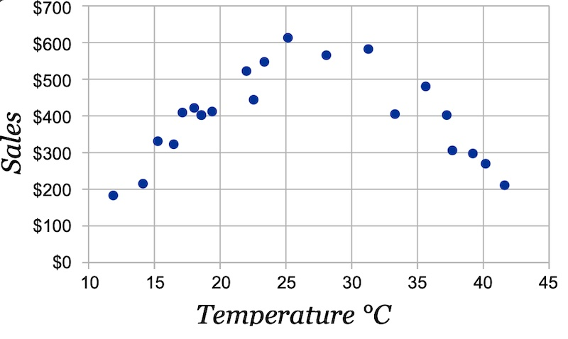
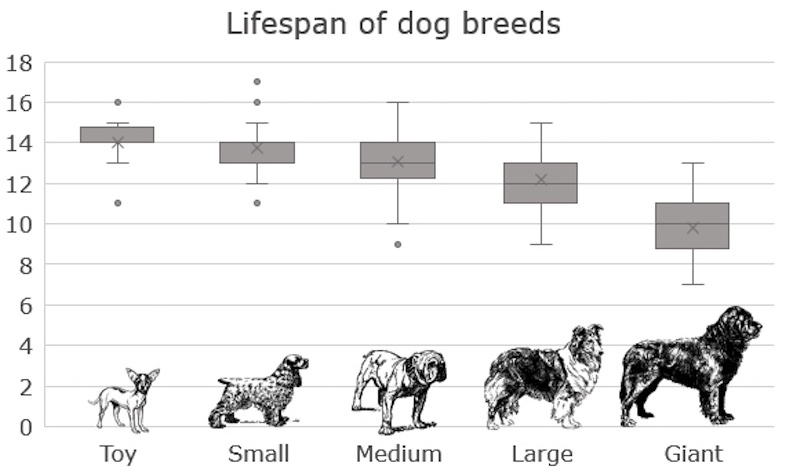

import { FigureCaption } from '../../components/figure-caption';

Applying machine learning effectively is tricky. You need data. You need a robust pipeline to support your data flows. And most of all, you need high-quality labels. As a result, most of the time, my first iteration doesn’t involve machine learning at all.

<blockquote class="twitter-tweet">
The first rule of machine learning: Start without machine learning
&mdash; Eugene Yan (@eugeneyan) <a href="https://twitter.com/eugeneyan/status/1436141466196217856?ref_src=twsrc%5Etfw">September 10, 2021</a></blockquote> 

## Wait—start _without_ machine learning?

I’m not alone in saying this.

Guess what’s Rule #1 in Google’s 43 [Rules of Machine Learning](https://developers.google.com/machine-learning/guides/rules-of-ml)?

> **Rule #1: Don’t be afraid to launch a product without machine learning.**
> 
> Machine learning is cool, but it requires data. Theoretically, you can take data from a different problem and then tweak the model for a new product, but this will likely underperform basic heuristics. If you think that machine learning will give you a 100% boost, then a heuristic will get you 50% of the way there.

Several machine learning practitioners—who I interviewed as part of [Applying ML](https://applyingml.com)—also gave similar advice in response to this question: _"Imagine you're given a new, unfamiliar problem to solve with machine learning. How would you approach it?"_

> I’d first try really hard to see if I could solve it without machine learning :D. I’m all about trying the less glamorous, easy stuff first before moving on to any more complicated solutions. — [_Vicki Boykis, ML Engineer @ Tumblr_](https://applyingml.com/mentors/vicki-boykis/#imagine-youre-given-a-new-unfamiliar-problem-to-solve-with-machine-learning-how-would-you-approach-it)

> I think it's important to do it without ML first. Solve the problem manually, or with heuristics. This way, it will force you to become intimately familiar with the problem and the data, which is the most important first step. Furthermore, arriving at a non-ML baseline is important in keeping yourself honest. — [_Hamel Hussain, Staff ML Engineer @ Github_](https://applyingml.com/mentors/hamel-husain/#imagine-youre-given-a-new-unfamiliar-problem-to-solve-with-machine-learning-how-would-you-approach-it)

> First, try to solve it without machine learning. Everybody gives this advice, because it’s good. You can write some if/else rules or heuristics that make some simple decisions and take actions as a result. — [_Adam Laiacano, Staff Eng (ML platform) @ Spotify_](https://applyingml.com/mentors/adam-laiacano/#imagine-youre-given-a-new-unfamiliar-problem-to-solve-with-machine-learning-how-would-you-approach-it)

## What should we start with then?

Regardless of whether you’re using simple rules or deep learning, it helps to have a decent understanding of the data. Thus, grab a sample of the data to run some statistics and visualize! (Note: This mainly applies to tabular data. Other data such as images, text, audio, etc. can be tricker to run aggregate statistics on.)

**Simple correlations help with figuring out the relationships** between each feature and the target variable. Then, we can select a subset of features, with the strongest relationships, to visualize. Not only does this help with understanding the data and problem—so we can apply machine learning more effectively— we also gain better context of the business domain. Note that correlations and aggregate statistics can be misleading though—variables that have strong relationships can appear to have zero correlation (more below).

**Scatter plots are a favorite for visualizing numerical values.** Have the feature on the x-axis and the target variable on the y-axis and let the relationship reveal itself. In the example below, temperature has zero correlation with ice cream sales. However, we see a clear relationship in the scatter plot—people buy more ice cream as temperature increases, but beyond a certain temperature, it gets too hot and they just stay indoors. 

<FigureCaption caption="Scatter plot of the relationship between temperature and ice cream sales" source="https://www.mathsisfun.com/data/correlation.html" />

**If either variable is categorical, I’ve found box plots to work well.** Imagine you’re trying to predict the lifespan of a dog—how does the size of the dog matter?

<FigureCaption caption="Box plot of lifespan across dog breed sizes" source="https://www.officetooltips.com/excel_365/tips/how_to_create_a_box_and_whisker_plot_in_excel.html" />

With an understanding of the data, we can then **start by solving the problem with heuristics.** Here are some examples of using heuristics to solve common problems (you’ll be surprised how difficult they are to beat):
- **Recommendations**: Recommend top-performing items from the previous period; can also be segmented by categories (e.g., genres, brands). If you have customer behavior, you can compute aggregated statistics on co-interactions to calculate item similarity for i2i recommendations (see Alibaba’s Swing Algorithm [here](/resources/real-time-recommendations/#industry-examples-of-real-time-recommendations).
- **Product classification**: Regex-based rules on product titles. Here’s an example from [Walmart’s product classifier (Section 4.5)](https://dl.acm.org/doi/10.14778/2733004.2733024): If product title contains “ring”, “wedding band”, “diamond. *bridal”, etc., classify it in the ring category.
- **Review spam identification**: Rules based on the count of reviews from the same IP, time the review was made (e.g., odd timing like 3 am), similarity (e.g., edit distance) between the current review and other reviews made on the same day.

Several folks have also replied to this [tweet](https://twitter.com/eugeneyan/status/1436198607972012036) with non-machine learning baselines such as regex, interquartile range for outlier detection, moving average for forecasting, building dictionaries for address matching, etc. 

**Do these heuristics actually work?** Yes! I’m often amazed at how effective they are given the minimal effort involved. Here’s one where a simple exclusion list stopped scammers.

<blockquote class="twitter-tweet" data-conversation="none">
Many years ago had a similar experience. Scammers were rapidly making new websites after we blocked them and slipping past models but they kept using the same images with the same filenames. Gotchaaaa.
&mdash; Jack Hanlon (@JHanlon) <a href="https://twitter.com/JHanlon/status/1425978463417217028?ref_src=twsrc%5Etfw">August 13, 2021</a></blockquote>

And another where regex > deep learning.

<blockquote class="twitter-tweet" data-conversation="none">
I’ve gotten so much flack for this. One project I did with string comparisons but customer was disappointed I didn’t use neural networks and hired someone else to do that. Guess which one was cheaper and more accurate,
&mdash; Mitch Haile (@bwahacker) <a href="https://twitter.com/bwahacker/status/1436280547219738627?ref_src=twsrc%5Etfw">September 10, 2021</a></blockquote>

Yea, you might say that those people training the machine learning models didn’t know what they were doing. Perhaps. Nonetheless, the point is, understanding the data and simple heuristics can easily do better than `model.fit()`, and in less than half the time.

**These heuristics also help with bootstrapping labels (aka weak supervision).**  If you’re starting from scratch and have no labels, weak supervision in a way to quickly get lots of labels efficiently, albeit at lower quality. These heuristics can be formalized as labeling functions to generate labels. Other forms of weak supervision include using knowledge bases and pre-trained models. More about weak supervision at Google and Apple [here](/resources/data-labeling/).

## When should we use machine learning then?

**After you have a non-ML baseline that performs reasonably well**, and the effort of maintaining and improving that baseline outweighs the effort of building and deploying an ML-based system. It’s hard to pinpoint exactly when this happens, but if your 195 handcrafted rules become impossible to update without something breaking, it’s a sign that you should consider machine learning. Here’s Rule #3 from Google’s Rules of ML.

> **Rule #3: Choose machine learning over a complex heuristic.**
> 
> A simple heuristic can get your product out the door. A complex heuristic is unmaintainable. Once you have data and a basic idea of what you are trying to accomplish, move on to machine learning… and you will find that the machine­-learned model is easier to update and maintain.

**Having robust data pipelines and high-quality data labels also suggests you’re ready for machine learning.** Before this happens, your existing data might not be good enough for machine learning. Say you want to reduce fraud on your platform, but you don’t even know how fraud looks like, let alone have any labels. 

Or you might have the data, but it’s in such a bad state that it’s unusable. For example, you have product category data that can be used to train a product classifier. But merchants deliberately misclassify products to game the system (e.g., to benefit from lower commissions in certain categories, or have an easier time ranking in sparse categories). 

Often, manual labeling is required to bootstrap a golden dataset of high-quality labels. With it, training _and validating_ your machine learning efforts become much easier. 

## But what if I need to use ML, just for the sake of it?

Hmm, that’s a tough position to be in. How do you balance solving the problem and serving customers, vs. wasting a ton of time and effort just for the sake of it? I don’t have an answer to that, but I’ll leave you with this genius tip from Brandon Rohrer.

<blockquote class="twitter-tweet">
ML strategy tip:  When you have a problem, build two solutions - a deep Bayesian transformer running on multicloud Kubernetes and a SQL query built on a stack of egregiously oversimplifying assumptions. Put one on your resume, the other in production. Everyone goes home happy.
&mdash; Brandon Rohrer (@_brohrer_) <a href="https://twitter.com/_brohrer_/status/1425770502321283073?ref_src=twsrc%5Etfw">August 12, 2021</a></blockquote> 