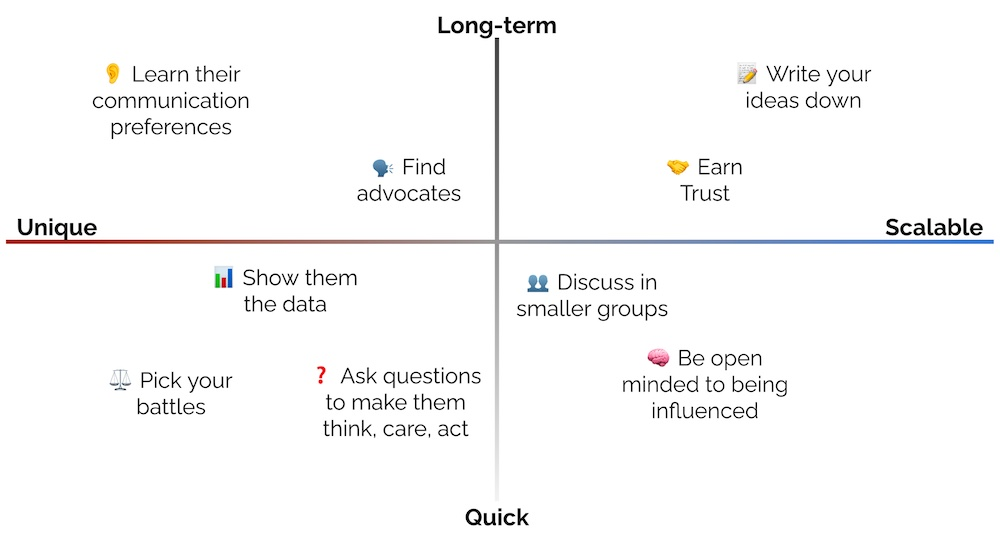

import { FigureCaption } from '../../components/figure-caption';

As data scientists, we work with other teams such as infra, engineering, and product to ship our machine learning systems. These teams have their own—sometimes competing—priorities, and everyone has limited resources and time. Our request is important, but so is everyone else’s. Without authority, how can we influence so our request gets prioritized?

Or consider another scenario: You’re the new joiner on a team. You spot a critical flaw in the design, or have an idea which you’re convinced is the better approach. How do you share your insight or suggestion with senior members, and influence the needed change?

Here’s some advice I found helpful on influencing without authority. Though the context and examples mostly related to data science, it applies to tech roles in general. We’ll start with simple practices you can adopt immediately, before going into principles and mindsets that may take more time and effort. 

## Show them the data

I shouldn’t even need to say this, right? You’re a data scientist, data is your superpower. Use data to demonstrate why your idea or suggestion is valuable. Nothing makes a point like numbers showing customer or business benefit in terms of dollars, reduced return rate, NPS, etc. Bring your analyses and A/B test results.

And data doesn’t just mean quantitative data. Anecdotes, research findings, and qualitative data count too. For example, you might be considering various ways to serve ML models (e.g., AWS EC2, SageMaker, Kubeflow, self-managed fleet). Share your findings on the pros and cons of each option before making a recommendation—this is data too, and the deep dive helps build confidence in your proposal.

> “The thing I have noticed is that when the anecdotes and the data disagree, the anecdotes are usually right. There is something wrong with the way that you are measuring it,” —Jeff Bezos

## Ask questions to help people think, care, and decide

Sometimes, we believe that the strength of our ideas, arguments, or communication makes people change their minds. Wrong. People make up their own minds.

An effective way to convince and help people decide is the [Socratic method](https://en.wikipedia.org/wiki/Socratic_method). Instead of telling people how to think, or what to do, ask questions that will make them think about it. Once they think about it, they’ll care about it. And once they care about it, they’ll act on it.

Perhaps you’ve identified a component in the system design that cannot scale, and are aware of more scalable, cheaper alternatives. Help the team think through it by asking: “How many queries per second can this support?”, “What’s the expected latency at p99?”, and “How much does it cost to support that throughput and latency?” Once the team agrees that it’s a concern, facilitate finding a solution by asking: “Do we know of anything that scales to our needs?”, “Has another team solved this problem, and can we reuse their system or service?” With some luck, they'll convince themselves of the better solution.

## Discuss in smaller groups

When introducing ideas or raising a conflicting view, you want to avoid people feeling defensive when challenged in a large environment. Thus, organize your meetings to have fewer people. Similarly, keep the number of recipients in your email thread small.

I’ve found socializing ideas with stakeholders one-on-one useful. This allows me to share my perspective, understand their views and concerns, and work out hairy issues without concern of anyone [losing face](https://www.merriam-webster.com/dictionary/lose%20face). It may require a bit more time and effort, but the outcome more than makes up for it.

## Write your ideas down

It can be difficult to schedule meetings with key stakeholders to share your ideas and proposals. But if you write it down in a memo or one-pager, they can read it when they have 10 minutes to spare and leave comments in it.

Writing scales very well. It’s O(1)—it takes the same effort to write for one person or 10,000. Writing your ideas in a doc helps it spread further than in-person presentations. 

Finally, writing helps you weave a coherent narrative. By adding data and connecting ideas, we’re forced to think deeply and resolve inconsistencies. As we write, we iterate on our ideas; this makes the final document more persuasive.

## Learn how they prefer to communicate

Are they [“Why”, “What”, or “How”](/resources/why-what-how/) people? Most people focus on one or two, though this changes across scenarios (e.g., roadmap planning, design review, correction of error). Knowing and targeting the Why, What, or How helps you meet them where they are and address their concerns. 

In general, people focus on the “Why”. The proposal’s rationale has an outsized impact on their decision—it has to be something they believe in or are excited about. In some scenarios (e.g., prioritizing projects), the “What” becomes more important: What are the benefits, costs, and risks involved? In other situations (e.g., design reviews), the “How” becomes more important: How will we scale and maintain the system in the long run? How will we address severity 1 & 2 issues?

Also, people have different communication preferences, such as: (i) early vs. later in the project, (ii) informal vs. formal settings, (iii) face-to-face vs. electronic, and (iv) lots of context vs. straight to the point. To learn the latter, next time you present your document, print a copy and observe how they read it. Do they study the entire document, including the appendices? Or do they scan through and look for the bottom line? Next time, adjust your document to meet their needs. 

## Find advocates

Sometimes, we might have a great idea but are not in the best position to present it in the most influential way. If so, we can tap on our relationships with others so they can promote the idea on our behalf. They may have an established relationship, or are in a more influential position, or can appeal to the values of the other party better.

If you do this, you have to be okay with your ally possibly receiving the bulk of the credit, even though it was your idea. IMHO, this is fine, because it’s the work and impact that matters. (Nonetheless, I can understand if such an outcome is hard to swallow). 

## Earn trust

If people trust you, they're more likely to accept your ideas. Earn trust by getting shit done and delivering value. If you’re new to the org/team, what are some fast, valuable wins that demonstrate your expertise and ability? Once you’ve proven yourself, people learn to trust you and your judgment on longer-term, riskier projects.

Another approach is to do the extra work. Before asking for a big favor or request, be aware of the details of your ask, including the challenges and risks. Do the research, explain your findings and trade-offs, and demonstrate the value of your proposal—this makes it easier for the other party to say yes. Understand their constraints via their roadmap, artifacts, and documents, and learn how your request fits into it. Doing your homework earns trust with the other party.

Once you understand their interests, make clear that you want what’s best for them too. Identify common goals you can collaborate on. Perhaps tie your business metrics to theirs, and find ways to address their challenges or help with their targets through your work. This helps them see you as an ally who has their interests at heart.

## Be open to being influenced

We all know someone who wants to influence others, but is not open to being influenced themselves. Don’t be that person. 

By being open-minded, we’re also earning trust. Changing our minds isn’t a weakness. On the contrary, it helps improve our ideas and decisions. Think of feedback or pushback as inputs to build on, rather than criticisms you need to defend. And as you iterate on feedback, your ideas and designs improve, making them more persuasive. 

Remember, the overall goal is the success of the organization and customers. There’s a chance that, no matter how good your idea or suggestion is, your project may not be the most valuable, or your decision may not be the right one. Keep an open mind.

## Pick your battles

Whether you’re pitching an idea, proposing a system design, or trying to steer the team towards a decision, recognize that you can’t win it all. It’s okay to have things not go your way (easier said than done, I know). Your suggestions may not be accepted for various reasons, such as lack of budget or resources, or because there are more pressing concerns. 

Getting a no isn’t necessarily bad. No doesn’t mean never ever; it just means no, not now. It’s important to understand what the no means: Is it a great idea, but at the wrong time? Or the wrong idea, because there was a blindspot overlooked? Understanding the no helps us iterate and improve our ideas. 

<FigureCaption caption="Quick to apply vs. long-term; Unique (for each party) vs. scalable (to everyone)"/>

Influencing without authority isn’t easy, especially if you’re a new joiner in a large organization. Nonetheless, like most skills, influence is a muscle that can be built through exercise, learning, and reflection. 
