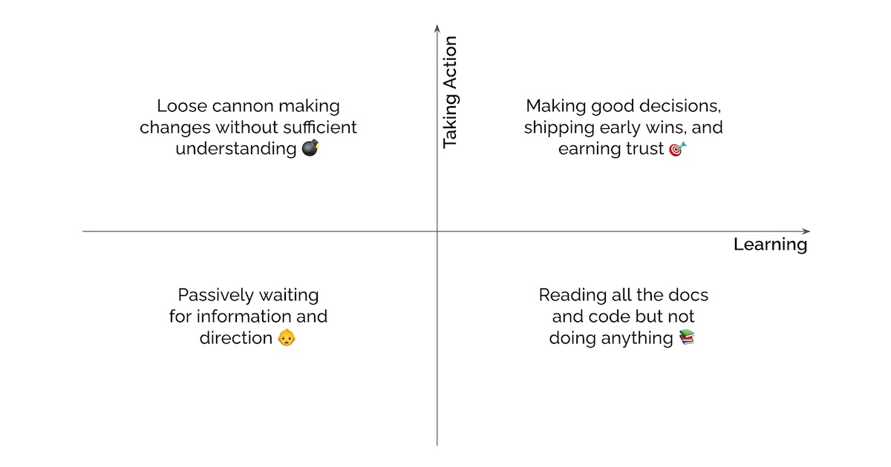

import { FigureCaption } from '../../components/figure-caption';

Onboarding to a new role can be scary. You want to start things on the right foot and so much rides on your first few months. Though I don't have it all worked out, here are some guidelines that served me well. This post is intended for tech folks in mid to senior roles. We'll start with discussing mindset before planning for the first 100 days.

## Starting with the right mindset

**Own your onboarding.** How successful your onboarding is lies with you. While your manager may have an initial onboarding plan, you own it and should feel empowered to update it as necessary. Treat the onboarding like any other project you're tasked to lead.

Taking ownership means clarifying expectations early and often. Define your [100-day plan](/resources/onboarding/#planning-for-success-in-the-first-100-days) and seek feedback within week one. Revisit it occasionally to check if expectations have changed, especially if you're in a fast-moving team. Revisiting expectations is important if you're an external joiner and don't understand the culture yet. If an onboarding plan has been prepared but is lacking in details or is too challenging, speak up! Request for clarification or help, and don't hesitate to make changes—no one wants to see you fail. 

Taking ownership also means you're responsible for making relationships work. Don't expect your manager and peers to proactively reach out to introduce themselves or offer support. Everyone's likely busy themselves. It's a bonus if they do but you should assume the onus is on you to take the first step. Most people are happy to have a 30-min intro chat or lend a helping hand if you'd just ask. 

**Have a Beginner's mind.** As the new joiner, you get to play the “I'm new here” card. I would take advantage of it and ask as many questions as needed. It's cliché but it bears repeating that there are no stupid questions. Your fresh perspective is valuable and your questions may nudge the team into better ways of doing things. 

For folks with experience in a similar domain or tech stack, don't just stick to what you know. We often assume that achieving success in the new role means doing what we did in the previous role, only more of it and better—most of the time, this assumption is wrong. Sometimes that's true, such as when we're hired into a younger org to spin up the same function we led in our previous org. But even then, it's unlikely we can copy-paste everything and expect it to work. We'll need to adjust to the unique circumstances of the team and org. We might need to stop doing what worked and pick up new capabilities. 

Don't be the person that comes in with “the answer” and doesn't make any effort to understand the idiosyncrasies of the team and org. You can tell who these people are. They tend to say “when I was at BrandedCo this was how _we_ did it” and “we should change things to be just like _my old place_”, which brings us to our next principle…

**Resist the urge to change things.** “Respect what came before” is one of Amazon's [Principal Engineering Tenets](https://www.amazon.jobs/en/landing_pages/pe-community-tenets). It means appreciating the value of working systems and the lessons they embody.

In your first week, you might find 10 things that seem wrong to you. Perhaps the build system is too complex or the machine learning too simple. Don't be too quick to judge and make changes! Make a note of it somewhere and work hard to disconfirm your beliefs. Revisit these notes every month or so and notice how your initial hypotheses change. 

You might find that, after learning more about the existing systems, only 2 out of the initial 10 observations are valid. If you had tried to change all 10 things, you would have been a bull in a china shop. By deferring judgment and collecting more data, you've narrowed the list down to the two things that matter and can put more wood behind fewer arrows.

The point is, don't fall prey to the action imperative. Don't feel the need to take action too hard and too quickly to put your stamp on the team. Instead, adopt a [Beginner's mind](https://eugeneyan.com/writing/beginners-mind/) and focus on learning. If we're too busy taking action instead of learning and diagnosing, we risk prescribing the wrong medicine. This leads to making bad decisions early on, losing trust, and inadvertently building resistance to any future ideas we have.

(Note: The above assumes you're joining in a time of stability, which would apply to most teams. If however, you're joining in a time of hypergrowth and need to widen your lead, or if everything's on fire and you need a quick turnaround, act quickly and decisively!)

**Invest time in culture and relationships too.** Being in a technical role, during onboarding, I tend to focus on the technical aspects (e.g., tools, systems, code) and neglect the cultural and social aspects. After all, the explicit is easier to see and learn than the implicit. However, it helps to have a grasp of team culture, relationships, and mechanisms, especially if you're in a more senior position.

An example of culture is how conflict is resolved. Do people disagree openly or is conflict avoided? If conflict has to be resolved, is it escalated upwards or delegated downwards? Once a decision is made, do people disagree and commit, or grumble and resist? Another cultural norm is how meetings are conducted. Does the team use powerpoint or write documents? New joiners in Amazon are often surprised by meetings where the first half is spent silently reading and commenting on a doc before discussions in the second half. 

For relationships, we tend to focus on vertical relationships such as our boss or direct reports, and don't spend enough time with peers and stakeholders. This can lead to missed collaboration opportunities or duplicating a system that a sister team has built. 

One person I engage with is the voice of the customer. These people have strong intuition about what customers will or will not like and know where the paper cuts are. Thus, they're a good sounding board for new ideas and features. Another person is the systems old hand. Relative to most people, they have a wider and deeper understanding of existing systems and their constraints. They know what can or cannot scale, how to reduce effort by reusing existing capabilities, and when something new needs to be built.

## Planning for success in the first 100 days

Now that we've discussed mindset, let's go through how to execute effectively in your first 100 days to earn trust and build strong relationships.

**Write your 100-day plan.** If you've joined a more mature organization, your manager may already have an onboarding plan prepared. If not, you can write one yourself. Either way, review expectations and update the plan occasionally so everyone's aligned.

Here's a rough guideline: It should have milestones for each of the first four weeks, the second month, and the third month. For each of these milestones, set goals for (i) learning—what internal tooling, systems, and mechanisms to pick up, (ii) relationships—who you should start engaging with, and (iii) deliverables—what you should have shipped.

Don't expect to have it fully fleshed out from day 1. Writing a 100-day plan should resemble agile more than waterfall. As you learn more about the org and existing systems, you'll identify gaps in your plan and update it as well as gain the context to set longer-term goals. Plan as much as you can and get feedback from your manager, ideally within the first week.

Suggested timeline:
- End of week 1: Draft 100-day plan with milestones for the first four weeks
- End of month 1: 100-day plan with milestones for the 2nd and 3rd month

**Plug into the human network.** As part of onboarding, you should have a list of people to talk to. Your manager may have prepared this list. If not, ask for suggestions on people who work on similar projects (e.g., fellow scientists or engineers) and key stakeholders (e.g., engineering or product managers).

When you chat with these initial group of people, ask them to suggest one other person they think you should also talk to. This could be someone whose work is relevant to yours or someone you should collaborate with. Repeat as necessary. After engaging with a number of people you should have a brief overview of who's engaged in similar work and who can be future collaborators and feedback providers. 

If you hit it off with someone, consider keeping in touch via a recurring meeting where you can share updates and ask for feedback. These could be informal mentors who you want to keep in touch with and seek advice from, or peers doing similar work but in a different org (e.g., machine learning systems in a different vertical). 

Suggested timeline:
- End of week 2: Meet with people on the initial list
- End of week 3: Meet with additional people others suggested

Suggested questions:
- What was your previous project and what are you working on now?
- What are your team's key goals and challenges?
- What are your interests, either at work or outside of work?

**Plug into the way of doing things and ship early wins.** The intent of shipping early is to use it as a forcing function to (i) learn enough about existing systems and mechanisms to ship a pull request, document, or feature and (ii) start earning trust. If your work involves research and trial and error, such as machine learning or product, early wins should be framed as experiments conducted (i.e., number of A/B tests) instead of expected performance (i.e., positive A/B test).

An oft-cited example of an early win is having a new joiner merge a pull request within the first week. Beyond contributing via code, another early win could be taking the lead and proposing a one-pager or design document to solve a moderately sized problem. Having deliverables that you can demo to the team and get feedback on is a big plus.

Suggested timeline: 
- End of week 1: Make and merge a pull request
- End of month 1: Write a one-pager and seek feedback
- End of month 2: Write a [design doc](/resources/ml-design-docs/) and seek feedback
- End of 100 days: Ship a new feature and launch an A/B test

(Note: The timeline above depends on the team's culture, mechanisms, and rate of iteration. Startups might expect an [A/B test within the first few weeks](https://blog.rstankov.com/onboarding-software-engineers-remote-at-product-hunt/) while larger organizations necessitate learning more about the context and existing systems, proposing a design doc, and gathering feedback before implementation. Adapt accordingly.)

**Improve the onboarding experience for the next person.** One of the highest leverage things you can do is to improve the onboarding process so future joiners take less time to become productive. If your team is scaling up rapidly, building or improving the onboarding process will likely have higher leverage than any code you write.

Nonetheless, you might be neck-deep in work after your onboarding and can't contribute much. That's fine. Try to set aside a few hours to reflect on your own onboarding and focus on the top pain points. What did you spend a disproportionate amount of time on and how did you overcome it? Can you share—perhaps on an internal wiki—your solution (e.g., shell scripts, configs) that new joiners can reuse? Alternatively, share your 100-day plan and onboarding notes so others can follow in your footsteps. 

## Conclusion

The worst thing you can do while onboarding is to be a loose cannon and force changes from day one (top left of image below). But the other extreme, spending too much time learning with nothing to show for it isn't much better (bottom right). Ideally, we want to be in the top right of the 2x2 where we learn quickly and  take action to ship and earn trust.

<FigureCaption caption="Avoid investing too little in learning or just learning without taking action."/>

You can avoid the first extreme by coming with a [Beginner's mind](https://eugeneyan.com/writing/beginners-mind/) and resisting the urge to change things. You can avoid the second extreme by taking ownership and writing a strong 100-day plan. Investing in learning and relationships helps with making good decisions and shipping early wins; shipping early wins earns trust and builds strong relationships. This leads to a virtuous cycle. I hope this advice makes your first 100 days more effective. All the best with your new role!