import { FigureCaption } from '../../components/figure-caption';
import "katex/dist/katex.min.css"

Personalization is the process of customizing each individual’s experience. It’s how an electronics geek gets different recommendations from a cooking hobbyist, and how they might get different results from the same search query (e.g., “Apple”)

How does personalization happen? I dug into a couple of industry papers and bucketed them into a few groups (e.g., bandit, sequential, graph-based). These groups aren’t mutually exclusive, and some approaches fall into multiple buckets. Nonetheless, they’re a good overview of the various patterns for personalization.

## Bandits: Learning continuously via exploration

Multi-armed bandits try to balance exploration and exploitation. They explore new actions to learn what the potential reward is, and they exploit the current best action to maximize reward. The goal is to learn about and choose actions that maximize total reward (aka minimize regret).

Contextual bandits take it a step further, where they collect and observe the context before each action, and choose actions based on the context. They learn about how actions _and context_ affect reward. In the case of recommendations and search, the context would be information we have about the customer (e.g., demographics, device, indicated/historical preferences) and environment (e.g., day of week, time of day).

Multi-armed bandits try to balance exploration and exploitation. They explore new actions to learn what the potential reward is, and they exploit the current best action to maximize reward. The goal is to learn about and choose actions that maximize total reward (aka minimize regret).

Contextual bandits take it a step further, where they collect and observe the context before each action, and choose actions based on the context. They learn about how actions _and context_ affect reward. In the case of recommendations and search, the context would be information we have about the customer (e.g., demographics, device, indicated/historical preferences) and environment (e.g., day of week, time of day).

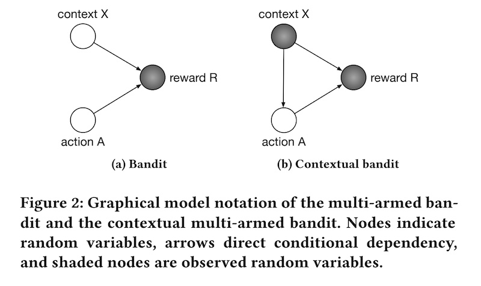
<FigureCaption caption="The difference between multi-armed and contextual bandits" source="https://dl.acm.org/doi/10.1145/3240323.3240354" />

Bandits have several advantages over batch machine learning approaches. Relative to batch ML models and A/B tests, a bandit-based approach has lower regret. Regret happens when customers are not able to benefit from a better model, such as when the data’s being collected (before the model can be trained), or when the customer is not in the best treatment group in an A/B test. Bandits don’t need to collect a full batch of data, train a model, and wait for an A/B test to conclude—instead, they can continuously learn about the best recommendation for each customer through exploration. 

In some cases, they may behave more optimally than batch recommenders. Batch recommenders tend to perform well when we have high certainty about recommendation relevance, such as when we have a lot of data about the user-item pair. However, when we have little or no data (i.e., long-tail, cold-start), batch recommenders ignore possibly relevant items in favor of popular items. In contrast, bandit recommenders can continue to explore in the face of uncertainty and gather more data.

**Netflix shared how they use contextual bandits to [personalize images for shows](https://netflixtechblog.com/artwork-personalization-c589f074ad76).** The bandit can choose from a set of images for each show (i.e., action) and observe the number of minutes the user played the show after being impressed with the image (i.e., reward). It also has information about user attributes (e.g., titles played, genres played, country, language preferences), day of week, time of day, etc. (i.e., context). 

For offline evaluation of the bandit, they apply _replay_ on the bandit’s predicted image and the random image shown during the exploration phase. They first get the bandit’s predicted image for each user-show pair. Then, they try to match it with the random images shown to users in the exploration phase. If the predicted image matches the randomly assigned image, that predicted-random match can be used for evaluation.

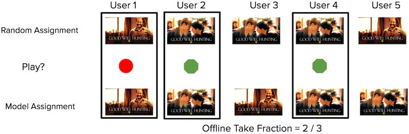
<FigureCaption caption="How to compute replay using random and model predicted images" source="https://netflixtechblog.com/artwork-personalization-c589f074ad76" />

From the set of predicted-random matches, they check if the user played the title or not. The main metric of interest is the number of quality plays over the number of impressions (i.e., take fraction)—for the _n_ images that were recommended, how many resulted in the user watching the show?

The benefit of replay is that it’s an unbiased metric when accounting for the probability of each image shown during exploration. Having the probability allows us to weigh the reward to control for bias in image display rates, either in exploration or production. (Also see this [SIGIR tutorial on counterfactual evaluation](http://www.cs.cornell.edu/~adith/CfactSIGIR2016/).) The downside is that it requires a lot of data, and there could be high variance in evaluation metrics if there are few matches between the predicted and random data. Nonetheless, techniques such as [doubly robust estimation](https://arxiv.org/abs/1103.4601) can help.

**Doordash also adopted a contextual bandit approach for [cuisine recommendations](https://doordash.engineering/2020/01/27/personalized-cuisine-filter/), with the addition of multiple geolocation levels.** The bandit explores by suggesting new cuisine types to customers to gauge their interest, and exploits to recommend customers their most preferred cuisines.

To model the “average” cuisine preference in each location, they introduced multiple levels in their bandit. As an example, they shared how levels could go from the lowest level of district, through submarket, market, and region.

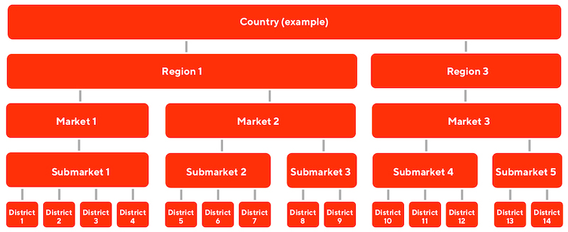
<FigureCaption caption="The multiple levels in Doordash's multi-level bandit" source="https://doordash.engineering/2020/01/27/personalized-cuisine-filter/" />

Each geolocation level provides prior knowledge so that cold-start customers can be represented by the prior of the location, until the bandit collects enough data about them for personalization. The geolocation priors also allows Doordash to balance the customer's existing preferences with the hot favorites of each geolocation. A sushi-lover ordering food from a new geolocation may be exposed to the hot favorite in the area (e.g., fried chicken), balancing his preferences with local popularity.

As a final example, we look at **how Spotify using contextual bandits to [identify the best recommendation explanation](https://dl.acm.org/doi/10.1145/3240323.3240354) (aka “recsplanations”) for users.** The problem was how to jointly personalize music recommendations with their associated explanation, where the reward is user engagement on the recommendation. Contextual features include user region, product and platform of user device, user listening history (genres, playlist), etc.

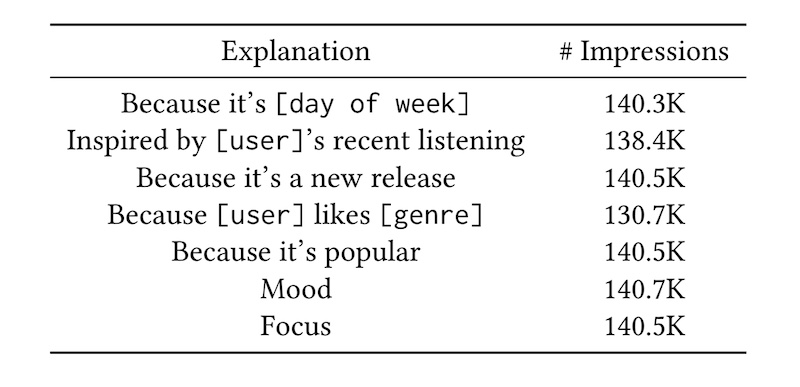
<FigureCaption caption="The various recsplanations in Spotify" source="https://dl.acm.org/doi/10.1145/3240323.3240354" />

An initial approach involved using logistic regression to predict user engagement from a recsplanation, given data about the recommendation, explanation, and user context. However, for logistic regression, the recsplanation that maximized reward was the same regardless of the user context.

To address this, they introduced higher-order interactions between recommendation, explanation, and user context, first by embedding them, and then introducing inner products on the embeddings (i.e., 2nd-order interactions). Then, the 2nd-order interactions are combined with first-order variables via a weighted sum, making it a 2nd-order factorization machine. They tried both 2nd and 3rd order factorization machines. (For more details of factorization machines in recommendations, see figure 2 and the “FM Component” section in the [DeepFM](https://arxiv.org/abs/1703.04247) paper).

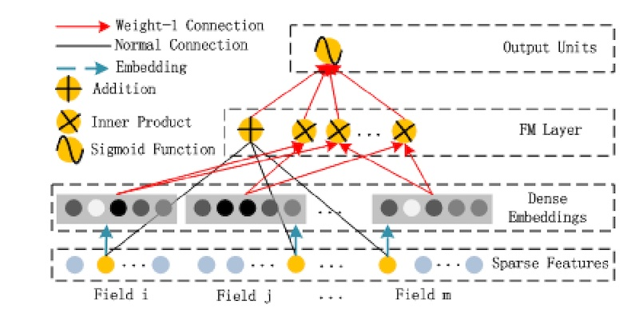
<FigureCaption caption="The factorization machine component of DeepFM" source="https://arxiv.org/abs/1703.04247" />

To train their model, they adopt sample reweighting to account for the non-uniform probability of recommendations in production. (They didn’t have the benefit of uniform random samples like in the Netflix example.) During offline evaluation, the 3rd-order factorization machine performed best. During online evaluation (i.e., A/B test), both 2nd and 3rd-order factorization machines did better than logistic regression and the baseline. Nonetheless, there was no significant difference between the 2nd and 3rd-order models.

## Embedding+MLP: Learning embeddings; pooling them

Deep learning has increasingly been applied to recommendations and search. In the beginning, they mostly adopted an embedding + multilayer perceptron (MLP) paradigm.

First, sparse input features (e.g., item, customer, context) are mapped into embedding vectors. Features that are variable in length, such as sequences of user historical behavior, are transformed into fixed-size vectors, usually via mean, sum, or max pooling. Then, the various features are concatenated and fed into full connected layers. The recommendation task is typically posed as a classification problem, with a final softmax layer predicting each item’s probability, or a final sigmoid layer predicting user engagement on an item (e.g., click, purchase).

**TripAdvisor shared about how they recommend [personalized experiences](https://www.tripadvisor.com/engineering/personalized-recommendations-for-experiences-using-deep-learning/) (i.e., tours) via this paradigm.** The recommender predicts the user’s next interest in an experience given her browsing history.

First, they train general-purpose item embeddings (100-dim) using [StarSpace](https://arxiv.org/abs/1709.03856), based on page view data. These embeddings are consumed by other downstream tasks, such as home page recommendations and ranking. Specific for personalized experiences, the embeddings are used to initialize the model weights before being fine-tuned for the specific recommendation task.

The model takes user browsing history as input. However, browsing history could be of varying lengths for different users. To compress them into a fix-length vector, they apply exponential recency weighted average. This is based on the assumption that the most recent browsing data would contribute most to predicting the next action. (They also tried using an LSTM to combine the embeddings but didn’t see any improvements relative to the recency weighted average.)

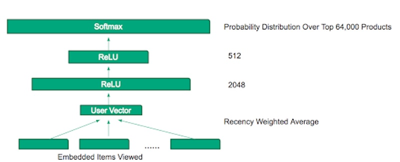
<FigureCaption caption="TripAdvisor's MLP for personalized experience recommendations" source="https://www.tripadvisor.com/engineering/personalized-recommendations-for-experiences-using-deep-learning/" />

The averaged embeddings then pass through two ReLU layers (2048-dim, 512-dim) before a final softmax layer to predict the probability over 64,000 experiences. While they found that increasing the dimensions of the hidden layers led to improved accuracy, it also increased serving latency. The penultimate layer of 512-dim was a trade-off between accuracy and latency.

**YouTube adopts a similar approach for [video recommendations](https://research.google/pubs/pub45530/), though they split the process into candidate generation and ranking.**

In the candidate generation stage, to represent user interests, they used the user’s past searches (i.e., search query token embeddings) and watches (i.e., video embeddings). To combine these variable-length sequences into a fixed-sized vector, they applied mean pooling. (They also tried other strategies such as sum, component-wise max, etc., and found mean pooling to work best). Then, they concatenate other user features such as geography, demographics, as well as the age of the video (to represent freshness). The demographic variables provide useful priors in the case of cold-start users.

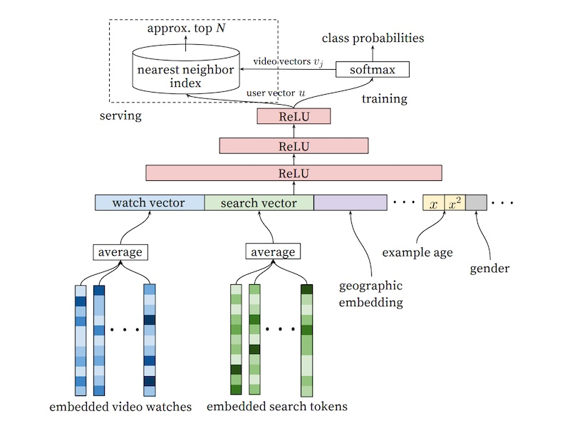
<FigureCaption caption="YouTube's candidate generation model for video recommendations" source="https://research.google/pubs/pub45530/" />

The features then pass through several fully connected ReLUs before a final softmax that predicts the probability of each video being watched. Given that there are millions of potential videos to predict the probability of, they adopt negative sampling to train the model efficiently. In practice, several thousand negatives are sampled, which led to a more than 100x speedup over the traditional softmax.

During serving, they apply approximate nearest neighbors to find video candidates for each user embedding. (Aside: I’m not sure what the arrow of video vectors pointing out of the softmax are. I’m guessing that, to get these video embeddings, they simply pass the single video as the watch vector and leave the other features empty. If you have a better understanding, please [reach out](https://twitter.com/eugeneyan).)

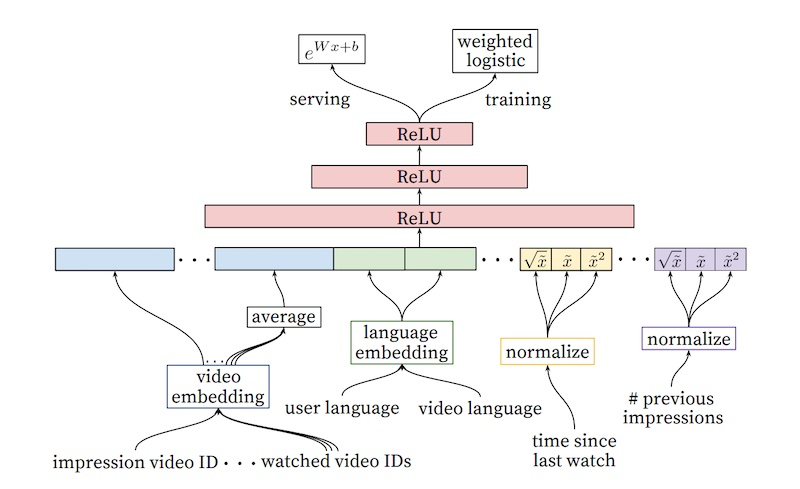
<FigureCaption caption="YouTube's ranking model for video recommendations" source="https://research.google/pubs/pub45530/" />

The ranking stage follows a similar approach. Video embeddings are averaged and concatenated with other features. The input also includes the video candidate to be impressed (from the previous candidate generation step); see the leftmost feature in the diagram above. This is then passed through several ReLU layers before a final sigmoid layer that predicts the probability of the video being watched, weighted by the observed watch time. The output is a list of candidates and their predicted watch time, which is then used to rank the videos.

As a final example, we look at **Alibaba’s [Deep Interest Network](https://arxiv.org/abs/1706.06978) for predicting ad engagement.** The authors assert that one downside of neural recommenders is the compression of variable-length behaviors into fixed-length vectors via pooling (e.g., mean, sum, max). As a result, it makes it difficult to understand and capture the user’s diverse interests effectively. (To recap, TripAdvisor used recency weighted mean while YouTube used simple mean.)

To improve on this, they introduced an attention layer that weighs historical user behavior using attention. The intent is to learn different representations of the user’s interest given the candidate ad. The model builds on their base model which was inspired by YouTube’s video recommender. The attention layer is introduced between the embedding and pooling layer, helping the model to learn which events are more important, and weigh them accordingly. (Similar to TripAdvisor, the authors also tried using an LSTM to model user historical behavior but it didn’t help). 

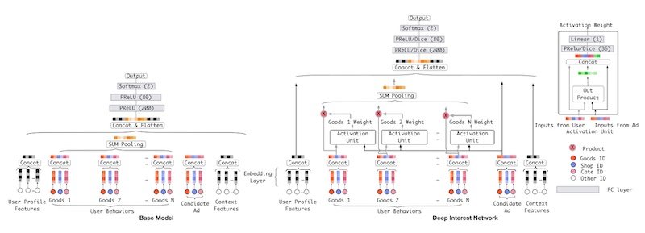
<FigureCaption caption="Baseline model (left); Deep Interest Network with attention layer (right)" source="https://arxiv.org/abs/1706.06978" />

In offline evaluation, the deep interest network had a 2% AUC improvement over the base model. In online evaluation, there was a click-through rate improvement of 10% and a [revenue per mille](https://en.wikipedia.org/wiki/Revenue_per_mille) improvement of 3.8%.

(Trivia: This paper was published on arXiv on 21 June 2017 while the [Transformer](https://arxiv.org/abs/1706.03762) paper (i.e., Attention is all you need) was published on 12 Jun 2017. It seems both groups were working on the concept of attention from neural machine translation, though for different use cases (ads and language translation). Goes to show that methods in machine learning can be applied across varying domains.)

## Sequential: Learning about item order in a sequence

An alternative to pooling variable-length user behavior events is to use sequential models such as RNNs. Nonetheless, one downside of RNN is that its input cannot be processed in a parallel manner—each event in the sequence requires the hidden state of the previous event. The recent NLP breakthrough, Transformer, addresses this by introducing positional encodings to help the model learn about each event’s order in the sequence. 

Let’s first look at an RNN-based approach. **Researchers from Telefonica experimented with using GRUs for [session-level recommendations](https://arxiv.org/abs/1511.06939).** They shared that most real-world recommendations don’t have the benefit of long user histories (e.g., Netflix) and can only work with short, session-level data. Thus, they sought to model user sessions for more relevant recommendations.

Their model uses a single [GRU](https://en.wikipedia.org/wiki/Gated_recurrent_unit) layer (additional layers led to worse results) followed by multiple fully connected layers. (They also tried using RNN and LSTM; both performed worse.) The final layer was a softmax over the catalog of items, limited to the most popular 30k - 40k items to reduce training and prediction time. 

The input is the current event in the session while the output is the next event (i.e., the initial input to the GRU is the first item that the user interacts with on the website in a session). Each subsequent event is passed through the GRU and the hidden state of one time-step is used as input to the (same) hidden layer of the next time-step. This allows the model to learn the temporal relationships between events in user behavioral sequences. They also tried passing _all_ previous events in the session as the input (instead of just the current event) but it didn’t lead to additional accuracy gain, suggesting the GRU’s ability to remember and account for previous events.

The input is represented via one-hot encoding (using item embeddings led to worse results). The output predicts the likelihood of each item in the catalog being the next item in the session. In offline evaluation, they showed that their GRU-based recommender outperformed item-KNN (based on co-occurrence of items in each session). 

As a continuation of their previous work on attention (i.e., deep interest network), **Alibaba proposed using the Transformer encoder block to model variable-length user behavior.** They call it [Behavioral Sequence Transformer](https://arxiv.org/abs/1905.06874) (BST). Similar to Deep Interest Networks (DIN), the paper focuses on the ranking stage, where given a set of candidate items, BST predicts the probability of clicking an item given the user’s historical behavior. 

Input items are represented by item and item-category embeddings. Though each item can have up to hundreds of features, it was too expensive (i.e., training time and inference latency) to include more in the behavioral sequence. The target item (i.e., each candidate from the candidate retrieval step) is included as part of the input, likely its position set to zero so BST can learn that it’s the target item. 

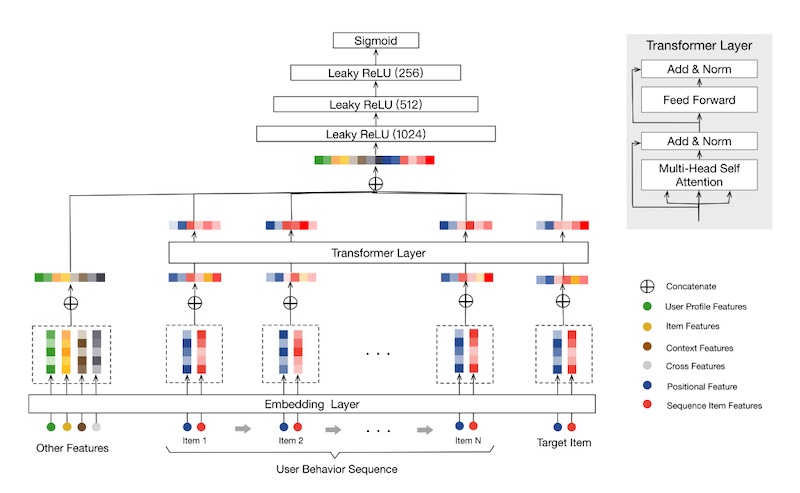
<FigureCaption caption="Alibaba's behavioral sequence transformer" source="https://arxiv.org/abs/1905.06874" />

For positional encodings, instead of using sin and cosine functions (like in the Transformer paper), they represented position (_pos_) by time difference between previous item interactions and recommendation time. They found this to work better than the original sinusoidal encodings. Another deviation is that while the original Transformer summed the input embeddings with the position embeddings, BST concatenates them instead.

$$
\operatorname{pos}\left(v_{i}\right)=t\left(v_{t}\right)-t\left(v_{i}\right)
$$

$$
t\left(v_{t}\right) = \text{recommendation time}
$$

$$
t\left(v_{i}\right) = \text{timestamp when user clicked on }(v_{i})
$$

They used a single transformer encoder block (using two or three led to worse results—overfitting?) The output of the transformer block is then concatenated with embeddings of other features (e.g., user profile, item, context). It then goes through three fully connected layers before a final sigmoid layer which predicts whether the item will be clicked or not.

How does using attention compare to pooling? They created a variant of Wide and Deep Learning which incorporates using history via mean pooling (WDL+Seq). From the results, we see that BST has a 4.5% CTR gain over mean pooling of behavioral sequences (WDL+Seq), and a 3% CTR gain over the previous DIN. Nonetheless, we should note that it also increases latency by 33% (from 15ms to 20ms). Alibaba has since shared about applying other sequential models for recommendations such as [BERT4Rec](https://arxiv.org/abs/1904.06690).

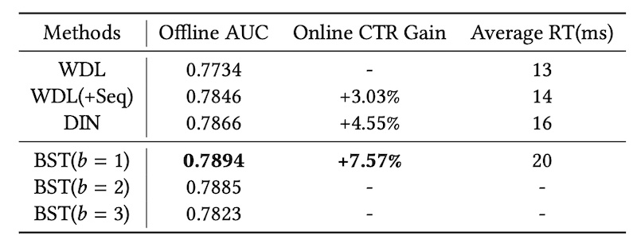
<FigureCaption caption="Results comparing BST to WDL with averaged sequences (WDL+Seq) and DIN" source="https://arxiv.org/abs/1905.06874" />

Finally, let’s look at **Spotify’s approach to [learn on sequences of sessions](https://research.atspotify.com/publications/contextual-and-sequential-user-embeddings-for-large-scale-music-recommendation/) to derive session-level user embeddings.** Each session consists of multiple music tracks. The intent is to learn a personalized user embedding for the _next_ session, given historical sessions and the current session's context. The model is trained to maximize cosine similarity between the predicted session-level user embedding, and the actual session-level user embedding (computed from what the user actually plays).

First, track embeddings are learned using word2vec via the continuous bag of words paradigm. Each session is then represented by the average of all tracks it contains. To better learn user preferences, they created three types of session embeddings: all tracks in the session, played tracks, and skipped tracks. 

In addition to the session embedding, they also concatenate features about the context (e.g., day of week, time of day, device) and the previous session (e.g., number of tracks played, time since last session). Then, to learn across multiple sessions, they use an LSTM where the output and hidden state from each session is used to predict the next session. 

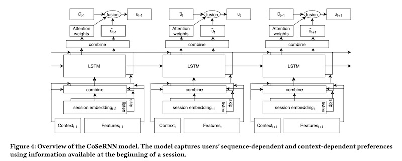
<FigureCaption caption="Spotify's model to learn user-level session embeddings from past sessions" source="https://research.atspotify.com/publications/contextual-and-sequential-user-embeddings-for-large-scale-music-recommendation/" />

Finally, they combine the predicted session-level user embedding with the long-term user embedding (weighted average of previous session embeddings), by learning attention weights on the LSTM output. Session-level user embeddings that are uncertain can thus default to the long-term user embedding. (It’s unclear how much of the juice is due to the LSTM on session sequences relative to the long-term user embedding). 

## Graph: Learning from a user or item's neighbors

Beyond representing users and their past behaviors as sequences, we can also represent them as graphs. For example, a user-item graph has users, and items that users have previously interacted with, as nodes. Edges can be weighted by the number of past interactions, item ratings, etc. 

The graph captures user interests as well as structural information about the user’s neighborhood (e.g., other users who also interacted with the same items, and the other items they interacted with). Thus, a user’s neighbors can help enrich what we know about the user when user behavior is sparse. The same goes for item nodes.

There are various ways to learn on a graph, including [DeepWalk](https://arxiv.org/abs/1403.6652), [Node2Vec](https://arxiv.org/abs/1607.00653), and [learning embeddings from an item graph](https://arxiv.org/abs/1803.02349). These approaches generally convert the graph into a sequence (via random walks) before applying unsupervised or semi-supervised sequential models; we won’t cover those here. In this section, we’ll focus on approaches that apply graph convolutions networks (CGN). Here’s a [short primer](https://towardsdatascience.com/graph-convolutional-networks-deep-99d7fee5706f) on how CGNs work. 

**Uber shared about how they apply [CGNs for food recommendations](https://eng.uber.com/uber-eats-graph-learning/).** They start by building two bipartite graphs. The first has users and dishes as nodes, and edges are weighted by the number of times a user ordered a dish, as well as the user rating on the dish. The second graph represents users and restaurants as nodes, where edges are the number of items ordered from a restaurant. 

They adopt [GraphSAGE](http://snap.stanford.edu/graphsage/) for the CGN, where the aggregation function is a mean or max pooling after projection. They also use sampling to constrain the number of nodes sampled to reduce computation required. (Pinterest also uses a variant called [PinSage](https://arxiv.org/abs/1806.01973) for item-to-item recommendations.)

Dishes are represented by embeddings of the description and images, while restaurants are represented by features related to menu and cuisine offerings. Given that there are different features for users, dishes, and restaurants, each node type will have different embedding dimensions. Thus, they use a projection layer to project all node embeddings to the same dimension.

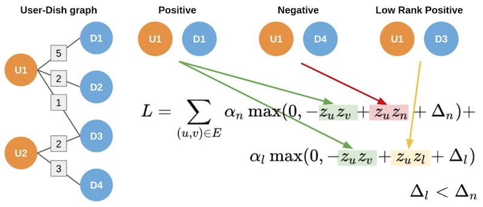
<FigureCaption caption="Ubereats' two-part hinge loss to account for strong and weak edges" source="https://eng.uber.com/uber-eats-graph-learning/" />

While GraphSAGE only considers binary edges, Uber’s user-dish and user-restaurant graphs have weighted edges, such as the number of times a user ordered a dish, as well as the user rating. To account for this, they adopted a two-part hinge loss. The hinge loss ensures that the predicted score between strong edges (i.e., multiple food orders) is higher than weak edges (i.e., few food orders), and the score on weak edges is higher than non-edges by a certain margin. (This is similar to the three-part hinge loss in [Amazon’s semantic product search](/resources/search-query-matching/).)

**Alibaba also shared about their [graph intention network](https://arxiv.org/abs/2103.16164) for ad prediction.** They use session-level user clicks to build the user-item graph, where edges are weighed by the co-occurrence of items clicked in the same session.

To learn a user’s intention for personalization, they apply diffusion and aggregation on the user-item graph. In the diffusion step, for each item the user has previously interacted with, they retrieve the neighboring users and their items. Then, in the aggregation step, they apply attention that considers correlations between the current node and its neighbors (see bottom half of image below).

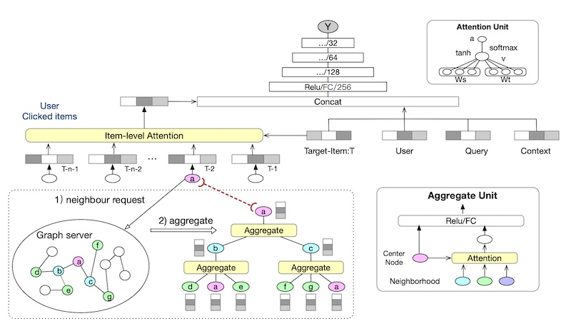
<FigureCaption caption="Learning item embeddings via a graph and attention" source="https://arxiv.org/abs/2103.16164" />

These graph embeddings are then combined via item-level attention and concatenated with features about the target item, user, query, and context. It then passes through multiple ReLUs before a sigmoid predicting probability of click. The entire model is trained end-to-end, including the graph embeddings and attention. 

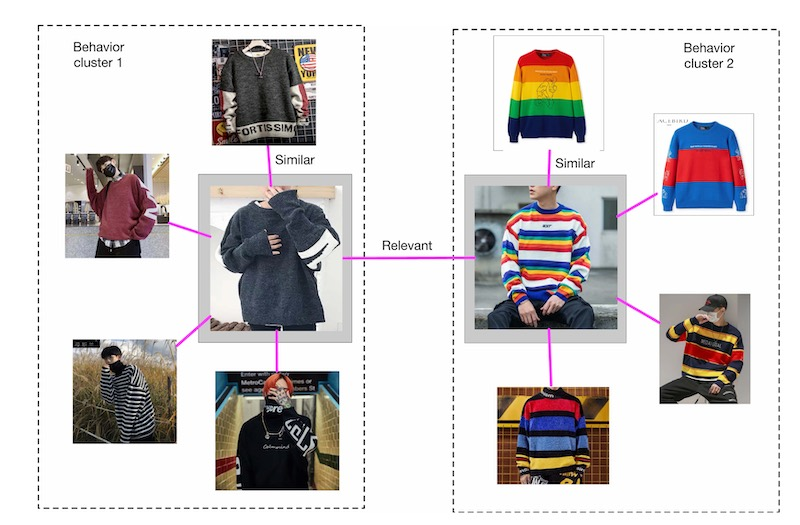
<FigureCaption caption="Examples of similar vs. relevant relationships between products" source="https://arxiv.org/abs/2103.16164" />

They shared that representing items via a graph reveals two types of item relationships. First, there are groups of highly similar items. These homogenous groups help enrich user interests when behavioral data is sparse. Second, there are pairs of relevant but less similar items. This helps introduce serendipity and exploration based on a user’s past interest. 

## User embeddings: Learning a model of the user

Finally, other than representing users as a sequence or graph of their past behavior, we can also learn user embeddings directly. 

**Airbnb shared their approach to learning user type embeddings for [search result personalization](https://dl.acm.org/doi/10.1145/3219819.3219885).** One problem they faced was data sparsity. Unlike retail e-commerce where customers shop and purchase weekly or monthly, user behavior on travel accommodations tends to be less frequent, maybe once or twice a year. Thus, they didn’t have enough data to learn user-level embeddings. Instead, they learn user-type embeddings based on location, device type, language settings, guest settings, number of past bookings, average price, etc.

These user-type embeddings are learned by interleaving them with session-level behavioral data (in which users interact with Airbnb listings) and applying a word2vec-like skip-gram model (pretty smart and lean IMO). This ensures that the user-type embeddings are in the same vector space as the listing embeddings, while still allowing them to use a self-supervised approach without needing labels. 

To use these user-type embeddings in search ranking, they compute the cosine similarity between user-type and candidate listings and add it as a feature. They shared that these (long-term) user-type embeddings had higher feature importance than the (short-term) user history feature which was based on bookings in the last two weeks. This is likely because the user-type embedding had higher coverage (86%) relative to the short-term user history feature (8%). 

**Alibaba also incorporates [user embeddings in the ranking stage](https://arxiv.org/abs/1904.06813) to account for user preferences.** To learn user embeddings, they train a fully connected model that takes as input the user’s behavior history, user features (e.g., gender, age, price level), and each candidate item. The final layer is a sigmoid predicting click probability on each item. User embeddings are then represented by the hidden vector (`pv`) from the penultimate layer. 

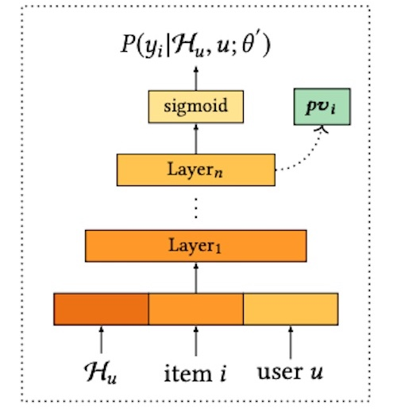
<FigureCaption caption="Learning personalized vectors given user history, candidate item, user profile" source="https://arxiv.org/abs/1904.06813" />

To use the personalized vector (`pv`), they concatenate it with candidate item embeddings (see image below). This is then put through attention layers before predicting the probability of click on each candidate item. Each item’s score is then used for reranking.

<FigureCaption caption="The personalized vectors (pv) are concatenated with candidate items" source="https://arxiv.org/abs/1904.06813" />

As a final example, we look at **Tencent’s approach to learning [user lookalikes for long-tail content recommendations](https://arxiv.org/abs/1906.05022) on WeChat.** WeChat is a messaging app in China that provides personalized articles, news, and videos via a “Top Stories” widget. Due to recommender feedback loops, popular content gets recommended to a greater extent and becomes more popular. As a result, content that is high quality and relevant, but less popular, languishes in the long-tail. This leads to reduced diversity and possibly stale recommendations.

To address the lack of behavioral data on long-tail content, Tencent developed a user-lookalike model for recommendations. Given a target user, who are the users that look like them, and what (long-tail) content have they viewed? Then, recommend the target user content from their lookalikes (i.e., user-user recommendations).

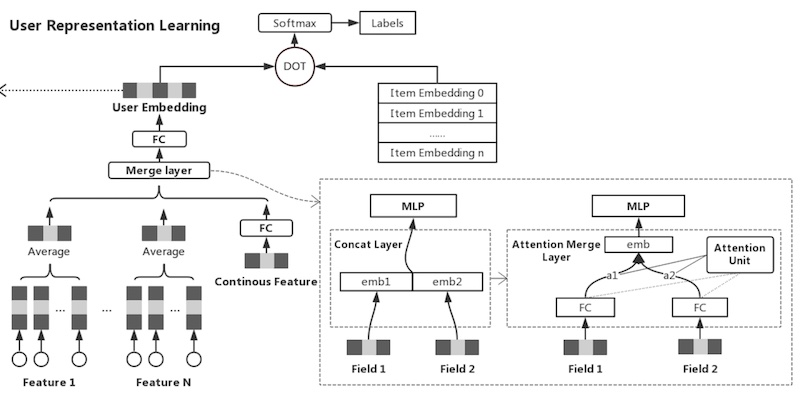
<FigureCaption caption="Tencent's model to learn user embeddings based on their past behavior" source="https://arxiv.org/abs/1906.05022" />

To learn user embeddings, they adopt an approach similar to YouTube’s ranking model. For the model’s input, they pass the user features (e.g., demographics, user indicated interests, follows, etc.) and historical behavior on WeChat. For labels, they use content that the user has clicked on, and adopt a negative sampling ratio of 10:1. Then, given the user and item embeddings, they put it through a dot product followed by a sigmoid to predict clicks. The model is trained and the user embedding is applied to represent users.

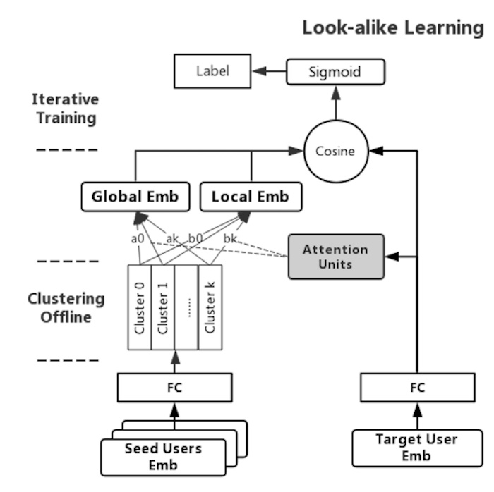
<FigureCaption caption="Tencent's two-tower lookalike model learn global and local attention" source="https://arxiv.org/abs/1906.05022" />

To learn lookalikes, they use a two-tower model to learn similarities between the target user embedding and the lookalike user embedding. Given that the number of lookalike users can be very large (as many as three million), instead of using user-level lookalike embeddings, they apply K-means clustering and use the centroids instead. They found K = 20 to work best. 

The input for the two-tower model is the user-lookalike pair, where the user embedding and lookalike embedding are passed into separate towers. The model includes a global and local attention mechanism. Global attention models how to weigh each lookalike (e.g., reduce weight of noisy users). Local attention models how to weigh each lookalike while considering the interest of the target user, thus learning a personalized representation. At the top of the two-tower model, the dot product is used to represent the similarity between the target and lookalikes. This is a proxy for the target user’s interest in the long-tail content that the lookalikes interacted with.

In production, the global and local attention transforms each lookalike embedding into global and local embeddings before being summed. The global embedding has 0.7 weight while the local embedding has 0.3 weight. 

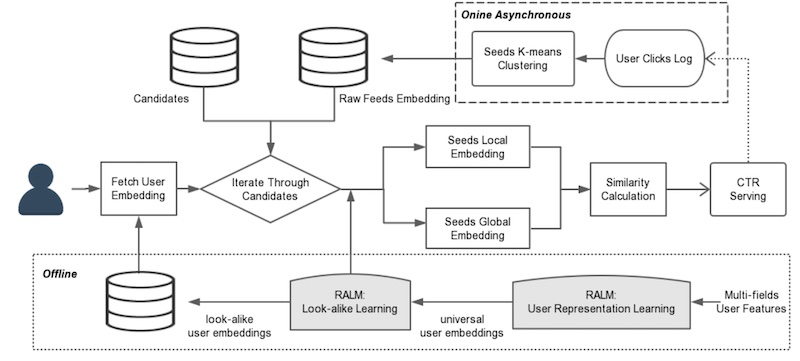
<FigureCaption caption="Tencent's system design for long-tail recs using user lookalikes" source="https://arxiv.org/abs/1906.05022" />

Here’s the overall system design, where the user representations and lookalike model are learned offline (bottom third of item) before being used online to compute similarities for recommendations. The top third of the image shows how the K-means clustering is applied on lookalikes every five minutes to get the 20 lookalike candidates.

## Conclusion

That was a whirlwind tour of the various patterns for personalization in recommendations and search. These patterns are not exhaustive. I’ve also come across papers that add [multi-interest](https://arxiv.org/abs/1904.08030) [heads](https://arxiv.org/abs/2005.09347) and learn [interest hierarchies](https://dl.acm.org/doi/abs/10.1145/3336191.3371827) on top of user interests, as well as approaches to model user interest [across domains](https://arxiv.org/abs/2008.02974). When to use which? Here's a rough heuristic:
- Want to continuously explore while minimizing regret? Bandits
- Starting with neural recsys & want something simple? Embeddings+MLP
- Have long-term user histories and sequences? Sequential
- Have sparse behavior data but lots of item/user metadata? Graphs
- Want generic embeddings for multiple problems? User models

If you’re starting with personalization, good ol’ logistic regression with crossed features is a tough baseline to beat. If you’re building a [real-time recommender]({{ site.baseurl }}#how-to-design-and-implement-an-mvp) (i.e., generates recs on request), learning item embeddings via word2vec and applying approximate nearest neighbors is pretty lean and gets much of the juice from session-level behavioral data. 

## References
- [Artwork Personalization at Netflix](https://netflixtechblog.com/artwork-personalization-c589f074ad76) `Netflix`
- [Personalized Cuisine Filter](https://doordash.engineering/2020/01/27/personalized-cuisine-filter/) `DoorDash`
- [Explore, Exploit, and Explain: Explainable Recommendations with Bandits](https://dl.acm.org/doi/10.1145/3240323.3240354) `Spotify`
- [Personalized Recommendations for Experiences Using Deep Learning](https://www.tripadvisor.com/engineering/personalized-recommendations-for-experiences-using-deep-learning/) `TripAdvisor`
- [Deep Neural Networks for YouTube Recommendations](https://research.google/pubs/pub45530/) `Google`
- [Deep Interest Network for Click-Through Rate Prediction](https://arxiv.org/abs/1706.06978) `Alibaba`
- [Session-based Recommendations with Recurrent Neural Networks](https://arxiv.org/abs/1511.06939) `Telefonica`
- [Behavior Sequence Transformer for E-commerce Recommendation](https://arxiv.org/abs/1905.06874) `Alibaba`
- [Contextual & Sequential User Embeddings for Music Recommendation](https://research.atspotify.com/publications/contextual-and-sequential-user-embeddings-for-large-scale-music-recommendation/) `Spotify`
- [Food Discovery with Uber Eats: Graph Learning to Power Recommendations](https://eng.uber.com/uber-eats-graph-learning/) `Uber`
- [Graph Intention Network for CTR Prediction in Sponsored Search](`https://arxiv.org/abs/2103.16164`) `Alibaba`
- [Real-time Personalization using Embeddings for Search Ranking](https://dl.acm.org/doi/10.1145/3219819.3219885) `Airbnb`
- [Personalized Re-ranking for Recommendation](https://arxiv.org/abs/1904.06813) `Alibaba`
- [Real-time Attention Based Look-alike Model for Recommender System](https://arxiv.org/abs/1906.05022) `Tencent`
- [SIGIR 2016 Tutorial on Counterfactual Evaluation and Learning](http://www.cs.cornell.edu/~adith/CfactSIGIR2016/)
- [Doubly Robust Policy Evaluation and Learning](https://arxiv.org/abs/1103.4601)
- [DeepFM: A Factorization-Machine based Neural Network for CTR Prediction](https://arxiv.org/abs/1703.04247)
- [StarSpace: Embed All The Things!](https://arxiv.org/abs/1709.03856)
- [Attention Is All You Need](https://arxiv.org/abs/1706.03762)
- [BERT4Rec: Sequential Recommendation with Bidirectional Encoder Representations from Transformer](https://arxiv.org/abs/1904.06690)
- [DeepWalk: Online Learning of Social Representations](https://arxiv.org/abs/1403.6652)
- [Node2vec: Scalable Feature Learning for Networks](https://arxiv.org/abs/1607.00653)
- [Billion-scale Commodity Embedding for E-commerce Recommendation in Alibaba](https://arxiv.org/abs/1803.02349)
- [GraphSAGE: Inductive Representation Learning on Large Graphs](http://snap.stanford.edu/graphsage/)
- [Graph Convolutional Neural Networks for Web-Scale Recommender Systems](https://arxiv.org/abs/1806.01973)