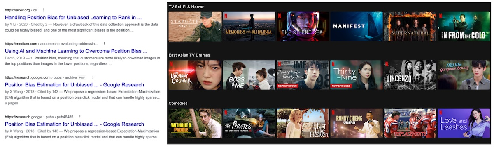
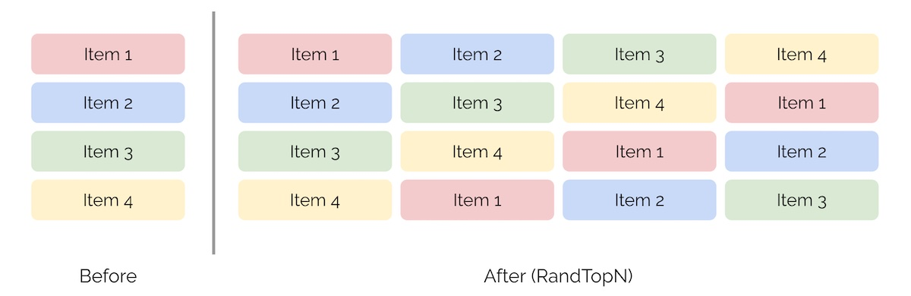
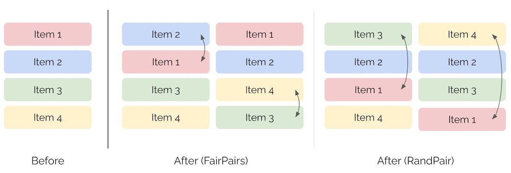

import { FigureCaption } from '../../components/figure-caption';

Position bias happens when higher positioned items are more likely to be seen and thus clicked _regardless of their actual relevance_. This leads to lesser engagement on lower ranked items. On Google Search, users click on the first position [10x more than the tenth position](https://www.sistrix.com/blog/why-almost-everything-you-knew-about-google-ctr-is-no-longer-valid/). Similarly, we scan through Netflix’s recommendation carousels from left to right.

<FigureCaption caption="Position bias happens when we process items from top-to-bottom or left-to-right."/>

Position bias can happen for several reasons. Perhaps we trust the algorithm and just blindly click on top results. Or perhaps we’re less likely to view lower-ranked items (i.e., presentation bias), especially if they’re on the second page of Google Search’s results. Maybe after we click the first relevant result or play the first relevant movie, we ignore the rest of the items.

Because of position bias, it's difficult to tell if users are engaging on recommendations because they’re truly relevant, or because the recommended item happens to rank highly. Training our models on biased historical data perpetuates the bias via a self-reinforcing feedback loop. This can lead to suboptimal outcomes where items that are more relevant but are shown in lower positions continue to get lower engagement and thus don’t improve their rank.

Here are some notes on various ways to measure position bias. Some isolate the effect of position bias better while others are more feasible on logged data.

## Measuring position bias via randomness

The straightforward way is to **shuffle (top) results uniformly at random** (_[RandN](https://dl.acm.org/doi/10.1145/2911451.2911537) or RandTopN_). This controls for item relevance by having the same item appear in multiple positions. Thus, any difference in customer engagement can be cleanly attributed to position bias. The downside is that this adversely impacts the customer experience and is usually too costly or out of the question. 

<FigureCaption caption="Shuffling the top 4 items uniformly at random."/>

Another approach is to **exploit the inherent randomness** in item positions. We see this in historical data when we have multiple rankers in production or when the production ranker is updated frequently. This lets us to [estimate position bias without intrusive interventions](https://arxiv.org/abs/1812.05161) like RandTopN. Nonetheless, unless we’re operating on a large scale with multiple rankers updating frequently, it can be hard to get such data.

A weaker form of inherent randomness occurs when multiple widgets recommend the same item but in different positions. In the example below, the Popular on Netflix widget recommends Battleship in position 3 and Shooter in position 4 while the Trending widget recommends Battleship in position 1 and Shooter in position 6. In this approach, the context (i.e., user, item, or query) is constant. Nonetheless, other noise may seep in such as widget position or how the widget is presented (e.g., title, explanation).

<FigureCaption caption="Inherent randomness in how Battleship and Shooter are ranked for two widgets."/>

If we don’t have multiple widgets in production, we can consider recommendations that are ranked in different positions across different contexts. For example, in item-to-item recommendations, the same recommended item may be shown in different positions for different context items. However, as the context isn’t constant, this approach can be noisy because the same recommended item or search result has different relevance based on the context item/query.

Despite the limitations of exploiting inherent randomness, the big advantage is that there’s no customer impact as we are measuring position bias via logged data.

Another approach is to **infer position bias via expectation maximization**. One way is to [model clicks via a position bias model](https://dl.acm.org/doi/10.1145/3159652.3159732). In the model, an item is clicked only if it is examined and relevant; examination depends only on the position while relevance depends only on the context and item. Google demonstrated this approach’s effectiveness on search logs from email and file storage services where there was only a single click for most queries. To do this, they represented queries and items via features instead of IDs.

A middle ground is to **add a bit of randomness** into item positions. For example, _[Fair](https://arxiv.org/abs/cs/0605037)[Pairs](https://dl.acm.org/doi/abs/10.1145/1341531.1341545)_ swaps items at positions _k_ and _k+1_ while _[RandPair](https://arxiv.org/abs/1608.04468)_ swaps items at positions _1_ and _k_. Similar to _RandN_, this keeps item relevance constant so we can measure the difference in customer engagement due to position bias. One downside is that RandPair can degrade customer experience especially if _k_ is large.

<FigureCaption caption="Swapping pairs of items via FairPair and RandPair."/>

We can also draw inspiration from [serendipity in recommendations](https://www.sciencedirect.com/science/article/abs/pii/S0950705116302763) and add a random value to item positions. For example, we can add values randomly sampled from a normal distribution (e.g., `np.random.normal`) to each item’s position and re-sort them on the sum. Depending on the standard deviation, each item has the chance to gain +/- _x_ positions.

However, adding randomness to an item’s position doesn’t account for the underlying scores of the item recommendations. For example, a position 1 item that has 10x the raw score of a position 2 item is treated the same as a position 1 item that has 1.1x the score of a position 2 item.

To address this, we can add randomness to the raw scores instead. One way is [Boltzmann exploration](https://arxiv.org/abs/1705.10257) where we (i) normalize/softmax the raw scores into probabilities and then (ii) sample the recommendations (based on these probabilities) as we populate our widget starting from position 1. This gives each recommended item a chance to gain a higher position weighted by recommendation probability (which we can also use in [counterfactual evaluation](/resources/counterfactual/)). Unlike _RandTopN_, these approaches anchor each item to its original position before adding randomness, possibly reducing the negative customer impact.

## Mitigating position bias

If we’re in the early days of building our recommender system or prioritize exploration over exploitation, adding some randomness can be a decent way to mitigate position bias while collecting click data. Because multiple items can appear in the same position (e.g., position 1), we can log which item performed better and train our models accordingly.

If adding randomness is not an option, we can use the measured/learned position bias to debias logged data. For example, the previous Google paper used inferred position bias to train models optimized on [inverse propensity weighted precision](https://dl.acm.org/doi/10.1145/3159652.3159732).

Alternatively, we can account for position bias by including positional features in our models. These positional features help the model learn how position affects reward. Then, during serving, we can set all items to have positional feature = 1 to negate the impact of position. More in Google’s [Rules of Machine Learning](https://developers.google.com/machine-learning/guides/rules-of-ml#rule_36_avoid_feedback_loops_with_positional_features).

## Conclusion

Depending on the user experience (UX), the impact of position bias can vary. If we’re a large platform where customers organically view items via search, recommendations, category pages, etc. and we run several algorithms in production, the position bias from an individual algorithm gets washed out by other algorithms.

On the other hand, if we’re launching a new platform or have a UX where the bulk of item discovery comes from a single interface (e.g., restaurant search on food delivery apps, social media feeds), IMHO it’s a good idea to measure and mitigate position bias early.

Do you know of other ways to measure and mitigate position bias? Would love to hear them in the comments below!

## References
- [Minimally Invasive Randomization for Collecting Unbiased Preferences from Clickthrough Logs](https://arxiv.org/abs/cs/0605037)
- [An Experimental Comparison of Click Position Bias Models](https://dl.acm.org/doi/abs/10.1145/1341531.1341545)
- [Unbiased Learning-to-Rank with Biased Feedback](https://arxiv.org/abs/1608.04468)
- [Learning to Rank with Selection Bias in Personal Search](https://dl.acm.org/doi/10.1145/2911451.2911537)
- [Estimating Position Bias without Intrusive Interventions](https://arxiv.org/abs/1812.05161)
- [Position Bias Estimation for Unbiased Learning to Rank in Personal Search](https://dl.acm.org/doi/10.1145/3159652.3159732)
- [Boltzmann Exploration Done Right](https://arxiv.org/abs/1705.10257)
- [A Survey of Serendipity in Recommender Systems](https://www.sciencedirect.com/science/article/abs/pii/S0950705116302763)