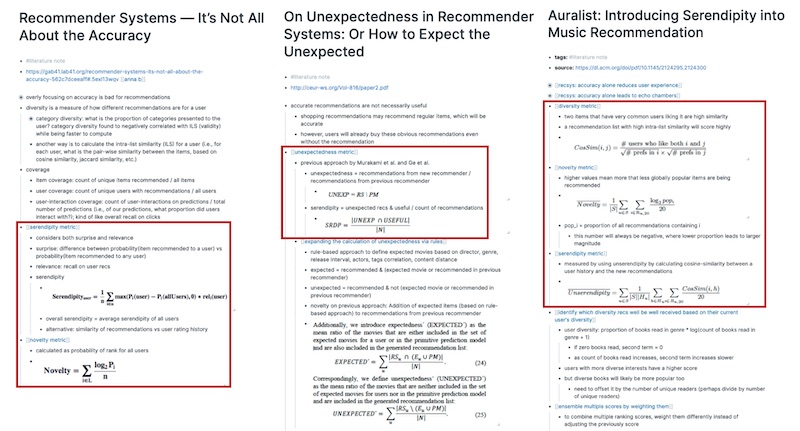
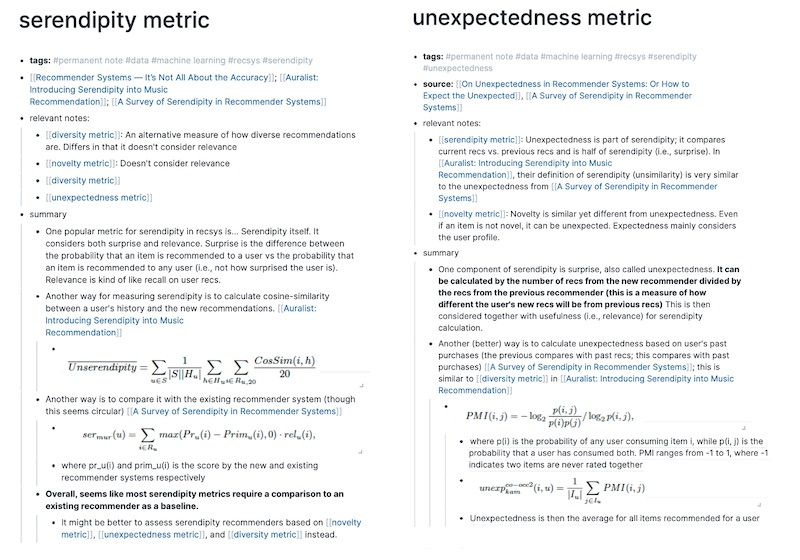

import { FigureCaption } from '../../components/figure-caption';

Papers contain distilled knowledge on what others found to work and not work. By reading them, we get up to speed on the problem space and **build on their approach**. This prevents us from reinventing the wheel and thus develop a working solution with lesser time and effort.

Reading papers also **widens our perspective**. Though we may work in narrow slices of data science, developments in tangential research are often helpful. For example, the idea of [word embeddings and graphs](https://eugeneyan.com/writing/recommender-systems-graph-and-nlp-pytorch/) has been useful in recommender systems. Similarly, [ideas from computer vision](https://pakodas.substack.com/p/nlp-keeps-stealing-from-cv-)—such as transfer learning and data augmentation—have been helpful for natural language processing (NLP).

Reading papers also **keeps us up to date**. The field of NLP has made large advances in the past decade. Nonetheless, by reading the most crucial 10 or so papers, we can quickly catch up. Being aware of recent improvements lets us apply them at work and increases our effectiveness.

> If I have seen further than others, it is by standing upon the shoulders of giants. – Isaac Newton

As a result, work takes less time and effort and we have more time to read and learn. It's a virtuous cycle!

## How to choose what papers to read?

If you’re starting to read papers, just read whatever interests you—most papers will have something to teach. Reading about topics you’re interested in also makes it easier to build the habit.

You could also select papers based on practicality. For example, you might need to quickly understand a domain for a project. Before starting on a project, I almost always set aside time for a [literature review](https://eugeneyan.com/writing/what-i-do-during-a-data-science-project-to-ensure-success/#research-what-others-have-done-and-what-worked). Spending a couple of days diving into papers can save weeks, if not months, of dead-ends and meandering.

Getting recommendations from peers is also a handy way to identify useful papers to read. I follow machine learning practitioners on social media, and when multiple of them mention the same paper, I take notice. Alternatively, subscribe to curated newsletters that have a high information-to-noise ratio.

What papers do I read? Out of practicality, I mostly read papers related to work. This allows me to immediately apply what I’ve read and thus reinforce my learning. Outside of work, I have an interest in [sequences](https://github.com/eugeneyan/applied-ml#sequence-modelling) and tend to read about [NLP](https://github.com/eugeneyan/applied-ml#natural-language-processing) and [reinforcement learning](https://github.com/eugeneyan/applied-ml#reinforcement-learning). I’m especially fond of papers that share what worked and what didn’t, such as through ablation studies. This includes the papers on [Word2vec](https://arxiv.org/abs/1301.3781), [BERT](https://arxiv.org/abs/1810.04805), and [T5](https://arxiv.org/abs/1910.10683).

## How to read papers?

A google search for “how to read papers” returns innumerable useful results. But if you find it overwhelming, here’s a couple that I found helpful:

- The _classic_ [three-pass approach](https://web.stanford.edu/class/ee384m/Handouts/HowtoReadPaper.pdf) (and a [three-minute video](https://www.youtube.com/watch?v=SKxm2HF_-k0) version)
- [OMSCS 6460 How To Read An Academic Paper](http://omscs6460.gatech.edu/research-guide/how-to-read-an-academic-paper/): Advice from a great Prof
- [Interviews](https://www.sciencemag.org/careers/2016/03/how-seriously-read-scientific-paper) with other scientists sharing their approach
- An [approach](https://cseweb.ucsd.edu/~wgg/CSE210/howtoread.html) for engineering-research papers
- [Reassurance](https://www.sciencemag.org/careers/2016/01/how-read-scientific-paper) that we’re not the only ones finding it hard

My method is similar to the three-pass approach. In the example below, I’ll share how I read several recsys papers to learn about the metrics of novelty, diversity, serendipity. etc.

**In the first pass**, I scan the abstract to understand if the paper has what I need. If it does, I skim through the headings to identify the problem statement, methods, and results. In this example, I’m specifically looking for formula on how to calculate the various metrics. I give all papers on my list a first pass (and resist starting on a second pass until I’ve completed the list). In this example, about half of the papers made it to the second pass.

**In the second pass**, I go over each paper again and highlight the relevant sections. This helps me quickly spot important portions when I refer to the paper later. Then, I take notes for each paper. In this example, the notes were mostly around metrics (i.e., methods, formula). If it was a literature review for an application (e.g., recsys, product classification, fraud detection), the notes would focus on the methods, system design, and results.

<FigureCaption caption="Sample literature notes" />

For most papers, the second pass suffices. I’ve captured the key information and can refer to it in future if needed. Nonetheless, I sometimes do a third pass if I’m reading papers as part of a literature review, or if I want to cement my knowledge.

**In the third pass**, I synthesize the common concepts across papers into their own notes. Various papers have their own methods to measure novelty, diversity, serendipity, etc. I consolidate them into a single note and compare their pros and cons. While doing this, I often find gaps in my notes and knowledge and have to revisit the original paper.

<FigureCaption caption="Sample permanent notes" />

Lastly, if I think it’ll be useful for others, I write about what I’ve learned and publish it online. Relative to starting from scratch, having my notes as a reference makes writing much easier. Here's the [post](https://eugeneyan.com/writing/serendipity-and-accuracy-in-recommender-systems/) from the example.

> Reading furnishes the mind only with materials of knowledge; it is thinking that makes what we read ours. – John Locke

## Try it for yourself

Before jumping deep into your next project, spend a day or two scanning through a couple of relevant papers. I’m confident it’ll save you time and effort in the medium to long term. Not sure where to start? Here are some useful resources to start with:

- [Papers with Code](https://paperswithcode.com): ML Research with the code to implement it
- [`applied-ml`](https://github.com/eugeneyan/applied-ml): Papers on how organizations built and deployed ML systems
- [`ml-surveys`](https://github.com/eugeneyan/ml-surveys): Survey papers summarising recent ML advancements
- [Google Scholar Alerts](https://scholar.google.com/intl/en/scholar/help.html#alerts): Updates when new publications match your query
- [42 Papers](https://42papers.com/): Trending papers in AI and Computer Science
