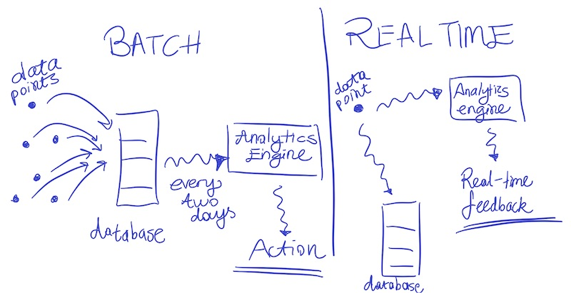
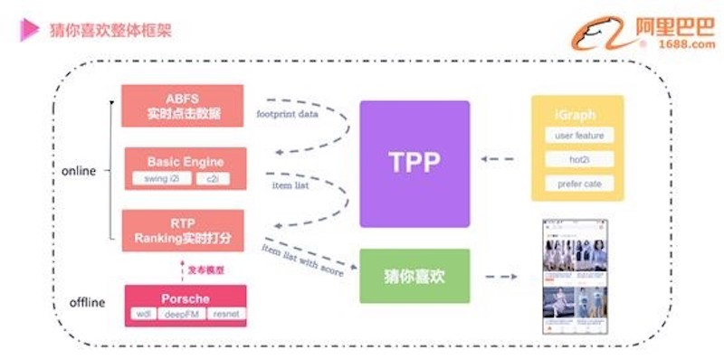
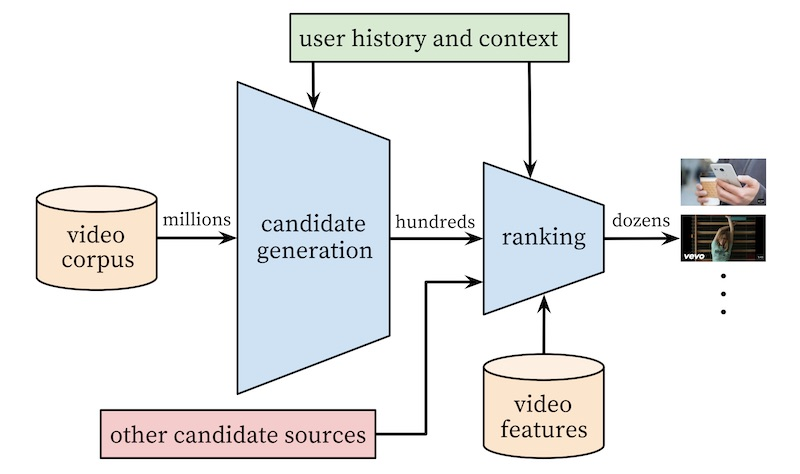
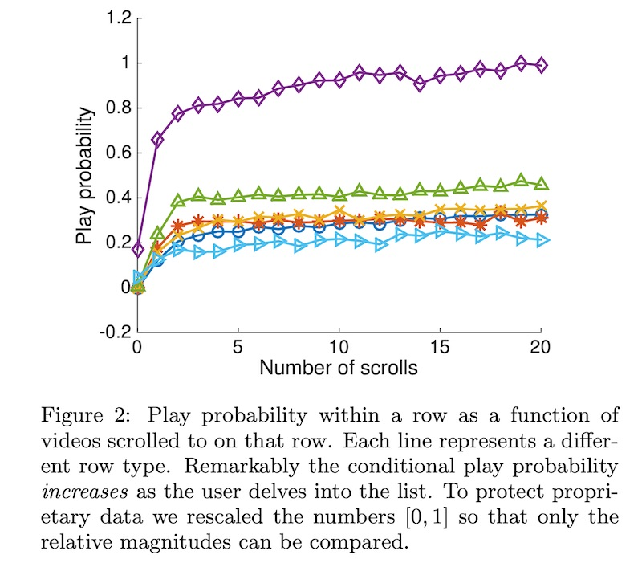
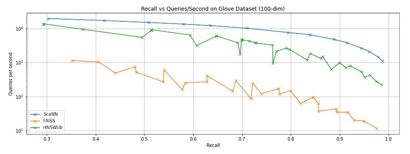

import { FigureCaption } from '../../components/figure-caption';
import "katex/dist/katex.min.css"

How do real-time recommendations look like in practice? In this write-up, we'll view some examples of real-time recsys from various companies and discuss when it makes sense to go real-time and how to implement an MVP.

Note: This discussion assumes basic knowledge of recommendation systems, such as the difference between item-to-item and user-to-item, and the candidate generation & ranking paradigm. Fret not if those terms are unfamiliar. We’ll have two primers to help you get up to speed.

## Primer I: Collaboration vs. Content-based, i2i vs. u2i

If you understand the difference between collaboration vs. content-based recommendations, and item-to-item vs. user-to-item, feel free to skip this section.

**Collaboration-based recommendations are based on user behavior.** Assume I like movie X and dislike movie Y. To recommend movies to me, we first find users similar to me (i.e., like X, dislike Y). Then, from those users, what are movies they liked, but I’ve not watched? Those movies are then recommended to me. With user behavioral data, users can “collaborate” to create recommendations for each other. Collaborative filtering is probably the most well-known approach.

**Content-based recommendations are based on item metadata.** Given the movies I’ve watched (and enjoyed), content-based recommenders suggest movies of similar genre, time period, director, etc. Relative to collaboration-based recommenders, content-based recommenders tend to be more effective when the movie is new and we don’t have enough user behavioral data about it yet (i.e., cold-start problem)

In item-to-item (i2i) recommendations, given an item, we recommend other items. Here’s an example of i2i recommendations on IMDB, under the “More Like This” widget. This works well in scenarios where the focus is the item (e.g., item detail page).


<FigureCaption caption="More like Independence Day on IMDB"/>

In user-to-item (u2i), given a user, we recommend items. We see this on the home page of Netflix, Amazon, Taobao, sometimes with the name of “Recommended For You”. Our social media feeds (e.g., Twitter, LinkedIn, Facebook) are u2i recommendations too. In such scenarios, the user (and their historical preferences) is the focus.


<FigureCaption caption="Recommended For You on Amazon"/>

Taken together, i2i and u2i recommendations provide coverage for the bulk of user traffic via detail pages and home pages.

## When _(not)_ to use real-time recommendations?

Before we get too excited, let me first say that **most use cases won't need real-time recommendations**; batch recommendations are good enough.
  
Relative to real-time recommendations, batch recommendations are computationally cheaper. They are usually generated once a day and benefit from batch processing’s economies of scale. The recommendations are then loaded into a key-value store (e.g., Redis, DynamoDB) and served via a key-value lookup. 

Batch recommendations are also simpler ops-wise. By caching pre-computed recommendations (in our key-value store), we decouple computation from serving. Thus, even if the compute step fails, there’s no customer-facing impact; we continue to serve the previous batch of (slightly stale) recommendations. The cache provides a buffer and ensures almost 100% uptime, reducing ops burden on the team (e.g., on-call, complaints).


<FigureCaption caption="Batch vs. streaming in the case of analytics" source="https://softwareengineeringdaily.com/2018/11/09/converged-data-platform-unifying-streaming-data-using-mapr/"/>

In contrast, real-time recommendations usually require more computation. For example, we might aggregate streamed events (e.g., click, like, purchase) and generate new recommendations on-demand, based on user interactions. (In comparison, batch recommendations only compute a single set daily.) Furthermore, such computation is done individually and does not benefit from economies of scale. (Nonetheless, we save on not generating recommendations for customers who don’t visit our app).

Operating real-time recommendations in production is also far tricker. Instead of using ephemeral Spark clusters (for compute) and a DynamoDB (for serving), we’ll need low-latency high-throughput APIs with 24/7 uptime. In the strictest scenario, we won’t have our key-value store as a buffer. The line between compute and serving disappears. Ops burden will increase (read: we’ll be paged in the middle of the night for an outage in another timezone 🚨). 

**Why real-time recommendations then?** They’re useful when the customer journey is mission-centric and depends on the context. Such missions are often time-sensitive. Real-time demand fades quickly; demand could be met (on a competitor site) or the user might lose interest. We’ll examine this in two examples: shopping and watching a movie.

Shopping is a **mission-centric activity**. Though a customer might predominately purchase a category of products, their shopping behavior is often punctuated with tangential missions. For example, if I usually shop for clothes, my u2i recommendations will mostly be fashion recommendations. However, if I need a new wide-screen monitor and start browsing for one, my u2i recommendations should update ASAP to help me quickly fulfill my mission (lest I go to a competing app). 

In this scenario, batch recommendations don’t react fast enough. And even when the recommendations are updated, due to the data imbalance, such mission-related needs are not met (More in Section 2.1 of this [Netflix paper](https://dl.acm.org/doi/10.1145/3240323.3240372)).

The movies we watch **depend on context** (though our long-term preferences are fairly stable). For example, we might watch different movies depending on whether we’re alone, with friends, with a romantic interest, or with children. It might also depend on our mood, as well as the time of day. Similar to shopping, daily batch recommendations face the same challenges here.

Other than the examples above, real-time recommendations are also handy in:
- Travel (our vacation destinations are often changing)
- YouTube (we watch videos for coding, yoga, and recipes within the same day)
- Serving ads (our interest is time-sensitive; our attention spans are shrinking)

Real-time recommendations are also useful when the majority of our customers are new (i.e., cold-start). This happens when we’re in the customer acquisition stage, such as when we’ve just launched a new product or entered a new market (e.g., e-commerce in Southeast Asia in 2013 - 2015). 

Imagine you’ve just downloaded an e-commerce app. Since we’re uncertain of your gender, the home page will have a mix of categories catering to each gender, from dresses to men’s shirts, from GPUs to makeup. If you click on a dress, we can immediately build a persona (that you’re female) and personalize your shopping experience. In this case, the u2i recommendations on your home page will tilt towards female products. 

Given that [1 in 4 users abandon mobile apps](https://techcrunch.com/2016/05/31/nearly-1-in-4-people-abandon-mobile-apps-after-only-one-use/) _after only one use_, quickly responding to customer needs—from the very first touchpoint—helps with acquisition and retention.

## Primer II: Candidate generation and ranking

Most modern recommenders have two key components: candidate generation and ranking. 

Candidate generation is a fast—but coarse—approach to get (hundreds of) item candidates from millions of items. We trade off precision for efficiency to reduce the search space (e.g., from 100 million to 1,000 candidates, a 99.999% reduction). This is usually done via metadata-based filters (e.g., category, brand) or k-nearest neighbors.

Ranking is a slower—but more precise—approach to sort and select top recommendation candidates. We have leeway to include features that might not have been feasible in the candidate generation step. Such features include user persona (e.g., demographics, price propensity), item metadata (e.g., attributes, engagement statistics), cross features (e.g., interaction between each feature pair), and media embeddings.

Ranking can be framed as either a classification or learning to rank problem. As a classification problem, we can score candidates based on probability of click or purchase. Logistic regression with crossed features is simple to implement and a difficult baseline to beat. Decision trees are also commonly used. As a learning to rank problem, commonly used algorithms include [LambdaMart](https://www.microsoft.com/en-us/research/publication/ranking-boosting-and-model-adaptation/), [XGBoost](https://arxiv.org/abs/1603.02754), and [LightGBM](https://papers.nips.cc/paper/2017/hash/6449f44a102fde848669bdd9eb6b76fa-Abstract.html). Neural networks are also gaining adoption, thanks to via distillation, pruning, quantization, etc.

## Industry examples of real-time recommendations

This [general reference](https://blog.csdn.net/xwd18280820053/article/details/90316416) sheds light on recommendation systems from a Chinese perspective. It’s organized based on the paradigm discussed, with sections for candidate generation (“Match”) and ranking (“Rank”). It also discusses two other components: profile (building user preferences) and post-processing (e.g., excluding previously purchased goods, item-deduplication across recommendation sets).

**To see how recommendations can be incrementally updated**, we’ll discuss two algorithms: the humble collaborative filtering (CF) and Alibaba’s Swing algorithm that improves on CF.

Collaborative filtering (for i2i recommendations) is implemented via the three formulas below. Let’s try to understand what they do and the intuition behind them.  

$$
\omega_{user}=\frac{1}{\left(\log _{2}(3+cnt)\right)^{2}}
$$

$$
\omega_{\text {item }}=\sum_{\text {user }} \omega_{\text {user }}
$$

$$
\operatorname{score}(i, j)=\sum_{u \operatorname{ser}} \frac{\omega_{user}}{1+\left(\omega_{i} * \omega_{j}\right)^{0.5}}
$$

**User weight**: A user’s weight is inversely proportionate to their number of item interactions (e.g., click, like, wish-listed). Intuition: Users who browse a lot tend to be less discriminative and thus have more noisy behavioral data.

**Item weight**: The more users interact with an item, the higher its weight.

**Item similarity score**: To calculate similarity between a pair of items, we sum the weight of users who interacted with both items, and divide it by the product of item weights. Intuition: The greater the overlap in user-interactions, the higher the item similarity (similar to collaborative filtering via matrix factorization or [alternating least squares](https://spark.apache.org/docs/latest/ml-collaborative-filtering.html)).

The Swing algorithm differs in that the weight (of a pair of users) depends on the number of items they both interacted with (in contrast, CF keeps user weights constant). The greater the proportion of items both users interacted with (i.e., intersection), the higher the user weights.

$$
\omega_{u 1}=\frac{1}{(cnt+5)^{0.35}}
$$

$$
\omega_{\text {pair }}=\omega_{u 1} * \omega_{u 2}
$$

$$
\operatorname{score}(i, j)=\sum_{\text {pair }} \frac{\omega_{\text {pair }}}{1+\text { intersection }}
$$

**User weight**: Similar to collaborative filtering.

**User-pair weight**: Product of user weights. For `n` users, we have `n^2` user-pair weights. 

**Item similarity score**: Similar to collaborative filtering. The key difference is that the denominator _only_ considers the intersection of products _both_ users have interacted with. (In contrast, CF considers all products any user has interacted with).

To make things clearer, here’s how we would calculate item similarity in code: 

```python
for i in xrange(0, len(u2items)):
    wi = math.pow(len(u2items[i]) + 5, -0.35)
    for j in xrange(i + 1, len(u2items)):
        intersection = u2items[i] & u2items[j]
        wj = wi * math.pow(len(u2items[j]) + 5, -0.35)
        for product_id in intersection:
            i2i[product_id] = i2i.get(product_id, 0.0) + wj / (1 + len(intersection)) 

# u2items = array of users and their items
# u2items[i] = items user i clicked on
# u2items[j] = items user j clicked on
# intersection = items both user i and user j clicked on
# wj = product-pair score
# i2i is incrementally updated as we loop through users (we won't use a loop in production)
```

Intuitively, if two users with very different tastes (and product interactions) click on the same product-pair, this suggests a strong relationship between the product-pair. Conversely, if two users have similar tastes (and many product pairs), the product-pair relationship is weaker. This reduces the noise from herd behavior (e.g., [Harry Potter problem](https://www.quora.com/Recommendation-Systems-What-exactly-is-Harry-Potter-Problem)) and identifies more meaningful i2i recommendations.

From these simple equations, we see how recommendations can be _incrementally updated in real-time_. Instead of batch matrix multiplication, user and item weights are updated with each customer interaction, perhaps in a key-value store. The weights can then be combined—via summation—to update i2i recommendations.

These equations can also be adapted to calculate user affinity towards category, brand, seller, price point, etc. Such affinities are then be used to weigh recommendation candidates. For example, if a user has historical preference for a specific brand, we give items with that brand a higher weight.

Here’s an example of Swing and category affinity used in [real-time recommendations at Alibaba](https://102.alibaba.com/detail?id=183). This implementation is for the “Recommended For You” widget on the home page of [1688](https://www.1688.com/index.html), a B2B e-commerce. The widget receives clicks from 72% of users.


<FigureCaption caption="Real-time recommendations on Alibaba 1688" source="https://102.alibaba.com/detail?id=183"/>


A quick rundown of the infra components:
- **iGraph**: Distributed graph database. Think of it as a key-value store, where nodes and edges are keys, and weights are values. Allows for efficient node-edge joins and graph queries. Used to store user preference and item metadata (e.g., user and item weights from the algorithms discussed). 
- **ABFS**: Alibaba basic feature server. Used for real-time computation of statistical features on user interactions (e.g., clicks, likes, purchases, etc.)
- **BE**: Basic engine. Highly efficient item-level filters and embedding-based kNN. _Used for candidate generation._
- **RTP**: Real-time prediction. Models for scoring item via various objectives (e.g., CTR, conversion). Includes logistic regression, [Wide & Deep](https://ai.googleblog.com/2016/06/wide-deep-learning-better-together-with.html), [Product-based Neural Network](https://arxiv.org/abs/1611.00144), and [Behavioral Sequence Transformer](https://arxiv.org/abs/1905.06874). _Used for ranking._
- **Porsche**: Distributed model training. Used in offline training and validation. Can also be used to update model parameters online, though not applied here.
- **TPP**: [Taobao](https://world.taobao.com/) personalization platform. Abstraction layer for the infra components above to improve developer productivity and experience.

Here’s how recommendations are updated and served. As the user browses on the app:
- With each item interaction (e.g., click, like, add-to-cart, purchase), ABFS computes user and item statistical features. These are passed to BE, and optionally updated in iGraph asynchronously.
- BE generates the top 1,000 candidates based on user and item features (i.e., user preference, item trends) from ABFS. In the image, we see BE using the Swing i2i and c2i (category-to-item) algorithms.
- RTP ranks the 1,000 candidates. Features can be added at this stage, such as user profile (gender, age, price propensity), item attributes (category, brand, seller), context (match with user last click/search), cross features (i.e., interaction features), and sequence features (click/category sequence). The top 600 products are presented to the user.

**[Tencent’s approach](https://dl.acm.org/doi/10.1145/2723372.2742785) is similar.** The crux is to break up item-based CF into two aggregates: item count and pair count. Item-to-item similarity is then computed using these aggregates. Thus, item and pair aggregates can be incrementally updated and combined to generate recommendations in real-time. Their system is implemented on [Apache Storm](https://storm.apache.org) and used in Tencent News, Tencent Videos, YiXun (e-commerce), and QQ ads (messaging).

$$
\text { itemCount }\left(i_{p}\right)=\sum r_{u, p}
$$

$$
\operatorname{pairCount}\left(i_{p}, i_{q}\right)=\sum_{u \in U} \operatorname{co-rating}\left(i_{p}, i_{q}\right)
$$

$$
\operatorname{sim}\left(i_{p}, i_{q}\right)=\frac{\operatorname{pairCount}\left(i_{p}, i_{q}\right)}{\sqrt{\operatorname{itemCount}\left(i_{p}\right)} \sqrt{\operatorname{itemCount}\left(i_{q}\right)}}
$$

A/B tests showed that real-time recommendations led to 6 - 8% increase in CTR for news recommendations, and 6 - 18% increase in CTR for e-commerce recommendations. 

The paper also shares tricks used to solve several challenges (listed below). Highly recommended read.
- Hoeffding bounds to prune redundant user-interaction events
- Demographic-based clustering to tackle cold-start problems
- Caching to address high reads due to traffic spikes
- Buffers to address data skews (referred to as the “hot item problem”)

Next, we look west and see how US companies have implemented real-time recommendations. 

**First, here’s [YouTube’s video recommendation system](https://dl.acm.org/doi/10.1145/2959100.2959190)**. We should be familiar with the overall design paradigm by now.


<FigureCaption caption="Real-time recommendations on YouTube" source="https://dl.acm.org/doi/10.1145/2959100.2959190" />

For candidate generation, approximate kNN is applied on video and search embeddings to select hundreds of videos from millions (probably billions by now).
  
For ranking, a deep neural network is used to score each video and select the best couple dozen. Additional features (e.g., query and video statistics, previous user interaction) help improve precision. The neural network is trained via weighted logistic regression, where positive labels are weighted by video watch time (negative labels are unweighted). This reflects the business objective of increasing expected watch time per video impression.

**Instagram’s [approach](https://ai.facebook.com/blog/powered-by-ai-instagrams-explore-recommender-system/) is similar**. In the candidate generation stage, account embeddings are used to identify accounts similar to those the user has previously interacted with. From these account candidates, they sample 500 media candidates (e.g., photos, stories).


<FigureCaption caption="Real-time recommendations on Instagram" source="https://ai.facebook.com/blog/powered-by-ai-instagrams-explore-recommender-system/" />

Then, these media candidates go through a three-pass ranking process which uses a combination of techniques to shrink neural network models:
- First pass: A distilled model mimics the later stages with minimal features to return the top 150 ranked candidates.
- Second pass: A lightweight neural network uses the full set of dense features and returns the top 50 ranked candidates.
- Final pass: A deep neural network uses the full set  of dense and sparse features to return the top 25 ranked candidates (for the first page of the Explore grid).

**For our final example, we look at [how Netflix re-ranks recommendations in real-time](https://dl.acm.org/doi/10.1145/2959100.2959174).** On most Netflix pages, we’ll see several recommendation rows. Each recommendation row has dozens of movies. The goal is to reorder the recommendation rows (i.e., North-South ordering) as well as the movies within each recommendation row (i.e., East-West order).


<FigureCaption caption="Recommendation rows on Netflix's home screen" source="https://dl.acm.org/doi/10.1145/2959100.2959174" />

Horizontal scrolls (on the recommendation rows) are used as user-interaction signals. They showed that video play probability is positively correlated with the number of horizontal scrolls. 


<FigureCaption caption="Relationship between horizontal scrolling and watch probability" source="https://dl.acm.org/doi/10.1145/2959100.2959174" />

In contrast to previous examples, re-ranking is carried out _on the client device_, avoiding a roundtrip to the server. (However, this also prevents candidate generation.) Given that viewing devices can be low-powered (e.g., TVs), computation needs to be lightweight. Thus, the algorithms used are simple—yet effective—probabilistic models. This allows recommendation rows below the fold (i.e., not on screen) to be updated on-the-fly as users perform horizontal scrolling above the fold.

Thus, we see that real-time recommendations are increasingly common, both in China and US. However, are they _only_ available to big tech? **No.** Here's how to cheaply build an MVP.

## How to design and implement an MVP

After the examples above, you’re might think real-time recommenders require specialized infra, deep learning models, and all that jazz. **I hope to convince you otherwise.** 

We'll briefly go through how to design and build an MVP, focusing on what’s commonly viewed as the bottleneck of real-time recommenders: _compute and serving_. In contrast, training is relatively easier and widely discussed.

To begin, I think it’s useful to approach DS/ML systems in three broad strokes:
- **Requirements (or constraints)**: What does success look like? What can we not do?
- **Methodology**: How will we use data and code to achieve success?
- **Implementation**: What infrastructure is needed in production?

When defining requirements, we should start from the customer. How will real-time recommendations improve the customer experience, and in turn benefit the business? What business metrics are important? Goals and success metrics will vary based on the business and use case, and will not be defined here.

For our MVP, perhaps more important than requirements are [constraints](https://eugeneyan.com/writing/what-i-do-before-a-data-science-project-to-ensure-success/#constraints-how-not) (i.e., how _not_ to solve the problem). Here are some constraints for our real-time recommender:
- Latency: App responsiveness is key to user experience. Google found that taking an additional 500ms to generate search results [reduced traffic by 20%](http://glinden.blogspot.com/2006/11/marissa-mayer-at-web-20.html). Amazon shared that 100ms additional latency [reduces profit by 1%](http://radar.oreilly.com/2008/08/radar-theme-web-ops.html). Thus, for our MVP, we set a budget of **200ms latency** (excluding network latency from users to our server).
- Throughput: To assess our design’s scalability, we set an expected throughput of **1,000 queries per second (QPS)**, or about 84 million queries a day. We probably won’t need 1,000 QPS throughout the day as traffic fluctuates.
- Cost: To achieve a healthy ROI, cost should be a fraction of expected revenue. Assuming real-time recommendations reap an additional 100k monthly, we set an **infra budget of 10k monthly** (i.e., 10%).

We should also consider other aspects such as availability (aka redundancy), security, privacy, ethics, etc. Nonetheless, for our MVP, the first three constraints are technical and business showstoppers which we’ll focus on.

**To train item embeddings, we adopt the simple but effective word2vec approach**, specifically, the skip-gram model. (This is also used by [Instagram](https://ai.facebook.com/blog/powered-by-ai-instagrams-explore-recommender-system/), [Twitter](https://blog.twitter.com/engineering/en_us/topics/insights/2018/embeddingsattwitter.html), and [Alibaba](https://arxiv.org/abs/1803.02349).) I’ve [previously written](https://eugeneyan.com/writing/recommender-systems-graph-and-nlp-pytorch/) about how to create embeddings via word2vec and DeepWalk and won’t go into details here.

**To generate candidates, we apply k-nearest neigbours** (à la YouTube’s implementation). However, exact kNN is slow and we don’t really need the precision at this stage. Thus, we’ll use [_approximate_ nearest neighbours](https://en.wikipedia.org/wiki/Nearest_neighbor_search#Approximate_nearest_neighbor) (ANN) instead.

There are several open-sourced ANN implementations, such as [Facebook’s FAISS](https://engineering.fb.com/2017/03/29/data-infrastructure/faiss-a-library-for-efficient-similarity-search/), [Google’s ScANN](https://ai.googleblog.com/2020/07/announcing-scann-efficient-vector.html), and Hierarchical Navigable Small Word Graphs ([hnswlib](https://github.com/nmslib/hnswlib)). We’ll benchmark them on the recall/latency trade-off. To mimic production conditions, each query consists of a single embedding (i.e., batch size = 1). The graph below shows ScaNN outperforming the other two implementations. (FAISS, in particular, is [optimized for batch queries](https://github.com/facebookresearch/faiss/wiki/FAQ#why-are-searches-with-a-single-query-vector-slow).)


<FigureCaption caption="Benchmarking ANNs on recall vs latency"/>

**To rank candidates, we start with a single-layer neural network** (read: logistic regression) with cross features—simple, yet difficult to beat. Cross features are created by combining all possible pairs of features to capture their interactions. While this blows up the feature space, it’s not a problem for logistic regression.

Beyond machine learning metrics (i.e., recall@k, NDCG, AUC), it’s probably more important to consider business metrics (circling back to requirements). Different goals call for different metrics:
- If our goal is **increased engagement**, or to sell ads based on clicks, we’ll want to consider absolute clicks, click-thru-rate, daily average users.
- If our goal is **customer acquisition**, we’ll want to optimize for first sale (e.g., units sold, conversion), monthly average users, and be willing to take a hit on revenue.
- If our goal is **increased revenue**, we’ll want to focus on revenue per session, average basket size, and customer lifetime value.

From experience, business stakeholders will usually have conflicting goals. Marketing wants to make the first sale (regardless of item price), customer experience wants to takedown poor quality products (even if they sell well), and commercial wants to maximize profit (by selling higher-priced items). Getting everyone to agree on key metrics and guardrails can be more difficult than improving our models.

**Will our MVP require specialized infrastructure? Not necessarily.** A cost-effective approach is to use [EC2 instances](https://aws.amazon.com/ec2/instance-types/) that can scale horizontally with a [load balancer](https://aws.amazon.com/elasticloadbalancing/) in front. To further simplify things, we can just use [AWS SageMaker](https://aws.amazon.com/sagemaker/).


<FigureCaption caption="Load balancing with multiple instances" alt="Load balancing with multiple instances" source="https://medium.com/dazn-tech/aws-application-load-balancer-algorithms-765be2eca158" />

To assess latency and throughput, we have various options including [`serverless-artillery`](https://github.com/Nordstrom/serverless-artillery) ([AWS guide](https://aws.amazon.com/blogs/machine-learning/load-test-and-optimize-an-amazon-sagemaker-endpoint-using-automatic-scaling/)) and [`locust`](https://locust.io). Running several load tests showed that a SageMaker endpoint backed by 30 m5.xlarge instances was able to serve 1,200 queries per second without breaking a sweat. At this throughput, median latency was 25ms while the 99th percentile was 65ms. There were zero errors. 

With regard to cost, m5.xlarge (16 gb RAM, 4 CPUs) instances in US West (Oregon) have an [hourly rate of $0.269](https://aws.amazon.com/sagemaker/pricing/). Running 30 instances for 28 days works out to approximately 5.5k, well within our 10k budget. Using reserved instances and/or auto-scaling can help with lowering cost.

Our simple MVP deliberately excludes several considerations. For example, to let other services query our item embeddings, we might want to expose them as a separate service. This will require additional infra (e.g., DynamoDB) which will increase cost and ops burden. The additional service call (for item embeddings) will also add latency (10-30ms) though it can be minimized via a good network setup. Also, how can we expose our candidate generation and ranking services via generic APIs, so other users can mix-and-match as required? We’ll want to consider these in the long-term roadmap.

## Building a real-time recommender need not be hard

I hope this improves your understanding of real-time machine learning in the context of recommendation systems, and demonstrates that it’s **not** an insurmountable challenge. Libraries (e.g., ScaNN) and managed services (e.g., AWS SageMaker) abstract away much of the nitty-gritty such as optimization, health checks, auto-scaling, recovery, etc. Building on them allows for effective, low-cost, real-time ML.

Designing and implementing machine learning systems can be difficult. If you’re building one and would like another pair of eyes or feedback, reach out via [@eugeneyan](https://twitter.com/eugeneyan) or [email](mailto:eugene@eugeneyan.com).


## References
- [推荐系统技术](https://blog.csdn.net/xwd18280820053/article/details/90316416)
- [机器如何“猜你喜欢”？深度学习模型在1688的应用实践](https://102.alibaba.com/detail?id=183)
- [TencentRec: Real-time Stream Recommendation in Practice](https://dl.acm.org/doi/10.1145/2723372.2742785)
- [Deep Neural Networks for YouTube Recommendations](https://dl.acm.org/doi/10.1145/2959100.2959190)
- [Powered by AI: Instagram’s Explore recommender system](https://ai.facebook.com/blog/powered-by-ai-instagrams-explore-recommender-system/)
- [Using Navigation to Improve Recommendations in Real-Time](https://dl.acm.org/doi/10.1145/2959100.2959174)
- [为电商而生的知识图谱，如何感应用户需求](https://102.alibaba.com/detail?id=179)
- [The Secret Behind Taobao’s AI-Powered Personalized Recommendations](https://medium.com/datadriveninvestor/the-secret-behind-taobaos-ai-powered-personalized-recommendations-c74398c64f3d)
- [Personalized Bundle List Recommendation](https://arxiv.org/abs/1904.01933)
- [Embeddings@Twitter](https://blog.twitter.com/engineering/en_us/topics/insights/2018/embeddingsattwitter.html)
- [Billion-scale Commodity Embedding for Recommendation in Alibaba](https://arxiv.org/abs/1803.02349)
- More recommendation systems papers in the [`applied-ml`](https://github.com/eugeneyan/applied-ml#recommendation) repository