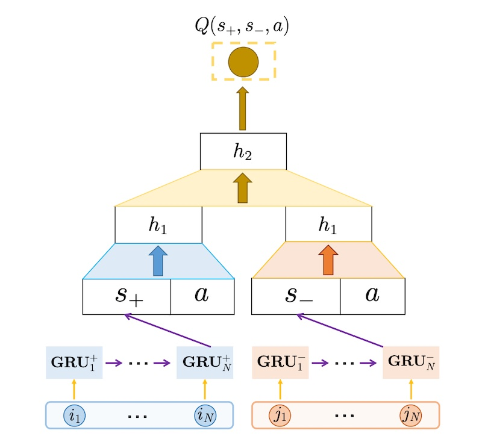
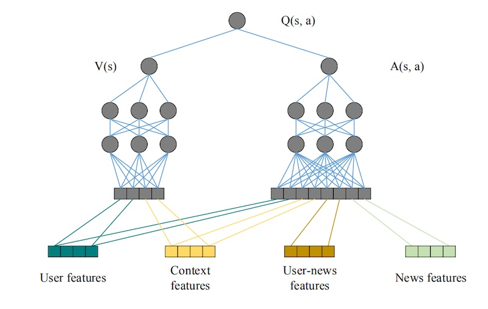
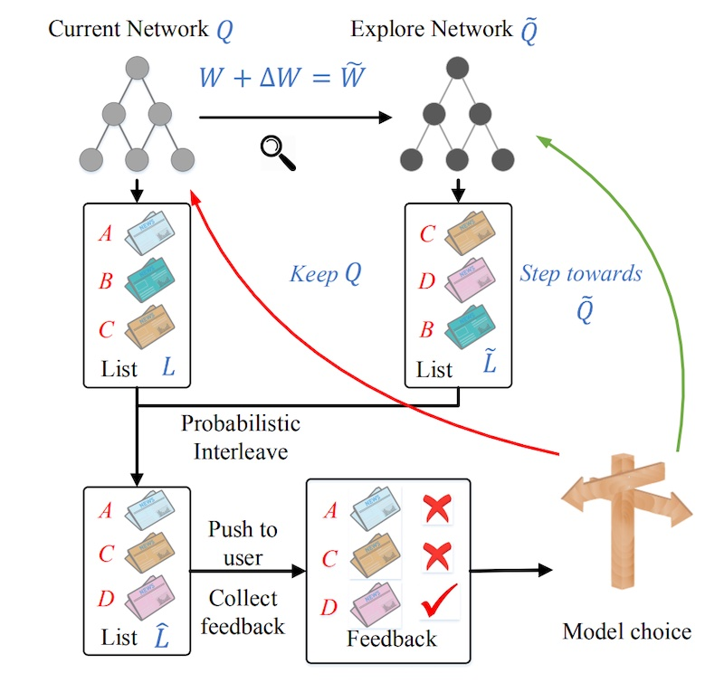
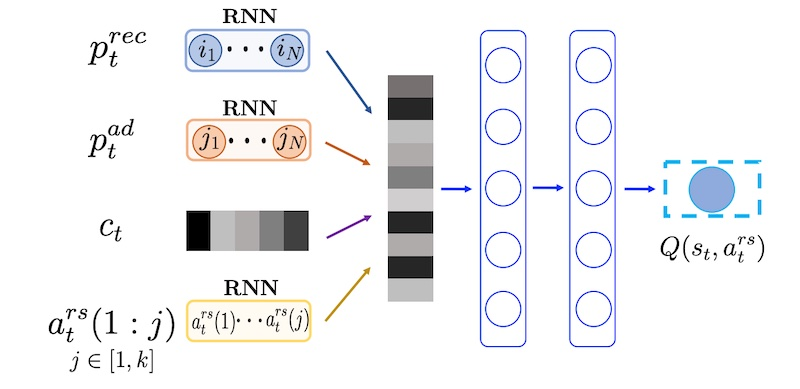
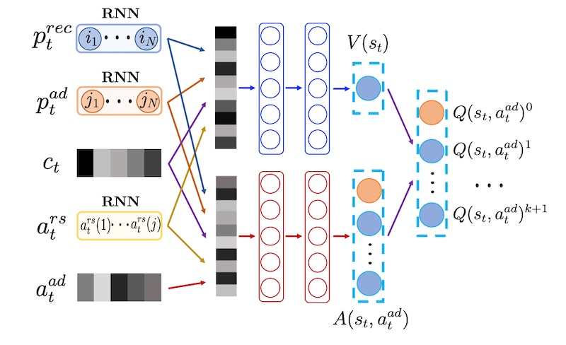

import { FigureCaption } from '../../components/figure-caption';
import "katex/dist/katex.min.css"

Most recommendation systems learn user preferences and item popularity from historical data, to retrain models at periodic intervals. This comes with a few downsides.

First, they’re designed to maximize the immediate reward of making users click or purchase, and don’t consider long-term rewards such as user activeness. Furthermore, they tend to adopt a greedy approach and overemphasize item popularity, neglecting to explore new items (i.e., cold-start problem). Finally, they don’t work well when new items are frequently added (e.g., news articles, TikTok/YouTube, etc).

One way to address this is via reinforcement learning. RL can learn to optimize for long-term rewards, balance exploration and exploitation, and continuously learn online. Here, we explore various reinforcement learning approaches for recommendation systems, including bandits, value-based methods, and policy-based methods.

## Contextual bandits: Multi-armed bandits with context

[Multi-armed bandits](https://en.wikipedia.org/wiki/Multi-armed_bandit) are a form of classical reinforcement learning. They try to balance exploration and exploitation by exploring new actions to learn what the potential reward is, and then exploiting the current best action to maximize reward. The goal is to learn about and choose actions that maximize total reward (aka minimize regret).

Contextual bandits take it a step further—they collect and observe the context before each action, and choose actions based on the context. They learn about how actions __and context__ affect reward. In the case of recommendations and search, the context would be data we have about the customer (e.g., demographics, device, indicated/historical preferences) and environment (e.g., day of week, time of day).

**Yahoo shared about using a [contextual bandit for recommending news articles](https://arxiv.org/abs/1003.0146).** While regular bandits only learn on features specific to each arm (i.e., disjoint linear models), their approach uses features—such as user-article cross features—that are shared across all arms (i.e., hybrid linear models). Experiments showed that this allowed click-through rate information from one article to be learned and applied to other articles (i.e., transfer learning)—this was not possible with disjoint linear models. 

For features, users were represented by 1,193 categorical features including demographics (age, gender), geography (locations, US states), and behavior (binary categories that summarize news consumption history). News articles were represented by 83 categorical features such as URL category (inferred from URL) and editor categories (manually tagged by human editors).

To reduce dimensionality, they projected user features into article categories and then clustered users with similar preferences. The same technique was also applied to news article features. This resulted in user and article features that were six dimensions each. To create user-article cross features, they computed the outer product of user and article features, leading to a 36-dimension vector—this puts the hybrid in hybrid linear models.

Evaluation was tricky as they only had offline data that was collected via a different policy (i.e., another recommender was in production when the data was collected, aka off-policy evaluation). Thus, they assumed that individual events were independent and identically distributed, and that the policy used to gather the logged data chose each arm uniformly at random. (They had a “learning bucket” to which some users were randomly assigned to. Users in the learning bucket were served articles randomly.)

Their policy evaluator takes in the learned policy and logged policy. If the learned policy chose the same arm as the logged policy, the event is retained and added to the history, and the payoff is updated. If the learned policy selects a different arm, then the event is ignored and the algorithm proceeds to the next event without any change in state. 

**Netflix also used [contextual bandits to personalize movie images](https://netflixtechblog.com/artwork-personalization-c589f074ad76) on the home page.** Why contextual bandits? They explained that batch machine learning approaches require time to collect data, train the model, and AB test, during which members do not benefit from the better experience (i.e., regret). To reduce regret, they moved towards online machine learning and adopted contextual bandits to continuously explore and learn about the best recommendation for each customer.

They started with a (non-contextual) [multi-armed bandit](https://netflixtechblog.com/selecting-the-best-artwork-for-videos-through-a-b-testing-f6155c4595f6) to find the single best artwork for all users. Then, it progressed to contextual bandits to personalize images for each user. The bandit can choose from a set of images for each show (i.e., action) and observe the number of minutes the user played the show after being impressed with the image (i.e., reward). It also has information about user attributes (e.g., titles played, genres played, country, language preferences), day of week, time of day, etc. (i.e., context).

They shared several bandit models, such as a greedy policy (via supervised regression model), epsilon greedy, LinUCB, and Thompson Sampling but weren't specific about which was used in production (probably an ensemble or something that's updated frequently). The evaluation approach was similar to Yahoo’s—I’ve written about it in more detail [here]({{ site.baseurl }}#bandits-learning-continuously-via-exploration).

## Value-based: Learning value for each state-action pair

In reinforcement learning, value-based methods learn the optimal value function. This is either a state function (mapping the state to a value) or a state-action function (mapping the state-action to a value). Using the value function, the agent acts by choosing the action that has the highest value in each state

**JD shared about using [deep Q-networks (DQN) and negative feedback for e-commerce recommendations](https://arxiv.org/abs/1802.06501).**  They shared that items that users skip (i.e., not click) provide useful signal about user preferences and should also be incorporated into recommender systems—a system with only positive items will not change its state or update its strategy when users skip the recommended items. 

Thus, they defined the state of their Markov decision process (MDP) to include negative items. Their MDP has two separate states: _State+_ (previous N items that users clicked or purchased) and _State-_ (previous N items that users skipped). For the transition, if users click/purchase the recommended item, _State+_ is updated by not _State-_; if users skip the item, _State-_ is updated but not _State+_.

As input for the DQN, gated recurrent units (GRUs) encode the sequence of positive and negative events into _S+_ and _S-_ embeddings. These embeddings are then concatenated with the candidate item (_a_). The first few hidden layers (for _S+_ and _S-_) are separated, the intuition is that we want to recommend items similar to the clicked/purchased items, but different from the skipped items. Thus, separating the first few hidden layers helps with capturing the distinct contributions of the positive and negative feedback.

<FigureCaption caption="JD's DQN to recommend items based on positive and negative events" source="https://arxiv.org/abs/1802.06501" />

To reduce computation cost, they have a prior candidate retrieval step that reduces the search space. Candidates are selected by finding the _N_ most similar items for the past _M_ items that users clicked and purchased. These candidates are then passed into the DQN as potential actions for ranking. 

**Microsoft also adopted a [DQN for news recommendations](https://dl.acm.org/doi/pdf/10.1145/3178876.3185994).** For features, they had:
- News features: 417 one-hot features such as provider, ranking, entity name, category, topic category, and historical click counts
- User features: Attributes of features that users clicked on in the last 1 hour, 6 hours, 24 hours, 1 week, and 1 year, totaling 413 x 5 = 2065 features
- User-news features: 25 features that describe the interaction between the user and specific news (e.g., frequency of entity, category, topic, provider) 
- Context features: 32 features such as time, day, freshness of news (time between recommendation and news published)

The DQN distinguishes between the four types of features. User and context features are considered _state_ features while all features are considered _action_ features. The intuition is that the reward for taking an action is related to all features, while the reward relevant to user attributes is impacted by user and context features only. Thus, the Q function is divided into value function (state features only) and advantage function (all features).

<FigureCaption caption="Microsofts's DQN for news recommendations" source="https://dl.acm.org/doi/pdf/10.1145/3178876.3185994" />

For reward, they combined (immediate) click-based reward and (long-term) user activeness reward. They reasoned that click metrics are only part of user feedback, and that recommendation systems should also consider whether the user will return to the application. User activeness was modeled via survival models and combined with click reward to get total reward. Nonetheless, user activeness reward had a low weight of 0.05.

For exploration, they applied dueling bandit gradient descent. Two networks are used to create recommendations: the current network _Q_ and the exploration network _Q’_. Weights of _Q’_ are obtained by adding some noise to the weights of _Q_. The recommendations from _Q_ and _Q’_ are then interleaved before being served to users. If the items recommended by _Q’_ get better feedback, the agent updates _Q_ towards _Q’_. Otherwise, _Q_ remains unchanged.

<FigureCaption caption="Exploration via Dueling Bandit Gradient Descent" source="https://dl.acm.org/doi/pdf/10.1145/3178876.3185994" />

As a final example, we look at **ByteDance’s use of [separate DQNs for recommendations and advertising](https://arxiv.org/abs/2003.00097).** They used a two-level framework to jointly optimize recommendations and ads. The first level generates the list of recommendations to optimize for user experience in the long run. The second level inserts ads into the recommendation list to balance between immediate advertising revenue and the negative influence of ads on long-term user experience. 

Their recommendation DQN considers the browsing history of items and ads separately. These item and ad sequences go through two GRUs to encode recommendation and ad preferences (similar to JD’s approach), before being concatenated with the context (e.g., app version, operating system, feed type)—this represents the state. Potential actions (i.e., item recommendations) are represented via embeddings. Given the state and a list of possible actions, the DQN outputs the Q-value of each state-action pair.

<FigureCaption caption="ByteDance's cascading DQN for recommendations" source="https://arxiv.org/abs/2003.00097" />

The advertising DQN is tricker. It needs to return three outputs: whether or not to include an ad, which ad to insert, and which position to insert it. However, these outputs are interdependent and a traditional DQN wouldn’t work. Thus, they designed a novel DQN that outputs the Q-value, specific to an ad, for all possible locations. They also added another unit in the final layer (index=0) to represent the Q-value of _not_ inserting an ad. This design lets the DQN consider the state and action and return all three outputs in a single pass.

<FigureCaption caption="ByteDance's DQN for advertising" source="https://arxiv.org/abs/2003.00097" />

The advertising DQN uses the same method as the recommendation DQN to get the state (via GRUs on item and ad sequences). The output of the recommendation DQN is also included in the state (of the ad DQN). Potential ads are represented via embeddings. 

Similar to Microsoft’s approach, the Q function is separated into value and advantage functions, where the value function doesn’t consider the ad input. The DQN outputs the Q-value of all ad-location pairs, a proxy for long-term influence of ads on user experience. This is then sent to the bidding system which trades off between immediate ad revenue and long-term Q-values.

## Policy-based: Learning actions for each state directly

Relative to value-based methods, policy-based methods learn the policy function that maps the state to action directly, without having to learn Q-values. As a result, they perform better in continuous and stochastic environments (i.e., no discrete states or actions) and tend to be more stable, given a sufficiently small learning rate.

**Google shared about [using REINFORCE for YouTube recommendations](https://arxiv.org/abs/1812.02353).**  The input is the sequence of user historical interactions, while the output predicts the next action to take (i.e., which video to recommend). 

For the main policy (π), the input sequence is embedded via an RNN. They tried a variety of RNNs (e.g., LSTMs, GRUs) and ended up using a [Chaos Free RNN](https://arxiv.org/abs/1612.06212) due to its stability and computation efficiency. The RNN takes in the sequence of user events up till time step _t_ and encodes it into the user state for the next time step (_t+1_). This is then concatenated with the context of time step _t+1_. 

The final softmax layer predicts the probability of each action (i.e., videos to recommend)—this is similar to a [previous implementation](https://dl.acm.org/doi/10.1145/2959100.2959190) which also had a softmax output layer. Given that the softmax contains millions of possible actions, they adopt sampled softmax during training. During serving, approximate nearest neighbors (ANN) is applied to retrieve the top actions.

<FigureCaption caption="Google's REINFORCE main policy with separate behavioral policy head" source="https://arxiv.org/abs/1812.02353" />

They also estimate the behavioral policy (β). They cite difficulty with directly logging the behavioral policy as there are multiple agents in their system. Thus, for each state-action pair, the behavioral head estimates the probability that the mix of behavioral policies will choose that action using another softmax. From the figure above, they reuse the user-state and model the behavioral policy with a separate head. To prevent the behavioral head from interfering with the user state of the main policy π, they block the gradient from flowing back to the RNN.

Boltzmann exploration was used to minimize the negative impact on user experience. They shared that brute force exploration (e.g., e-greedy) was not viable as it could result in inappropriate recommendations and poor user experience. After the top _M_ candidates are retrieved via an ANN, the logits (unscaled distances?) are fed into a smaller softmax to normalize the probabilities before sampling from the distribution. Exploration and exploitation are balanced by recommending the top _K_ most probable items and sampling the rest from the remaining _M - K_ items.

## Actor-Critic: Combining value-based and policy-based

Actor-critic combines the best of value-based and policy-based methods by splitting the model into two, one for computing the action based on state, and another to produce the Q-value of the state-action. The (policy-based) actor takes state as input and outputs the best action, learning the optimal policy and controlling how the agent behaves. The (value-based) critic then evaluates the action by computing the value function and providing feedback, to the actor, on how good the action is.

I came across several examples of actor-critic used in recommendations and search. We won’t be discussing them in this piece and I recommend you read them as required.
- Alibaba’s use of [actor-critic to choose the best ranking function](https://arxiv.org/abs/1803.00710) for a search query
- Baidu’s use of [two actors, one for home page recs and one for detail page recs](https://arxiv.org/abs/1902.03987)
- JD’s use of [actor-critic for page-wise recommendations](https://arxiv.org/abs/1805.02343)

## Conclusion

Are you trying to apply reinforcement learning for recommendation problems? If so, contextual bandits might be a good place to start—they’re relatively simpler to implement and might not need as much data as deep learning approaches. Beyond contextual bandits, DQNs seem to be the go-to baseline.

Nonetheless, regardless of which approach you adopt, pay extra attention to how off-policy evaluation is done—having the right evaluation framework is more than half the battle won. Here’s a good [tutorial](http://www.cs.cornell.edu/~adith/CfactSIGIR2016/) on counterfactual evaluation. Also, see this [paper](https://arxiv.org/abs/2104.08912) on Simpson’s Paradox in offline evaluation for recommendations.

## References

- [A Contextual-Bandit Approach to Personalized News Article Recommendation](https://arxiv.org/abs/1003.0146)
- [Selecting the best artwork for videos through A/B testing](https://netflixtechblog.com/selecting-the-best-artwork-for-videos-through-a-b-testing-f6155c4595f6)
- [Artwork Personalization at Netflix](https://netflixtechblog.com/artwork-personalization-c589f074ad76)
- [Recommendations with Negative Feedback via Deep Reinforcement Learning](https://arxiv.org/abs/1802.06501)
- [DRN: A Deep Reinforcement Learning Framework for News Recommendation](https://dl.acm.org/doi/pdf/10.1145/3178876.3185994)
- [Jointly Learning to Recommend and Advertise](https://arxiv.org/abs/2003.00097)
- [Top-K Off-Policy Correction for a REINFORCE Recommender System](https://arxiv.org/abs/1812.02353)
- [A recurrent neural network without chaos](https://arxiv.org/abs/1612.06212)
- [Deep Neural Networks for YouTube Recommendations](https://dl.acm.org/doi/10.1145/2959100.2959190)
- [Reinforcement Learning to Rank in E-Commerce Search Engine](https://arxiv.org/abs/1803.00710)
- [Whole-Chain Recommendations](https://arxiv.org/abs/1902.03987)
- [Deep Reinforcement Learning for Page-wise Recommendations](https://arxiv.org/abs/1805.02343)
- [SIGIR 2016 Tutorial on Counterfactual Evaluation and Learning](http://www.cs.cornell.edu/~adith/CfactSIGIR2016/)
- [The Simpson's Paradox in the Offline Evaluation of Recommendation Systems](https://arxiv.org/abs/2104.08912)