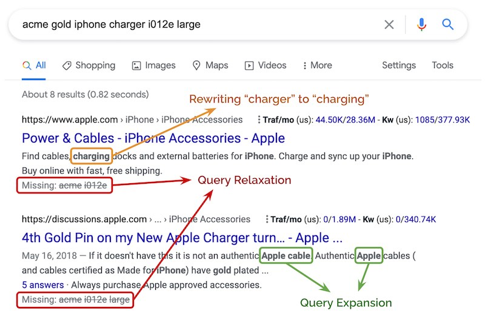
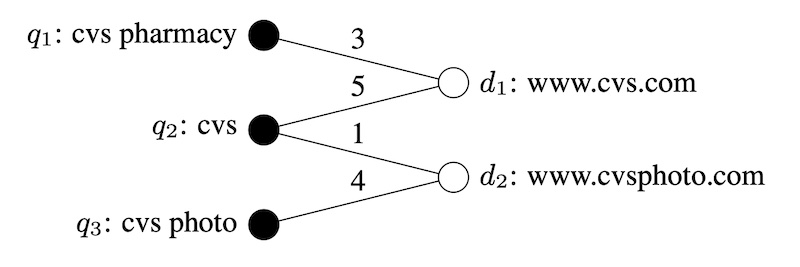
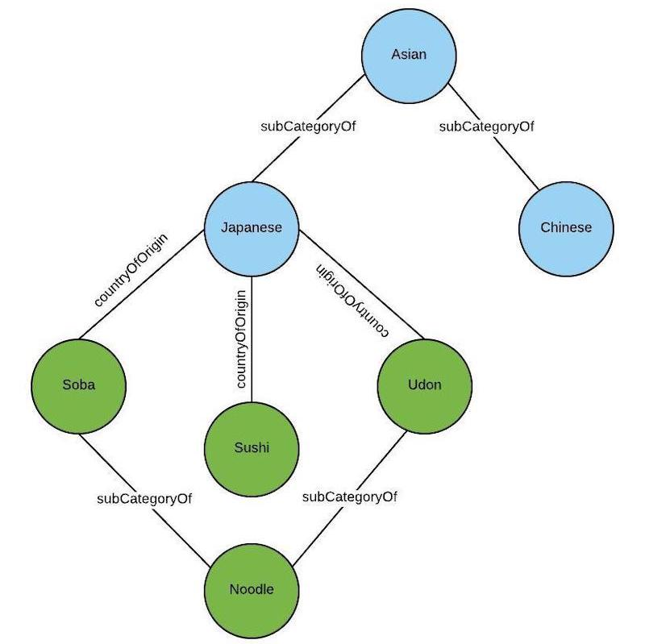
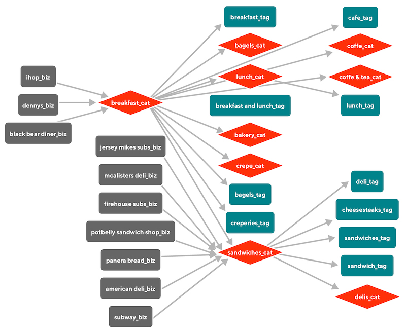
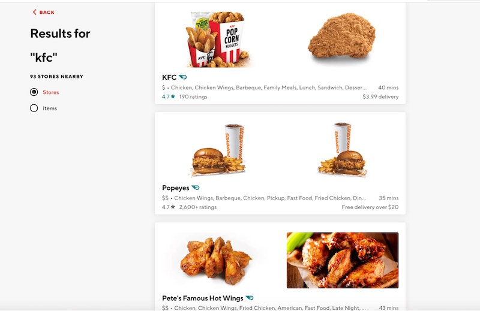
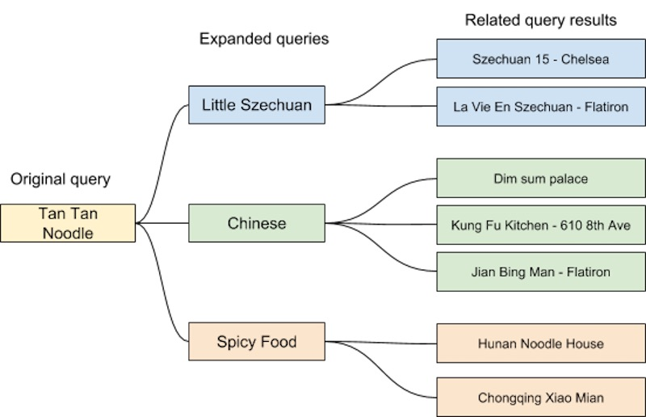
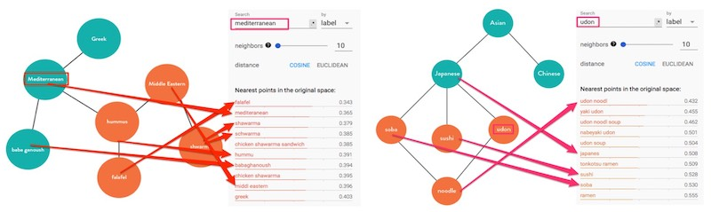
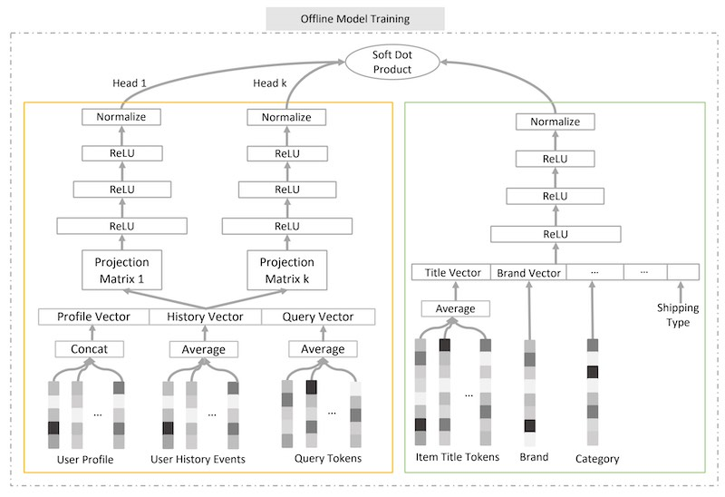
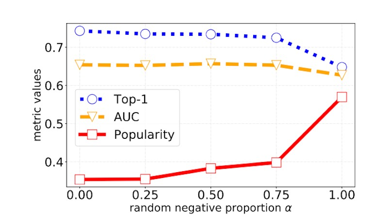

import { FigureCaption } from '../../components/figure-caption';
import "katex/dist/katex.min.css"

Search and recommendations have a lot in common. They help users learn about new products, and need to retrieve and rank millions of products in a very short time (<150ms). They’re trained on similar data, have content and behavioral-based approaches, and optimize for engagement (e.g., click-through rate) and revenue (e.g., conversion, gross merchandise value).

**Nonetheless, search differs in one key aspect—it has the user’s query as additional input.** (Think of search as recommendations with the query as extra context.) This is a boon and a bane. It’s a boon because the query provides more context to help us help users find what they want; it’s a bane because users expect results to be in line with their query.

In this post, we’ll explore various ways to normalize, rewrite, and retrieve (aka match) documents using **the query**. (Though the ranking step is also important, we’ll focus on query processing and matching for now). We’ll compare three main approaches: 
- **Lexical-based**: This approach replaces or augments the query string directly via normalization, spellchecks, expansion, translation, etc.
- **Graph-based**: This uses a knowledge graph is used to understand queries and documents at a higher level for query expansion and matching.
- **Embedding-based**: This uses latent representations—learned via self-supervised or supervised techniques—for expansion and matching.

## Lexical-based: The bedrock of query processing

Lexical-based approaches start with **preprocessing** the query string. This includes normalization (e.g., stemming, unicode standardization, removing accents), spell checking, and tokenization. Stemming in particular helps to reduce the various morphological forms of words to the same query. For example, “hiking boot” and “hike boots” are [stemmed](https://9ol.es/porter_js_demo.html) to “hike boot”, making it easier for downstream matching of queries to documents. In general, these preprocessing steps replace the query.

**Query expansion** augments the query by adding tokens to match additional documents. Additional tokens include synonyms (e.g., “handphone” can be expanded to “handphone OR mobile phone OR cellphone”) and abbreviations (e.g., “t-shirt L” can be expanded to “t-shirt L OR t-shirt large”).

**Query relaxation** is somewhat the opposite of query expansion; we remove tokens from the query instead. This makes the query less restrictive and increases recall. The simplest approach is to remove stop words. For product search, query relaxation can drop color, measure (e.g., small, medium, large), model numbers, brand, and other entities. 

For example, “acme gold iphone charger i012e large” can be relaxed to “iphone charger”. Trying to match on the full query string leads to no results. But in this case, we can infer that the key intent is “iphone charger” and relax the query string to increase recall. The example below also shows “charger” being rewritten to “charging”, as well as query expansion by adding the “apple” token. 

<FigureCaption caption="An example of query rewriting, relaxation, and expansion" />

**Query translation** is another form of rewriting, where a text-translation paradigm is applied to convert tail (i.e., unpopular, 20th percentile) queries into head queries that account for the bulk of traffic, helping to increase recall. It also helps in downstream ranking as we have more behavioral information (e.g., clicks, purchases) on head queries.

After the query is processed, it can be used to **retrieve relevant documents**. For lexical approaches, it mostly involves matching tokens and n-grams in the query to document fields such as title, description, category, attributes, etc.

**[DoorDash’s search system](https://doordash.engineering/2020/12/15/understanding-search-intent-with-better-recall/) starts with basic processing** (e.g., removing extra whitespaces, lowercasing, expanding contractions) before spell correction via the [Symmetric Delete](https://github.com/wolfgarbe/SymSpell) spelling correction algorithm. Then, the updated query tokens are standardized via a manually curated synonym dictionary. For example, “Poulet Frit Kentucky”, “KFZ”, and “KFC” are normalized to "kfc”.

However, specific—and valid—queries such as “Chick’n” were being spell-corrected to “Chicken”. (There are many items in their catalog with names that might not be present in an English dictionary and have low edit distance to regular words.) To avoid these invalid corrections, they apply spell check only after the initial attempt at matching does not return any results.

**[Yahoo shared about their text-translation approach](https://www.kdd.org/kdd2016/subtopic/view/ranking-relevance-in-yahoo-search)** to rewrite queries. The intent was to overcome the problem of matching and ranking cold start queries (not seen in the click log). To achieve this, they built a translation model using query-document pairs from their bipartite click graph. (A bipartite graph is a graph where nodes can be separated into two, disjointed sets, such as queries and documents.) The translation model learns phrase-level translations such as word alignment, phrase extraction, and phrase scoring. At query time, the model segments each query into phrases and then translates each phrase.

<FigureCaption caption="Yahoo's bipartite query-document graph" source="https://www.kdd.org/kdd2016/subtopic/view/ranking-relevance-in-yahoo-search" />

Each query is typically translated into hundreds of candidates. Candidates are scored on three groups of features: query features (e.g., number of tokens in query, number of stop words, language model score), translated query features (same as query features), and similarity between the original query and translated query (e.g., [Jaccard similarity](https://en.wikipedia.org/wiki/Jaccard_index) between shared URLs, word-level cosine similarity, etc). The similarity features were found to be the most important.

Finally, the original query and top-scoring translated query are both used to retrieve documents. The final result set is a union of documents matching either query. For documents that match both queries, their max score is used.

## Graph-based: Adding concepts and relationships

Graph-based approaches involve building and using a **knowledge graph to expand queries and improve retrieval**. The most famous example of a knowledge graph is probably Google’s, [introduced](https://blog.google/products/search/introducing-knowledge-graph-things-not/) almost 10 years ago. It has nodes for people, places, things, etc, and edges to connect them together.

During query time, the query is parsed and tagged to the relevant concepts (i.e., nodes) in the knowledge graph. The query can then be expanded—to include relevant concepts—by finding the closest nodes in the knowledge graphs. 

Building a knowledge graph is taxing. Nonetheless, we can bootstrap one by using [WordNet](https://en.wikipedia.org/wiki/WordNet), a lexical database of semantic relationships between words (available in more than 200 languages!) or [ConceptNet](https://en.wikipedia.org/wiki/Open_Mind_Common_Sense#ConceptNet), a semantic network where edges are assertions of commonsense between concepts (e.g., “is a”, “is used for”, “is made of”). Another approach is to mine [Wikipedia redirects](https://en.wikipedia.org/wiki/Wikipedia:Redirect).

<FigureCaption caption="An example of ConceptNet with synonym, part of, and form of relationships" source="https://conceptnet.io/" />

**[Uber shared about how they use a knowledge graph for search](https://eng.uber.com/uber-eats-query-understanding/).** First, they developed an ontology to describe the entities of the graph and the relationships between them. For example, foods and cuisines are related by `countryOfOrigin` while each entity can be a `subCategoryOf` another entity.

Then, they ingest and transform data from multiple sources to fit their ontology. Next, entities and edges are deduplicated, and new edges are built across multiple data sources. For example, the same restaurant on Foursquare and internal data should be represented as the same node. This connects disparate restaurant data from multiple sources via the same node—looking up a restaurant should return metadata from all data sources. 

Then, they annotate restaurants and menu items with tags based on graph nodes—this is done offline. During query time (i.e., online), queries are annotated and expanded—by traversing the graph—in real-time to increase recall. 

For example, if a user queries for “Asian”, the graph expands the search to include subsets such as “Chinese” and “Japanese”. Similarly, a query for “Udon” can be expanded to include related terms such as “Ramen”, “Soba”, and “Japanese”. The graph also includes location as an edge. Thus, if a restaurant is outside a user’s delivery zone, the graph can traverse to find similar cuisines in the user’s area.

<FigureCaption caption="Uber's knowledge graph with country-of-origin and sub-category-of relationships" source="https://eng.uber.com/uber-eats-query-understanding/" />

**[DoorDash also uses a knowledge graph](https://doordash.engineering/2020/12/15/understanding-search-intent-with-better-recall/)** and shared their ontology. They have three types of entities (i.e., nodes) in their knowledge graph (which is implemented in Neo4j):
- **Store**: Where the food is sold. It has the `_biz` suffix (e.g., `ihop_biz`).
- **Food category**: A coarse-grained descriptor of foods such as Chicken, Chinese, Fast Food. It has the `_cat` suffix (e.g., `breakfast_cat`).
- **Food tag**: A fine-grained descriptor of popular items sold, such as fried chicken, dim sum, tacos. It has the `_tag` suffix (e.g, `sandwich_tag`).

Entities are connected by three types of relationships: 
- Each store will belong to a primary food category. For example, `ihop_biz` belongs to `breakfast_cat`.
- Each food category can have at most one parent food category. For example, `sandwich_cat` only has `breakfast_cat` as its parent, and `deli_cat` only has `sandwich_cat` as its parent. This enforces hierarchy between the food categories.
- Each food tag will belong to one food category. For example, `deli_tag`, `sandwich_tag`, and `cheesesteaks_tag` belong to `sandwich_cat`.

<FigureCaption caption="DoorDash graph with relationships between stores, categories, and tags" source="https://doordash.engineering/2020/12/15/understanding-search-intent-with-better-recall/" />

At query time, the knowledge graph expands on the underlying query concept. For example, when a customer searches for “KFC”, the KFC store nearest to the customer is returned as the top result. Then, the graph is used to expand the query to return restaurants with tags (e.g., `fried_chicken_tag`, `wings_tag`) that have the same primary category (i.e., `chicken_cat`).

<FigureCaption caption="Query expansion for 'kfc'" source="https://doordash.engineering/2020/12/15/understanding-search-intent-with-better-recall/" />

Similarly, when the customer enters a broad search query such as “Asian”, it is mapped to the `asian_cat`. This is then expanded to subcategories such as `thai_cat` and `chinese_cat`, and restaurants with tags belonging to these categories are retrieved. In the example below, Charm Thai contains the `thai_tag` which is part of the `thai_cat`, and HI Peninsula contains the `dim_sum_tag` which is part of the `chinese_cat`.

<FigureCaption caption="Query expansion for 'asian'" source="https://doordash.engineering/2020/12/15/understanding-search-intent-with-better-recall/" />

## Pitfalls of lexical and graph-based approaches

Lexical-based approaches that treat each query as a bag-of-words can lead to incorrect results. DoorDash shared an example where customers searching for “California rolls” would get results for Mexican restaurants, instead of sushi places, because the tokens “California” and “roll” appear in the food menus of Mexican restaurants.

Lexical-based approaches also struggle to understand:
- **Hypernyms**: Broader categories of words, such as “hat” being a hypernym of “beret”, “cap”, and “snapback”.
- **Synonyms**: Different words, same meaning (e.g., “burgundy dress”, “red dress”).
- **Antonyms**: Words which have or imply opposite meaning. While “latex gloves” contain the same tokens as “latex free gloves”, they have the opposite meaning. 

While this can be overcome with dictionaries and rules, it is tedious to manually curate and maintain these knowledge bases for each language.

Lexical-based approaches are also fragile to morphological variants (e.g., “woman” vs. “women”). While stemming can be applied, it is imperfect and can lead to information loss and errors. For example, “universal”, “university”, and “universe” all stem to “univers”. Similarly, this involves handcrafted rules which are a pain to create and maintain.

Finally, lexical-based approaches are sensitive to spelling errors. [One out of 10 queries is misspelled](https://blog.google/products/search/abcs-spelling-google-search/). While we can adopt spellcheckers and correctors, as DoorDash’s experience showed, spell correctors can be too aggressive and change the customer’s intent. 

Though knowledge graphs help with increasing recall, they’re also a lot of manual work. From Uber and DoorDash’s experience, effort is needed to build the ontology, populate the knowledge graph with data from multiple sources, deduplicate nodes and edges, create new edges for better relationship mapping, and ensure the accuracy of nodes and edges.

Then, we need to tag catalog items with the nodes in the knowledge graphs offline, and tag and expand queries in real-time online. Knowledge graphs are costly to scale and maintain, and require constant manual curation and quality checks to ensure correctness.

To augment lexical and graph-based approaches, teams have increasingly turned to representation learning and embedding-based approaches. 

## Embedding-based: Decomposing queries into numbers

Representation learning is a way to learn latent representations (i.e., embeddings) of items from data. They are latent because they cannot be observed directly. They’re also referred to as semantic embeddings because they learn the semantics of items well. It can be done **via self-supervised or supervised methods**. 

The most commonly known self-supervised approach is probably [word2vec](https://en.wikipedia.org/wiki/Word2vec), which learns text embeddings given a corpus of text. It does this by training a network to predict a word’s neighbors (i.e., context) given a word via the skip-gram approach, or predict a word given its neighbors via the continuous-bag-of-words (CBOW) approach. A similar paradigm can be used to generate query embeddings.

Supervised methods usually use click or purchase events as labels. This involves training a model that takes a query and document as input and predicts the probability of click or purchase. The trained model is then used to generate query and document embeddings. 

Once we have query and document embeddings, we can use them in query expansion and document retrieval. Embeddings have several advantages over the lexical-based approach. For example, they encode semantics and eliminate the need for a synonym dictionary; “handphone”, “cellphone”, and “mobile phone” are likely to be close in the embedding space. Furthermore, with character-level n-grams, query embeddings can be made less sensitive to morphological variants and spelling errors. 

### Self-supervised techniques: No need for labels!

**[Yahoo’s approach to learning representations](https://www.kdd.org/kdd2016/subtopic/view/ranking-relevance-in-yahoo-search)** starts with creating a [bipartite graph](#yahoo-graph) of queries and clicked documents. Then, they extracted tokens from co-clicked queries to represent documents; tokens from more co-clicked queries are likely to be more representative of documents. Thus, the more queries two documents share, the closer they are, and vice versa. Similarly, queries that share many co-clicked documents are likely to have similar intent.

Each query is represented by a vector of tokens, with weights proportional to their frequencies in the query, and normalized to 1. Then, query and document vectors are propagated iteratively (somewhat like [alternating least squares](http://stanford.edu/~rezab/classes/cme323/S15/notes/lec14.pdf) for collaborative filtering), resulting in query and document embeddings in the same vector space. To get similarities between queries and documents, they compute the inner product of these vectors. 

**[Uber used the GloVe algorithm](https://eng.uber.com/uber-eats-query-understanding/)** to learn query embeddings. GloVe (Global Vectors) creates word embeddings by learning word co-occurrence in a corpus. To apply the language modeling paradigm to search, each query is considered a word in a sentence, and queries are “next to each other” in the sentence (i.e., same context) if both queries lead to an order from the same restaurant. To put it another way, the restaurant is the context and two queries share the same context if they both lead to orders in the same restaurant.

<FigureCaption caption="Queries leading to orders from the same restaurant have the same context" source="https://eng.uber.com/uber-eats-query-understanding/" />

They start with constructing a Pointwise Mutual Information matrix with the search queries, where _a_ and _b_ are tuning params and _p(q1, q2)_ is the joint distribution of _q1_ and _q2_.

$$
\operatorname{pmi}\left(q_{1}, q_{2}\right)=\log \frac{p\left(q_{1}, q_{2}\right)}{p\left(q_{1}\right)^{a} p\left(q_{2}\right)^{b}}
$$

Then, they apply a GloVe-based factorization model to learn query embeddings. These query embeddings can then be used for query expansion (via approximate nearest neighbors) to improve search recall. For example, if a user searches for “tan tan noodle” (or more correctly, “dan dan noodle”) and there are no restaurants selling it nearby, it can be expanded to “Little Szechuan”, “Chinese”, and “Spicy Food”. 

<FigureCaption caption="Query expansion for 'tan tan noodle'" alt="Query expansion for 'tan tan noodle'" source="https://eng.uber.com/uber-eats-query-understanding/" /> 

**[GrubHub adopts a similar paradigm](https://bytes.grubhub.com/search-query-embeddings-using-query2vec-f5931df27d79)** using the skip-gram architecture and shared examples where the nearest neighbors for “Udon” and “Mediterranean” almost map 1:1 with a reference food graph. This provides assurance that the self-supervised approach can capture knowledge graph-like semantics via embeddings. 

<FigureCaption caption="Embeddings for 'udon' and 'mediterranean' relative to the knowlege graph" source="https://bytes.grubhub.com/search-query-embeddings-using-query2vec-f5931df27d79" />

### Supervised techniques: Improves modeling of our desired event

**[Amazon built semantic product search](https://arxiv.org/abs/1907.00937)** using customer behavioral data. Their neural net architecture shares embeddings across the query and product. Queries are fed into the model as they are while products are represented as an ordered bag-of-attributes (e.g., title, brand, color). They also tried learning attribute embeddings but it led to 5% lower recall (relative to concatenating attributes), likely due to the variability in accuracy and availability of structured data.

<FigureCaption caption="Amazon's neural network architecture for semantic product search" source="https://arxiv.org/abs/1907.00937" />

Average pooling is then applied to get a fixed-length embedding for the query and product. Relative to recurrent approaches such as LSTM and GRU, using average pooling made little difference (<0.5%) in mean average precision and recall@100 while requiring less computation, training time, and inference latency.

They initially adopted a two-part hinge loss. First, _ŷ_ is the cosine similarity between query and product embeddings, and _y_ = 1 if the product is purchased (in response to the query) and zero otherwise. The hinge loss ensures that _ŷ_  > 0.9 when _y_ = 1 and _ŷ_ < 0.2 when _y_ = 0. However, they found a large overlap in score distributions between random negatives (red) and purchased positives (green) due to products that were impressed but not purchased. 

Thus, they updated the two-part loss to also consider products that were impressed but not purchased, where _ŷ_ < 0.55 where _y_ = impressed but not purchased. This improved the separation of scores between random negatives (red), impressed but not purchased negatives (grey), and purchased positives (green).

<FigureCaption caption="Score distribution with two-part (left) and three-part (right) hinge loss" source="https://arxiv.org/abs/1907.00937" />
  
To tokenize queries and products, they applied tokenization approaches such as:
- Work unigrams and n-grams: N-grams capture phrase-level information that unigrams don’t. For example, “chocolate milk” and “milk chocolate” are different though they share the same unigrams.
- Character tri-grams: These are robust to types and handle compound words (e.g., “amazontv”, “firetvstick”) well. They also capture similarity of model parts. 

<FigureCaption caption="Example tokens for the query 'artistic iphone 6s case'" source="https://arxiv.org/abs/1907.00937" />

It is unfeasible to have a vocabulary of all possible word n-grams as dictionary size grows exponentially with _n_. Thus, they maintain a vocabulary of hundreds of thousands of n-grams based on token frequency. To handle unseen words, they hash out-of-vocabulary (OOV) tokens to additional embedding bins. By using fixed hash functions and shared query-document embeddings, unseen tokens in both the query and products map to the same embedding vector. A bin size 5-10x larger than vocab size is used. Then, all tokens are combined as a single bag-of-tokens (i.e., unordered, equal weight).

**[Facebook’s embedding-based search](https://arxiv.org/abs/2006.11632)** adopts a two-tower approach with separate towers for queries and documents. The model is formulated as a ranking problem based on distance between a query and document. Cosine similarity is used as the distance metric.

<FigureCaption caption="Facebook's two-tower architecture that includes location and social features" source="https://arxiv.org/abs/2006.11632" />

They use triplet loss to approximate the recall objective. For a given triplet _(q, d+, d-)_, _q_ is the query while _d+_ and _d-_ are the associated positive and negative documents. _D(q, d)_ is the distance between the query and document embedding and _m_ is the margin enforced between positive and negative pairs. The intuition is to separate the positive and negative pairs by the distance margin. 

$$
L=\sum_{i=1}^{N} \max \left(0, D\left(q^{(i)}, d_{+}^{(i)}\right)-D\left(q^{(i)}, d_{-}^{(i)}\right)+m\right)
$$

For positive labels, they tried using clicks and impressions. Why impressions as positive labels? The intuition is to teach the model to return the same set of results that will be ranked high by the ranker. Both were found to be equally effective, though adding impressions to click data did not improve the model. 

For negative labels, they tried using random samples and impressed-but-not-clicked samples. The model trained on the latter (i.e., non-clicked impressions) had worse recall relative to random negatives, with a 55% recall drop for the people embedding model. (Contrast this to Amazon’s approach where accounting for non-click impressions led to improved results.) They hypothesized that non-click impressions bias towards hard cases where the documents match the query on at least one factor. In contrast, the majority of documents are easy cases that don’t match the query at all. Thus, using non-click impressions bias the training data, making it not representative of the actual retrieval task.

For text features, they used character and word n-grams. Adding word n-grams led to small but consistent improvements (+1.5% recall). Similar to Amazon, they found the cardinality of word n-grams too high (352 million for query trigrams) and had to apply hashing to reduce the size of the embedding table.

As additional context, they included location features of the query (e.g., city, country, language) and document (e.g., group location). They also included social embedding features that were trained via a separate embedding model to embed users and entities in the social graph.

As a final example, we look at **[JD’s semantic retrieval model](https://arxiv.org/abs/2006.02282)** which takes it one step further with the introduction of multiple query heads. 

<FigureCaption caption="JD's two-tower architecture with multiple query heads" source="https://arxiv.org/abs/2006.02282" />

The item tower is straightforward where embeddings from multiple attributes (e.g., title, brand, seller) are concatenated into a single vector (this is similar to Amazon’s approach though they have embeddings for each attribute). Then, the vector goes through multiple [Rectified Linear Unit](https://en.wikipedia.org/wiki/Rectifier_(neural_networks)) layers. The output item embedding is finally normalized to be the same length as the query embedding. 

The query tower is novel in that it has multiple heads (à la [Transformer](https://en.wikipedia.org/wiki/Transformer_(machine_learning_model))). An additional projection layer passes the dense input layer into _k_ dense representations. These _k_ representations are then passed into _k_ separate encoders, each with their own parameters. As a result, each query head captures different semantic meanings for a query, such as different popular brands for a product query (e.g., Apple and Samsung for “cellphone”) and different products for a brand query (e.g., phones and monitors for “Samsung”).

To get query-item similarity, they compute a weighted sum of all inner products between the multiple query embeddings and the single item embedding. The weights are computed from the softmax of the same set of inner products, with a temperature parameter (β). The higher the temperature, the more uniform the weights will be. As temperature goes to zero, the similarity score becomes equivalent to selecting the largest inner product.

$$
w_{i}=\frac{\exp \left(e_{i}^{\top} g / \beta\right)}{\sum_{j=1}^{m} \exp \left(e_{j}^{\top} g / \beta\right)}
$$

To create negative item labels, they used a mix of random negatives and batch negatives. Random negatives are uniformly sampled from all items. Thus, each item has the same probability of showing up as a negative. However, this is computationally expensive as each random negative has to go through the item tower (to get the item embedding). Batch negatives come from the other query-item pairs in the same batch. For a query-item pair, the other positive items in the same batch are used as item negatives. They found that a proportion of 0.5 - 0.75 random negatives works well. 

<FigureCaption caption="Using 0.5 - 0.75 random negatives leads to optimal results" source="https://arxiv.org/abs/2006.02282" />

## Embedding-based approaches have pitfalls too

For example, Uber shared that “halal” may expand to “middle eastern”, “mediterranean”, or South-East Asian cuisines and retrieve restaurants that may not be halal, leading to a poor customer experience. Furthermore, representation learning requires a large amount of behavioral data that might not be available when the search system is launched in a new marketplace with little to no data.

Thus, I've found **lexical, graph, and embedding-based approaches to be complementary**. Most search systems use embedding-based approaches to augment lexical and/or graph-based approaches (instead of replacing them completely). For example:
- Uber uses its knowledge graph with query embeddings for query expansion
- Amazon's semantic matching augments keyword and behavioral matching
- Facebook's semantic matching augments their existing boolean-matching

<FigureCaption caption="Amazon's (left, semantic matching) and Facebook's (right, NN Operator in the retrieval box) embedding-based approach augmenting existing methods" />

## Conclusion: Start lexical, then embeddings

There’s no one way to handle search queries. Lexical-based techniques are a fundamental, content-based approach that doesn’t require building a knowledge graph or large amounts of behavioral data—if you’re building a search system from scratch, perhaps start here. ElasticSearch and Lucene largely work out of the box.

If you find yourself reaching the point of diminishing returns with lexical or graph-based approaches, especially with long-tail queries, try augmenting it with query embeddings learned via self-supervised representation learning—they’re bang for buck.

## References
- [Things Not Strings: Understanding Search Intent with Better Recall](https://doordash.engineering/2020/12/15/understanding-search-intent-with-better-recall/)
- [Ranking Relevance in Yahoo Search](https://www.kdd.org/kdd2016/subtopic/view/ranking-relevance-in-yahoo-search)
- [Introducing the Knowledge Graph: things, not strings](https://blog.google/products/search/introducing-knowledge-graph-things-not/)
- [Food Discovery with Uber Eats: Building a Query Understanding Engine](https://eng.uber.com/uber-eats-query-understanding/)
- [Query2vec: Search query expansion with query embeddings](https://bytes.grubhub.com/search-query-embeddings-using-query2vec-f5931df27d79)
- [Semantic Product Search](https://arxiv.org/abs/1907.00937)
- [Embedding-based Retrieval in Facebook Search](https://arxiv.org/abs/2006.11632)
- [Personalized and Semantic Retrieval: E-commerce Search via Embedding Learning](https://arxiv.org/abs/2006.02282)
- [Towards the Next Generation of Query-Ad Matching in Baidu's Sponsored Search](http://research.baidu.com/Public/uploads/5d12eca098d40.pdf)