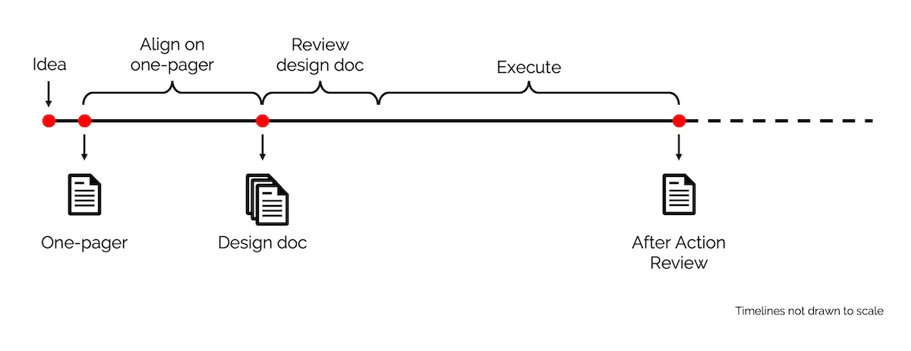

import { FigureCaption } from '../../components/figure-caption';

Here's a story from the early days of Amazon Web Services: Before writing any code, [engineers spent 18 months](https://review.firstround.com/how-to-build-an-invention-machine-6-lessons-that-powered-amazons-success#lesson-1-slow-down-to-innovate) contemplating and writing documents on how best to serve the customer. Amazon believes this _is_ the fastest way to work—thinking deeply about what the customer needs before executing on that rigorously refined vision.

Similarly, as a data scientist, though I solve problems via code, a lot of the work happens _before_ writing any code. Such work takes the form of thinking and/via writing documents. This is especially so in Amazon, which is famous for its writing culture.

How do we write effective documents for data science and machine learning projects? I'll start by sharing three documents I've written: one-pagers, design documents, and after action reviews. Then, I'll reveal the framework I use to structure most of my writing, including this post. In the next post, we'll discuss design docs.

## One-pagers, design docs, after-action reviews

I usually write three types of documents when building/operating a system. The first two help to get alignment and feedback; the last is used to reflect—all three assist with thinking deeply and improving outcomes.

<FigureCaption caption="The three types of documents written during a project"/>

**One-pagers:** I use these to achieve alignment with business/product stakeholders. Also used as background memos for quarterly/yearly prioritization. In a single page, they should allow readers to quickly understand the problem, expected outcomes, proposed solution, and high-level approach. Extremely useful to reference when you’re deep in the weeds of a project, or encounter scope creep.

**Design docs:** I use these to get feedback from fellow scientists and engineers. They help identify design issues early in the process. Furthermore, you can iterate on design docs more rapidly than on systems, especially if said systems are already in production. It usually covers methodology and system design, and includes experiment results and technical benchmarks (if available).

Design docs are more commonly seen in engineering projects; not so much for data science/machine learning. Nonetheless, I’ve found it invaluable for building better ML systems and products.

**After-action reviews:** I use these to reflect after shipping a project, or after a major error. If it’s a project review, we cover what went well (and not so well), follow-up actions, and how to do better next time. It’s like a [scrum retrospective](https://eugeneyan.com/writing/what-i-love-about-scrum-for-data-science/#retrospectives-feedback-loop-for-improvement), except with more time to think and written as a document. The knowledge can then be shared with other teams.

If it’s an error review (e.g., the system goes down), we diagnose the root cause and identify follow-up actions to prevent reoccurrence. Nowhere do we blame individuals. The intent is to discuss what we can do better and share the (sometimes painful) lessons with the greater organization. Amazon calls these [Correction of Errors](https://wa.aws.amazon.com/wat.concept.coe.en.html); here's how it [looks like](https://github.com/JDHarris007/coe/blob/master/CoE.md).

## Writing framework: Why, What, How, (Who)

The Why-What-How framework is so simple that it sounds like a reading/writing lesson for first graders. Nonetheless, it guides most, if not all, of my work documents.

**Why:** Start by explaining _Why_ the document is important. This is often framed around the problem or opportunity we want to address, and the expected benefits. We might also answer the question of _Why now?_

Think of this as the hook for your document. After reading the _Why_, readers should feel compelled to blaze through the rest of your doc (and hopefully commit to your proposal). In resource-strapped environments (e.g., start-ups), this section convinces decision-makers to invest resources into your idea. 

Thus, it’s critical that—after reading this section—your audience understands the problem and context. Describe it simply in their terms: customer benefits, business gains, productivity improvements. Contrast the two _Whys_ below; which is better suited for a business audience?

> “We need to procure GPU clusters for distributed training of SOTA deep learning models that will improve nDCG@10 by 20%.”
> 
> “We need to invest in infra to improve customer recommendations, with an expected conversion and revenue uplift of 5%.”

The first one might be a tad exaggerated, but I’ve seen _Whys_ that start like that.  🤦‍♂️ It’s a great way to lose the audience from the get-go.

**What:** After the audience is convinced we should solve the problem, share what a good solution looks like. What are the expected outcomes and ways to measure them? 

One way to frame _What_ is via measures of success and constraints. Measures of success define what a good (or bad) solution looks like; constraints define what solutions can (and cannot) do. Together, they enable readers to evaluate and decide on proposals, make trade-offs, and provide feedback.

Another way of framing _What_ is via requirements. Business requirements specify the expected customer experience, uplift to business metrics (success measures), and budget (constraints). They might also be framed as product or functional requirements. Technical requirements specify throughput, latency, security, privacy, etc., usually as constraints.

**How:** Finally, explain _How_ you’ll achieve the _Why_ and _What_. This includes methodology, high-level design, tech decisions, etc. It’s also useful to add how you’re _not_ implementing it (i.e., out of scope).

The depth of this section depends on the document. For one-pagers, it could be a paragraph or two on deliverables, with details in the appendix. For design docs, you may want to include a [system context diagram](https://en.wikipedia.org/wiki/System_context_diagram), tech decisions (e.g., centralized vs. distributed, EC2 vs. EMR vs. SageMaker), offline experiment results (e.g., hit rate, nDCG), and benchmarks (e.g., throughput, latency, instance count).

Having a solid _Why_ and _What_ provides context and makes this section easier to write. It also makes it easier for readers to evaluate and give feedback on your idea. Conversely, poorly articulated intent and requirements make it difficult to spot a good solution even when it’s in front of us.

**(Who):** While writing docs, we should keep our audience in mind. Although _Who_ may not show up as a section in the doc, it’ll influence how it turns out (topics, depth, language). 

A document for business leaders will (and should!) look very different from a document for engineers. Difference audiences will focus on different aspects: customer pain points, business outcomes, ROI vs. technical requirements, design choices, API specifications. 

Writing with your _Who_ in mind makes for more productive discussions and feedback. We don’t ask business leaders for feedback on infra choices, and we don’t ask devops engineers for guidance on business strategy.

## How to use the framework to structure your docs

Here are some examples of using Why-What-How to structure a one-pager, design doc, after-action review, and my writing on this site.

### One-pager example

**Why:** Our data science team (in an e-commerce company) is challenged to help customers discover products easier. Senior leaders hypothesize that better product discovery will improve customer engagement and business outcomes.

**What:** First-order metrics are engagement (e.g., CTR) and revenue (e.g., conversion, revenue per session). Second-order metrics include app usage (e.g., daily active users) and retention (e.g., monthly active users). Constraints are set via a budget and timeline.

**How:** The team considered several online (e.g., search, recommendations) and offline (e.g., targeted emails, push notifications) approaches. Their analysis showed the majority of customer activity occurs on product pages. Thus, an [item-to-item](/resources/real-time-recommendations/) (i2i) recommender—on product pages—is hypothesized to yield the greatest ROI. 

**Appendix:** Breakdown of inbound channels and site activity, overview of the various approaches, detailed explanation on recommendation systems.

### Design document example

**Why:** Currently, our product pages lack a way for users to discover similar products. To address this, we are building an i2i recommender to improve product discoverability and customer engagement. 

**What:** Business requirements are similar to those specified in the one-pager, albeit with greater detail. We collaborated with the web and mobile app teams to define technical requirements such as throughput (\> 1,000 requests per second), latency (<150ms at p99), and availability (99% uptime). Our constraints include cost (<10% of revenue generated, with an absolute threshold) and integration points.

**How:** This will be the meatiest section of the design doc. We’ll share the [methodology and high-level design](/resources/real-time-recommendations/), including system-context-diagrams, tech choices, initial offline evaluation metrics (for ML), and address aspects of throughput, latency, cost, security, data privacy, integration, etc.

**Appendix:** Trade-offs, what was considered but excluded, API specs, UI, etc.

### After-action review example

**Context:** During a peak sales day ([11/11](https://en.wikipedia.org/wiki/Singles%27_Day)), the i2i recommender was not visible on product pages for a period of time. This was discovered by category managers inspecting their products’ discounts.

**Why ([5 Whys](https://en.wikipedia.org/wiki/Five_whys)):** The spike in traffic led to increased latency (\>150ms) when serving recommendations. The increased latency led to the recommender widget timing out—and not being shown—on product pages. While autoscaling was enabled, it hit the [instance quotas](https://aws.amazon.com/premiumsupport/knowledge-center/ec2-InstanceLimitExceeded-error/) and could not scale beyond that. Though we conducted load tests at 3x normal traffic, these were insufficient as peak traffic was 30x normal traffic. In addition, it was not discovered earlier because our alarms didn’t account for results not being displayed.

**What:** Customer experience was unaffected as product pages continued to load within expected latency. Nonetheless, not serving recommendations led to loss of expected revenue. Based on revenue attributed to the recommender during the rest of the day, the estimated loss is $x.

**How:** We will take these follow-up actions to prevent a repeated incident and detect similar issues earlier. These are their respective owners.

**Appendix:** Timeline of incident, overall learnings and recommendations.

### Personal writing example

**Why**: Why is writing documents important? Share anecdote.

**What**: What documents do I write? Share some examples.

**How**: Explain the Why-What-How approach and share examples.

## Writing docs is expensive, but cheap

Writing documents cost money. They take time to write, review, and iterate on—this is time that could have been spent on implementation. 

Nonetheless, writing is a cheap way to ensure we **solve the right problems in the right way**. They save money by helping teams avoid rabbit holes or building systems that aren’t used. They also help align stakeholders, improve initial ideas, and scale knowledge. 

If the problem is ambiguous, the proposed solution contentious, the effort required high (\> 3-6 months), and/or consensus is required across multiple teams, starting with a document will save effort in the medium to long term.

So before you start your next project, write a document using Why-What-How. Here’s more detail about [one-pagers](https://eugeneyan.com/writing/what-i-do-before-a-data-science-project-to-ensure-success/#first-draw-the-map-to-the-destination-one-pager)  (and other things I do before starting a project).